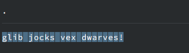
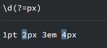
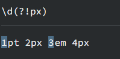

# Table of Contents

* [练习网站](#练习网站)
* [基础语法](#基础语法)
  * [\](#)
  * [()](#-1)
  * [[]](#-2)
  * [{}](#-3)
  * [$1](#1)
* [符号表](#符号表)
* [练习题目](#练习题目)
* [使用](#使用)
* [参考资料](#参考资料)


# 练习网站

[https://regexr-cn.com/]

# 基础语法

## \

> 将下一个字符标记符、或一个向后引用、或一个八进制转义符。例如，“\\n”匹配\n。“\n”匹配换行符。序列“\\”匹配“\”而“\(”则匹配“(”。即相当于多种编程语言中都有的“转义字符”的概念。**就理解为转义符号**<br/>可以这么理解，如果不加‘\’，会被识别为 'w'字符，加了‘\’就会被识别为正则语法

比如要匹配一个"+"号，正则怎么写呢？


## ()

>  分组捕获

举个例子：451w 或者451wr

你想匹配 451 w

 对应的正则表达式为：$$(\d){3}([a-z])+$$

那么第一个分组表达式就是提取451,第二个分组表达式提取的是w或者wr


## []

> 包含,默认是一个字符长度
>
> [^] 不包含,默认是一个字符长度

一般使用$$[A-Z]$$或者$$[0-9]$$


## {}

> {*n*,*m*}  匹配长度

匹配指定数量个前面的标记。`{1,3}` 会匹配1个到3个。`{3}` 会匹配正好3个。`{3,}` 会匹配3个或更多。


## $1 

$1，$2表达的是小括号()分组里面的内容：$1是第一个小括号里的内容，    $2是第二个小括号里面的内容，依此类推。例如：


**知道这个用法后，可以很方便的提取字符进行拼接。**

```java
String str = "451wt489bc5894";
System.out.println(str+"-->"+str.replaceAll("(\\d{3})(\\w+)(\\d{3})(\\w+)(\\d{4})","$5/$4+$3+$2+$1"));
```


## 点

匹配除换行符之外的任何字符。 等价于 `[^\n\r]`




## ?= / ?!/?<=/?<!  

+ `?=` :**正向先行断言.** 匹配主表达式**后面**的组而不将其包含在结果中

  

+ `?=!` :**负向先行断言.** 指定主表达式后无法匹配的组（如果匹配，则结果将被丢弃）。




+ `?<=` :**正向后行断言.** 匹配主表达式**之前**的组而不将其包含在结果中

  

+ `?<!` :**负向后行断言.** 指定主表达式**之前**无法匹配的组（如果匹配，则结果将被丢弃）。


对于这 4 个断言的理解，可以从两个方面入手：

- **1、关于先行(lookahead)和后行(lookbehind)：**正则表达式引擎在执行字符串和表达式匹配时，会从头到尾（从前到后）连续扫描字符串中的字符，设想有一个扫描指针指向字符边界处并随匹配过程移动。先行断言，是当扫描指针位于某处时，引擎会尝试匹配指针还未扫过的字符，先于指针到达该字符，故称为先行。后行断言，引擎会尝试匹配指针已扫过的字符，后于指针到达该字符，故称为后行。
- **2、关于正向(positive)和负向(negative)：**正向就表示匹配括号中的表达式，负向表示不匹配。

对这 4 个断言形式的记忆：

- **1、先行和后行：**后行断言 **(?<=pattern)、(?<!pattern)** 中，有个小于号，同时也是箭头，对于自左至右的文本方向，这个箭头是指向后的，这也比较符合我们的习惯。把小于号去掉，就是先行断言。
- **2、正向和负向：**不等于 **(!=)**、逻辑非 **(!)** 都是用 **!**号来表示，所以有 **!** 号的形式表示不匹配、负向；将 **!** 号换成 **=** 号，就表示匹配、正向。


后面在回头看:https://www.runoob.com/w3cnote/reg-lookahead-lookbehind.html


# 符号表


| 元字符 | 描述                                       |
| :----: | :----------------------------------------------------------- |
| [A-Z] | 26个大写字母 |
| [a-z] | 26个小写字母 |
| [0-9] | 0至9数字 |
| [A-Za-z0-9] | 26个大写字母、26个小写字母和0至9数字 |
| ^ | **匹配输入字行首**。如果设置了RegExp对象的Multiline属性，^也匹配“\n”或“\r”之后的位置。 |
| $    | **匹配输入行尾**。如果设置了RegExp对象的Multiline属性，$也匹配“\n”或“\r”之前的位置。 |
| *    | **匹配前面的子表达式任意次**。例如，zo*能匹配“z”，也能匹配“zo”以及“zoo”。*等价于{0,}。<br/>**任意次可以为0次** |
| +    | **匹配前面的子表达式一次或多次(大于等于1次）**。例如，“zo+”能匹配“zo”以及“zoo”，但不能匹配“z”。+等价于{1,}。 |
| ? | 匹配前面的子表达式**零次或一次**。例如，“do(es)?”可以匹配“do”或“does”。?等价于{0,1}。 |
| \d | 匹配一个数字字符。等价于[0-9]。grep 要加上-P，perl正则支持 |
| \D | 匹配一个非数字字符。等价于[^0-9]。grep要加上-P，perl正则支持 |
| \w | 匹配包括下划线的任何单词字符。类似但不等价于“[A-Za-z0-9_]”，这里的"单词"字符使用Unicode字符集。 |
| \W | 匹配任何非单词字符。等价于“[^A-Za-z0-9_]”。 |
| (?=pattern)  | 非获取匹配，正向肯定预查，在任何匹配pattern的字符串开始处匹配查找字符串，该匹配不需要获取供以后使用。例如，“Windows(?=95\|98\|NT\|2000)”能匹配“Windows2000”中的“Windows”，但不能匹配“Windows3.1”中的“Windows”。预查不消耗字符，也就是说，在一个匹配发生后，在最后一次匹配之后立即开始下一次匹配的搜索，而不是从包含预查的字符之后开始。 |
| (?!pattern)  | 非获取匹配，正向否定预查，在任何不匹配pattern的字符串开始处匹配查找字符串，该匹配不需要获取供以后使用。例如“Windows(?!95\|98\|NT\|2000)”能匹配“Windows3.1”中的“Windows”，但不能匹配“Windows2000”中的“Windows”。 |
| (?<=pattern) | 非获取匹配，反向肯定预查，与正向肯定预查类似，只是方向相反。例如，“(?<=95\|98\|NT\|2000)Windows”能匹配“2000Windows”中的“Windows”，但不能匹配“3.1Windows”中的“Windows”。*python的正则表达式没有完全按照正则表达式规范实现，所以一些高级特性建议使用其他语言如java、scala等 |
| (?<!pattern) | 非获取匹配，反向否定预查，与正向否定预查类似，只是方向相反。例如“(?<!95\|98\|NT\|2000)Windows”能匹配“3.1Windows”中的“Windows”，但不能匹配“2000Windows”中的“Windows”。*python的正则表达式没有完全按照正则表达式规范实现，所以一些高级特性建议使用其他语言如java、scala等 |


# 练习题目

+  100.119.123.251 -> 251.123.119.100 数字颠倒

   ```java
   String str = "100.119.123.251";
   
   System.out.println(str+"->"+str.replaceAll("(\\d+)\\.(\\d+)\\.(\\d+)\\.(\\d+)","$4.$3.$2.$1"));
   
   100.119.123.251->251.123.119.100
   ```

+  匹配451wt489bc5894

   > (\d{3}\w+)(\d{3}\w+)(\d{4})

   


# 使用

```java
String str = "451wt489bc5894";
Pattern pattern = Pattern.compile("(\\d{3})(\\w+)(\\d{3})(\\w+)(\\d{4})");
Matcher matcher = pattern.matcher(str);
if(matcher.matches()){
    int count = matcher.groupCount();
    for(int i=1;i<=count;i++ ){
        System.out.println(matcher.group(i));
    }
}
451
wt
489
bc
5894

```

使用正则，我们可以根据正则表达式得到我们想要的某些元素，适用于提取某些数字和字符的结合。


# 参考资料 

[百度百科](https://baike.baidu.com/item/%E6%AD%A3%E5%88%99%E8%A1%A8%E8%BE%BE%E5%BC%8F/1700215)

