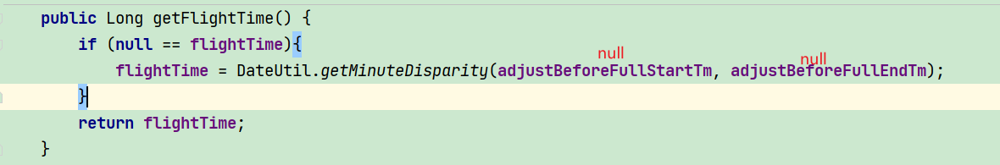

# Table of Contents


最后发现是get方法设置错误（桂华）



```java

	public static Long getMinuteDisparity(Date start, Date end) {
		long nm = 1000 * 60L;// 一分钟的毫秒数
		end.setSeconds(0);
		start.setSeconds(0);
		long diff = end.getTime() - start.getTime();
		return diff / nm;
	}
```


在toString的时候，获取相关属相的时候，空指针问题！！！

