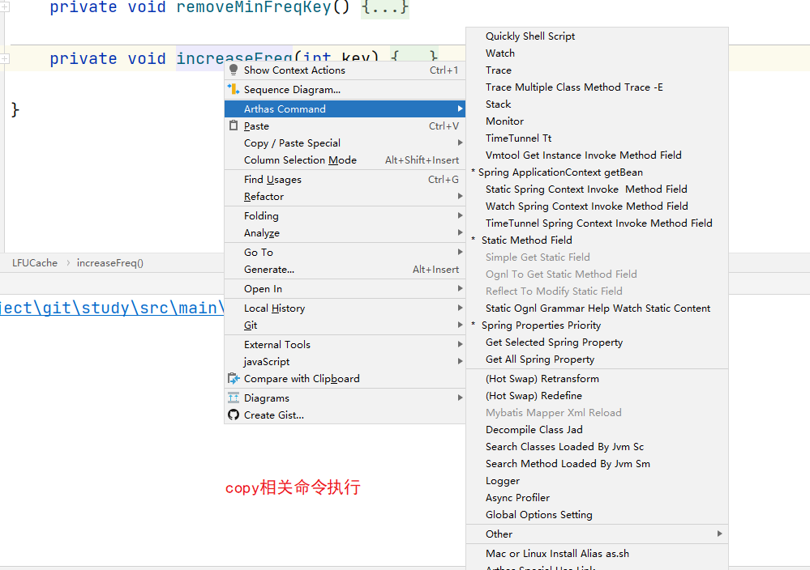

# Table of Contents

* [执行方式](#执行方式)
* [[watch](https://arthas.aliyun.com/doc/watch.html) - 方法执行数据观测](#watchhttpsarthasaliyuncomdocwatchhtml---方法执行数据观测)
* [[trace](https://arthas.aliyun.com/doc/trace.html) - 方法内部调用路径，并输出方法路径上的每个节点上耗时](#tracehttpsarthasaliyuncomdoctracehtml---方法内部调用路径并输出方法路径上的每个节点上耗时)
* [[jad](https://arthas.aliyun.com/doc/jad.html) - 反编译指定已加载类的源码](#jadhttpsarthasaliyuncomdocjadhtml---反编译指定已加载类的源码)
* [[stack](https://arthas.aliyun.com/doc/stack.html) - 输出当前方法被调用的调用路径](#stackhttpsarthasaliyuncomdocstackhtml---输出当前方法被调用的调用路径)
* [[ognl](https://arthas.aliyun.com/doc/ognl.html)](#ognlhttpsarthasaliyuncomdocognlhtml)
* [注意](#注意)


+ 官方地址:https://arthas.aliyun.com/doc/commands.html


# 执行方式

一般都是idea装一个arthas的插件，在直接copy命令执行。





# [watch](https://arthas.aliyun.com/doc/watch.html) - 方法执行数据观测

使用watch命令查看，方法的入参和出参，注意`X`找个参数可以看方法的展开程度。


#  [trace](https://arthas.aliyun.com/doc/trace.html) - 方法内部调用路径，并输出方法路径上的每个节点上耗时


# [jad](https://arthas.aliyun.com/doc/jad.html) - 反编译指定已加载类的源码
# [stack](https://arthas.aliyun.com/doc/stack.html) - 输出当前方法被调用的调用路径


# [ognl](https://arthas.aliyun.com/doc/ognl.html)

1. 调用静态属性

   

   ```java
   ognl '@全路径类目@静态属性名'
       
   ognl -x 3 '@com.qm.study.config.ThreadConfig@THREAD_POOL_SIZE'
   ```

   

2. 获取静态方法

   ```java
   ognl '@全路径类目@静态方法名("参数")'
       
   ognl -x 3 '@com.qm.study.config.ThreadConfig@getTest({参数})'
   ```

   

# 注意 

增强类记得要还原！！生产慎用。
