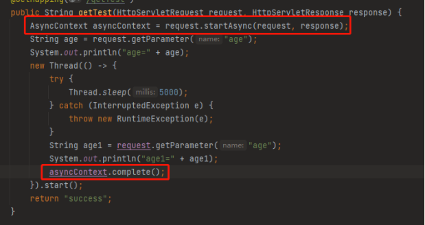
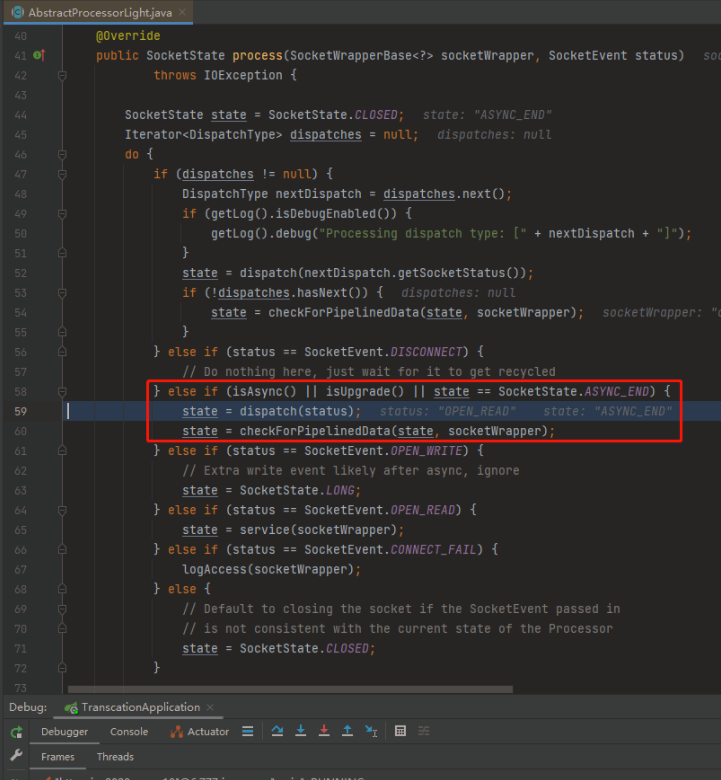

# Table of Contents

* [总结](#总结)

参考链接：https://mp.weixin.qq.com/s/mg1WnQ9MU6tcsNJcUD9Dow

# 总结

1. tomcat前提下，request线程会被回收。

2. 使用异步的时候，不能保证request线程是否会被回收。

3. 解决方案是：使用AsyncContext

   

4. 原理是：内部做了判断，对使用AsyncContext的线程暂时不回收。

