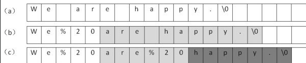

# Table of Contents

* [剑指4](#剑指4)
* [判断一个字符串是不是回文字符串](#判断一个字符串是不是回文字符串)
* [滑动窗口主题](#滑动窗口主题)
* [[5]最长回文子串](#5最长回文子串)


#  剑指4

题目：请实现一个函数，把字符串中的每个空格替换成"%20"。例如输入“We are happy.”，则输出“We%20are%20happy.”。


第一反应是使用`String`自带的`replace`,但是题目要求是**所有空格**

+ 方法一：时间复杂度O(n2)

  

  

我们替换第一个空格，这个字符串变成图（b）中的内容，表格中灰色背景的格子表示需要做移动的区域。接着我们替换第二个空格，替换之后的内容如图（c）所示。同时，我们注意到用深灰色背景标注的"happy"部分被移动了两次。


+ 使用快慢指针

这里有一点要注意的是，不是用新数组去承接，而是原数组扩容后，使用指针，然后使用尾插法。


1. 把第一个指针指向字符串的末尾，把第二个指针指向替换之后的字符串的末尾。
2. 依次复制字符串的内容，直至第一个指针碰到第一个空格。
3. 把第一个空格替换成'%20'，把第一个指针向前移动1格，把第二个指针向前移动3格。
4. 依次向前复制字符串中的字符，直至碰到空格。
5. 替换字符串中的倒数第二个空格，把第一个指针向前移动1格，把第二个指针向前移动3格。


# 判断一个字符串是不是回文字符串

```java
bool isPalindrome(string s) {
    int left = 0, right = s.length - 1;
    while (left < right) {
        if (s[left] != s[right])
            return false;
        left++; right--;
    }
    return true;
}
```


# 滑动窗口主题

[滑动窗口](../C.数据结构与算法/labuladong/滑动窗口.md)


#  [5]最长回文子串 

**回文串就是正着读和反着读都一样的字符串**。

**寻找回文串的问题核心思想是：从中间开始向两边扩散来判断回文串**。对于最长回文子串，就是这个意思：

但是边界问题要注意处理

1. 回文串是奇数  aba
2. 回文串是偶数 abba

```java
public String longestPalindrome(String s) {
    String res = "";

    for (int i = 0; i < s.length(); i++) {

        // 以 s[i] 为中心的最长回文子串
        String s1 = palindrome(s, i, i);
        // 以 s[i] 和 s[i+1] 为中心的最长回文子串
        String s2 = palindrome(s, i, i + 1);
        // res = longest(res, s1, s2)
        res = res.length() > s1.length() ? res : s1;
        res = res.length() > s2.length() ? res : s2;

    }
    return res;
}

private static String palindrome(String s, int l, int r) {
    //这里 s.charAt(l)== s.charAt(r) 当2边指针数据相等，才进行指针移动。
    while (l >=0  && r < s.length() && s.charAt(l)== s.charAt(r)) {
        l--;
        r++;
    }
    //特殊情况处理
    if(l+1>r-l-1){
        return "";
    }
    return s.substring(l + 1, r-l- 1);
}
```


https://zhuanlan.zhihu.com/p/107792552
