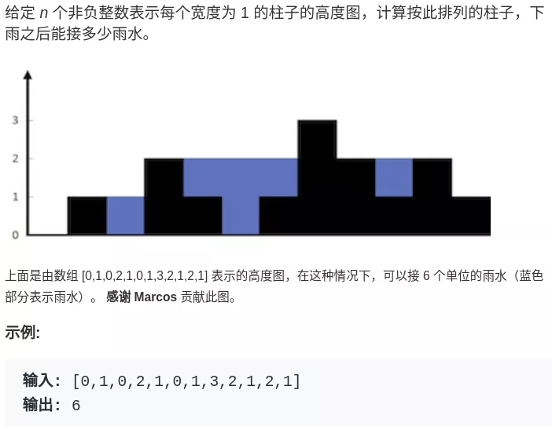

# Table of Contents

* [[1]两数之和](#1两数之和)
* [二分法](#二分法)
* [最小K个数/最大K个数](#最小k个数最大k个数)
* [[4]寻找两个正序数组的中位数](#4寻找两个正序数组的中位数)
* [[剑指 Offer 11]旋转数组的最小数字](#剑指-offer-11旋转数组的最小数字)
* [[15]三数之和](#15三数之和)
* [[16]最接近的三数之和](#16最接近的三数之和)
* [双指针技巧](#双指针技巧)
* [[977]有序数组的平方](#977有序数组的平方)
* [[209]长度最小的子数组](#209长度最小的子数组)
* [[54]螺旋矩阵](#54螺旋矩阵)
* [[59]螺旋矩阵II](#59螺旋矩阵ii)
* [[42]接雨水](#42接雨水)
* [[48] 旋转图像](#48-旋转图像)


#   [1]两数之和 

这个题解法有很多

1. 双重for循环
2. HashMap去做,时间复杂度O(n)
3. 使用双指针 前提是排好序--- 【难度主要在于是获取元素的下标而不是元素，**不建议用**】

```java
 public static int[] twoSum(int[] nums, int target) {

        int[] result = new int[2];

        LinkedHashMap<Integer, Integer> linkedHashMap = new LinkedHashMap<>();

        for (int i = 0; i <= nums.length - 1; i++) {

            int temp = target - nums[i];

            if(linkedHashMap.containsKey(temp)){
                result[0] = linkedHashMap.get(temp);
                result[1] = i;
                break;
            }
            linkedHashMap.put(nums[i],i);
        }

        return result;

    }
```


# 二分法

常规框架

```java
 * // int binarySearch(int[] nums, int target) {
 * //     int left = 0, right = ...;
 * //
 * //     while(...) {
 * //         int mid = left + (right - left) / 2;
 * //         if (nums[mid] == target) {
 * //         ...
 * //         } else if (nums[mid] < target) {
 * //             left = ...
 * //         } else if (nums[mid] > target) {
 * //             right = ...
 * //         }
 * //     }
 * //     return ...;
 * // }
```


大家写二分法经常写乱，主要是因为**对区间的定义没有想清楚，区间的定义就是不变量**。要在二分查找的过程中，保持不变量，就是在while寻找中每一次边界的处理都要坚持根据区间的定义来操作，这就是**循环不变量**规则。

写二分法，区间的定义一般为两种，左闭右闭即[left, right]，或者左闭右开即[left, right)。


```java
 public static int binarySearch(int[] arr, int target) {
        if (null == arr) {
            return -1;
        }
        int left = 0;
        int right = arr.length - 1;
        //确定搜索区间【0，length-1】 或者 【0，length)  注意开闭区间
        //确定终止条件，当left>right 时，循环结束。
        while (left <= right) {
            //  left + (right - left) / 2 等同于 (right+left)/2
            //是为了防止溢出
            int mid = left + (right - left) / 2;
            //下面要做的就是比较，‘缩小范围区间’，脑海中要有画面。
            if (arr[mid] == target) {
                return mid;
            } else if (arr[mid] < target) {
                //中位数都小于target 那么left是不是要右移
                left = mid + 1;
            } else if (arr[mid] > target) {
                //中位数都小于target 那么 right 是不是要左移等于中位数
                right = mid-1;
            }
        }
        return left;
    }

```

```java
 public static int binarySearch(int[] arr, int target) {
        if (null == arr) {
            return -1;
        }
        int left = 0;
        int right = arr.length - 1;
        //确定搜索区间【0，length-1】 或者 【0，length)  注意开闭区间
        //确定终止条件，当left>right 时，循环结束。
        while (left < right) {
            //  left + (right - left) / 2 等同于 (right+left)/2
            //是为了防止溢出
            int mid = left + (right - left) / 2;
            //下面要做的就是比较，‘缩小范围区间’，脑海中要有画面。
            if (arr[mid] == target) {
                return mid;
            } else if (arr[mid] < target) {
                //中位数都小于target 那么left是不是要右移
                left = mid + 1;
            } else if (arr[mid] > target) {
                //中位数都小于target 那么 right 是不是要左移等于中位数
                right = mid;
            }
        }
        return left;
    }

```


注意区间不同导致的只是**right的位置偏移。**


+ 左闭右闭即[left, right]， right = mid-1,这个其实你写mid也没问题的。但是数据足够多，会多一些查询。

+ 左闭右开即[left, right)。 right = mid


# 最小K个数/最大K个数

本题目的思想，本质**就是先排序**，在取K个数。

1. 正常排序

   ```java
   //底层也是做了很多改进
   Arrays.sort(arr);
   int[] ans = new int[k];
   for (int i = 0; i < k; i++) ans[i] = arr[i];
   return ans;
   ```

2. 使用堆排序

   ```java
   //最小堆
   PriorityQueue<Integer> priorityQueue = new PriorityQueue<>((a, b) -> a - b);
   //最大堆
   PriorityQueue<Integer> priorityQueue = new PriorityQueue<>((a, b) -> b - a);
   ```

3. 使用快排

   ```java
   qucikSort(arr,0,arr.length-1)
   ```


# [4]寻找两个正序数组的中位数
中位数是按顺序排列的一组数据中居于中间位置的数


> 奇数：(size/2)+1
>
> 偶数：(size/2)+1和(size/2)的一半


+ 第一种就是直接合并，然后求中位数，但是**时间复杂度不匹配**。

1,先看num1的中位数 和num2的中位数
2.比较2个中位数 依次舍弃部分数据
3.最后求剩下数的中位数

https://zhuanlan.zhihu.com/p/115919224


# [剑指 Offer 11]旋转数组的最小数字 

这题我做的时候，很开心，一次就写出来。

**运用了双指针的思想，进行对比，求出转折点，即最小数字。**

```java
 public int minArray(int[] num) {
        int length = num.length;
        if (1 == length) {
            return num[0];
        }
        int left = 0;
        int right = length - 1;
        while (left < right) {
            if (num[left] > num[right]) {
                left++;
            } else{
                right--;
            }
        }
        return num[left];
    }
```

后来看了其他人的解法，发现我比较的次数多了，可以取$$n/2$$

```java
   int length = num.length;
        if (1 == length) {
            return num[0];
        }
        int left = 0;
        int right = length - 1;
        while (left < right) {
            //主要是这里进行了二分 可以减少比较次数。
            int medium = (left + right) / 2;
            if (num[medium] < num[right]) {
                right = medium;
            } else  {
                left = medium + 1;
            }
        }
        return num[left];
```


# [15]三数之和

这题思路对了，就是在去重的问题上了。

```java
if (nums[i] > 0) {
    return result;
}
// i去重
if(i > 0 && nums[i] == nums[i - 1]){
    continue;
}
// left right 去重
while (left + 1 < right && nums[left] == nums[left + 1]) left++;//[1]
while (left < right - 1 && nums[right] == nums[right - 1]) right--;//[2]

```


```java
public static List<List<Integer>> threeSum(int[] nums) {

        List<List<Integer>> result = new ArrayList<>();
        if (null == nums||nums.length < 3) {
            return result;
        }
        Arrays.sort(nums);
        for (int i = 0; i <= nums.length - 1; i++) {
            if (nums[i] > 0) {
                return result;
            }
            if(i > 0 && nums[i] == nums[i - 1]){
                continue;
            }
            int left = i + 1;
            int right = nums.length - 1;

            while (left < right) {
                int sum = nums[left] + nums[right] + nums[i];
                if (sum < 0) {
                    left++;
                } else if (sum > 0) {
                    right--;
                } else  {
                    result.add(new ArrayList<Integer>(Arrays.asList(nums[left], nums[right], nums[i])));
                    while (left + 1 < right && nums[left] == nums[left + 1]) left++;//[1]
                    while (left < right - 1 && nums[right] == nums[right - 1]) right--;//[2]
                    left++;
                    right--;
                }
            }

        }
        return result;
    }
```


# [16]最接近的三数之和

注释的这2个地方最容易忽视。

```java
public int threeSumClosest(int[] nums, int target) {
    if (null == nums || nums.length < 3) {
        return 0;
    }
    Arrays.sort(nums);
    //这里要给一个初始值 
    int result = nums[0] + nums[1] + nums[2];
    for (int i = 0; i <= nums.length - 1; i++) {
        if (result == target) {
            break;
        }
        int left = i + 1;
        int right = nums.length - 1;

        while (left < right) {
            int sum = nums[left] + nums[right] + nums[i];
			//这里要考虑复数的情况
            if (Math.abs(sum - target) < Math.abs(result - target)){
                result = sum;
            }
            if (sum < target) {
                left++;
            } else if (sum > target) {
                right--;
            } else {
                result = target;
                left++;
                right--;
            }
        }
    }
    return result;
}
```


# 双指针技巧


其实就是用fast去探路,如果有重复的就跳过去,不重复的赋值给slow

[如何高效对有序数组或链表去重](../C.数据结构与算法/labuladong/如何高效对有序数组或链表去重.md)

[数组双指针直接秒杀七道题目](../C.数据结构与算法/labuladong/数组双指针直接秒杀七道题目.md)


#  [977]有序数组的平方


数组其实是有序的， 只不过负数平方之后可能成为最大数了。

那么数组平方的最大值就在数组的两端，不是最左边就是最右边，不可能是中间。


```java
 public int[] sortedSquares(int[] nums) {

        int[] res = new int[nums.length];
        int k = nums.length - 1;

        int left = 0;
        int right = nums.length - 1;

        while (left<=right){
            if (nums[left] * nums[left] < nums[right] * nums[right]) {
                res[k--] = nums[right] * nums[right];
                right--;
            } else {
                res[k--] = nums[left] * nums[left];
                left++;
            }
        }
        return res;
    }
```


#     [209]长度最小的子数组 


这里要解决的一个问题是，找到了对应的窗口，怎么判断窗口的子窗口也是大于或者小于目标值

可以发现**滑动窗口的精妙之处在于根据当前子序列和大小的情况，不断调节子序列的起始位置。从而将O(n^2)的暴力解法降为O(n)。**

```java
public int minSubArrayLen(int target, int[] nums) {
        if (nums == null) {
            return 0;
        }
        //当前窗口长度
        int length = 0;
        //窗口左边
        int left = 0;
        //窗口右边
        int right = 0;
        int sum = 0;
        int result = Integer.MAX_VALUE;
        while (right <= nums.length - 1) {

            sum = sum + nums[right];
            // 注意这里使用while，每次更新 i（起始位置），并不断比较子序列是否符合条件
            while (sum >= target) {
                length = right - left + 1;// 取子序列的长度
                result = Math.min(result, length);
                sum = sum - nums[left++];
            }
            right++;
        }
        return result ==  Integer.MAX_VALUE ? 0 : result;
    }
```


# [54]螺旋矩阵

有两种解决办法：

第一种，顺着矩阵的四个边界旋转即可，重点是找准四个边界角的坐标值，该坐标值应该随着每一次的 for 循环而自动改变，直到无法进行 for 循环

第二种，把整个矩阵分成一层一层的，然后从外层往内层逐层遍历


```
public List<Integer> spiralOrder(int[][] matrix) {

    List<Integer> result = new ArrayList();

    if (null == matrix) {
        return result;
    }
    int top = 0;
    int bottom = matrix.length - 1;
    int left = 0;
    int right = matrix[0].length - 1;

    while (true) {

        //从左到右
        for (int i = left; i <= right; i++) {
            result.add(matrix[top][i]);
        }
        top++;
        if (left > right || top > bottom) {
            break;
        }
        //从上到下
        for (int i = top; i <= bottom; i++) {
            result.add(matrix[i][right]);
        }
        right--;
        if (left > right || top > bottom) {
            break;
        }

        //从右到左
        for (int i = right; left <= i; i--) {
            result.add(matrix[bottom][i]);
        }
        bottom--;
        if (left > right || top > bottom) {
            break;
        }

        //从下到上

        for (int i = bottom; top <= i; i--) {
            result.add(matrix[i][left]);
        }
        left++;
        if (left > right || top > bottom) {
            break;
        }
    }

    return result;

}
```


# [59]螺旋矩阵II

而求解本题依然是要坚持循环不变量原则。

模拟顺时针画矩阵的过程:

- 填充上行从左到右
- 填充右列从上到下
- 填充下行从右到左
- 填充左列从下到上

**由外向内一圈一圈这么画下去。** 需要处理最后一个 处于中间的数

可以发现这里的边界条件非常多，在一个循环中，如此多的边界条件，如果不按照固定规则来遍历，那就是**一进循环深似海，从此offer是路人**。


这里每一种颜色，代表一条边，我们遍历的长度，可以看出每一个拐角处的处理规则，**拐角处**让给新的一条边来继续画。

```java
    public int[][] generateMatrix(int n) {
        int[][] res = new int[n][n];
        // 循环次数 这个需要搞清楚 为什么是
        int loop = n / 2;
        // 定义每次循环起始位置
        int startX = 0;
        int startY = 0;
        // 定义偏移量
        int offset = 1;
        // 定义填充数字
        int count = 1;

        // 定义中间位置
        int mid = n / 2;
        while (loop > 0) {
            int i = startX;
            int j = startY;

            // 模拟上侧从左到右
            for (; j<startY + n -offset; ++j) {
                res[startX][j] = count++;
            }

            // 模拟右侧从上到下
            for (; i<startX + n -offset; ++i) {
                res[i][j] = count++;
            }

            // 模拟下侧从右到左
            for (; j > startY; j--) {
                res[i][j] = count++;
            }

            // 模拟左侧从下到上
            for (; i > startX; i--) {
                res[i][j] = count++;
            }

            loop--;
            //一圈已经画完
            startX += 1;
            startY += 1;

            offset += 2;
        }

        if (n % 2 == 1) {
            res[mid][mid] = count;
        }

        return res;
    }
```


# [42]接雨水

https://mp.weixin.qq.com/s/8E2WHPdArs3KwSwaxFunHw





就是用一个数组表示一个条形图，问你这个条形图最多能接多少水。

```java
int trap(int[] height);
```


**这么一想，可以发现这道题的思路其实很简单。具体来说，仅仅对于位置`i`，能装下多少水呢？**

```java
water[i] = min(
               # 左边最高的柱子
               max(height[0..i]),  
               # 右边最高的柱子
               max(height[i..end]) 
            ) - height[i]
```


```java
int trap(int[] height) {
    int left = 0, right = height.length - 1;
    int l_max = 0, r_max = 0;

    int res = 0;
    while (left < right) {
        l_max = Math.max(l_max, height[left]);
        r_max = Math.max(r_max, height[right]);

        //主要是 这句代码  怎么转化下面的判断代码呢？
        // res += min(l_max, r_max) - height[i]
        if (l_max < r_max) {
            res += l_max - height[left];
            left++;
        } else {
            res += r_max - height[right];
            right--;
        }
    }
    return res;
}
```


```java
res += Math.min(l_max[i], r_max[i]) - height[i];
```

其实这个问题要这么思考，我们只在乎`min(l_max, r_max)`。**对于上图的情况，我们已经知道`l_max < r_max`了，至于这个`r_max`是不是右边最大的，不重要。重要的是`height[i]`能够装的水只和较低的`l_max`之差有关**：


# [48] 旋转图像


主要换一下思路，先折叠，在反转。

```java
 public void rotate(int[][] matrix) {


        //对角线折叠
        for (int i = 0; i <= matrix.length - 1; i++) {

            for (int j = i; j <= matrix.length - 1; j++) {

                int temp = matrix[i][j];
                matrix[i][j] = matrix[j][i];
                matrix[j][i] = temp;
            }
        }
        //行 反转

        for (int[] ints : matrix) {

            int i = 0;
            int j = ints.length - 1;

            while (i < j) {

                int temp = ints[i];
                ints[i] = ints[j];
                ints[j] = temp;
                i++;
                j--;
            }
        }

    }
```

https://mp.weixin.qq.com/s/8jkzRKLNT-6CnEkvHp0ztA
