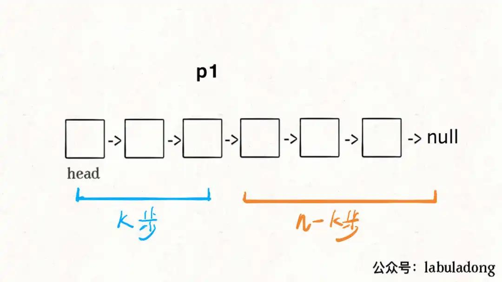
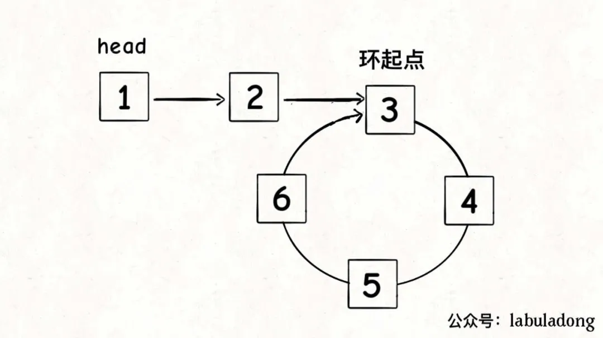

# Table of Contents

* [[203]移除链表元素](#203移除链表元素)
* [[21]合并两个有序链表](#21合并两个有序链表)
* [[23]合并K个升序链表](#23合并k个升序链表)
* [[剑指 Offer 22]链表中倒数第k个节点](#剑指-offer-22链表中倒数第k个节点)
* [[19]删除链表的倒数第 N 个结点](#19删除链表的倒数第-n-个结点)
* [[876]单链表的中点](#876单链表的中点)
* [[141]环形链表](#141环形链表)
* [[142]环形链表 II](#142环形链表-ii)
* [[160]相交链表](#160相交链表)
* [[24]两两交换链表中的节点](#24两两交换链表中的节点)
* [[206]反转链表](#206反转链表)


# [203]移除链表元素


技巧：定义一个虚拟头节点，这样就不用担心 头节点删除的问题。


```java
public ListNode removeElements(ListNode head, int val) {

        if (null == head) {
            return null;
        }
        ListNode dummy = new ListNode(-1);
        dummy.next = head;
        ListNode p = dummy;
        while (p.next != null) {
            if (val == p.next.val) {
                p.next = p.next.next;
            } else {
                p = p.next;
            }
        }
        return dummy.next;
    }
```


#  [21]合并两个有序链表 


> 合并两个数组（包括字符串）时，如果从前往后复制每个数字（或字符）需要重复移动数字（或字符）多次，那么我们可以考虑从后往前复制，这样就能减少移动的次数，从而提高效率

```java
 //1.oneNode 定义一个临时变量 twoNode定义一个临时变量
    //2.定义一个新单链表 以及临时变量
    //3.比较 oneNode 和twoNode 放入新链表
    //4.处理oneNode和twoNode 末尾某个链表为空的情况
    public SingleLinkList merge(Node headOne, Node headTwo) {

        Node currentOne = headOne.next;
        Node currentTwo = headTwo.next;
        if (null == currentOne) {
            return new SingleLinkList(headTwo);
        }
        if (null == currentTwo) {
            return new SingleLinkList(headOne);
        }
    
        Node node = new Node("1");
        Node temp = node;
    
        while (currentOne != null && currentTwo != null) {
            if(currentOne.order<currentTwo.order){
                temp.next= currentOne;
                temp = temp.next;
                currentOne =  currentOne.next;
    
            }else {
                temp.next= currentTwo;
                temp = temp.next;
                currentTwo =  currentTwo.next;
            }
        }
    
        if (currentOne == null) {
            while (currentTwo != null) {
                temp.next = new Node(currentTwo.order, currentTwo.name);
                temp = temp.next;
                currentTwo = currentTwo.next;
            }
        } else {
            while (currentOne != null) {
                temp.next = new Node(currentOne.order, currentOne.name);
                temp = temp.next;
                currentOne = currentOne.next;
            }
        }
    
        return new SingleLinkList(node);
    }
```


#    [23]合并K个升序链表 

这里要用到【堆排序-最小堆】，把链表节点放入一个最小堆，就可以每次获得`k`个节点中的最小节点：

```java
ListNode mergeKLists(ListNode[] lists) {
    if (lists.length == 0) return null;
    // 虚拟头结点
    ListNode dummy = new ListNode(-1);
    ListNode p = dummy;
    // 优先级队列，最小堆
    PriorityQueue<ListNode> pq = new PriorityQueue<>(
        lists.length, (a, b)->(a.val - b.val));
    // 将 k 个链表的头结点加入最小堆
    for (ListNode head : lists) {
        if (head != null)
            pq.add(head);
    }

    while (!pq.isEmpty()) {
        // 获取最小节点，接到结果链表中
        ListNode node = pq.poll();
        p.next = node;
        if (node.next != null) {
            pq.add(node.next);
        }
        // p 指针不断前进
        p = p.next;
    }
    return dummy.next;
}
```

优先队列`pq`中的元素个数最多是`k`，所以一次`poll`或者`add`方法的时间复杂度是`O(logk)`；所有的链表节点都会被加入和弹出`pq`，**所以算法整体的时间复杂度是O(Nlogk)，其中k是链表的条数，N是这些链表的节点总数**。


# [剑指 Offer 22]链表中倒数第k个节点 


这个题，第一反应，是求出当前链表的长度`n`,那么需要第二次遍历得到`n-k`,能不能遍历一次呢？

可以做到的，如果是面试问到这道题，面试官肯定也是希望你给出只需遍历一次链表的解法。

这个解法就比较巧妙了，假设`k = 2`，思路如下：

首先，我们先让一个指针`p1`指向链表的头节点`head`，然后走`k`步：



现在的`p1`，只要再走`n - k`步，就能走到链表末尾的空指针了对吧？

趁这个时候，再用一个指针`p2`指向链表头节点`head`：


接下来就很显然了，让`p1`和`p2`同时向前走，`p1`走到链表末尾的空指针时走了`n - k`步，`p2`也走了`n - k`步，也就恰好到达了链表的倒数第`k`个节点：

这样，只遍历了一次链表，就获得了倒数第`k`个节点`p2`。

```java
 public ListNode getKthFromEnd(ListNode head, int k) {
        if (null == head) {
            return null;
        }
        ListNode p1 = head;
        while (p1.val <= k && null != p1.next) {
            p1 = p1.next;
        }
        ListNode p2 = head;
        while (null != p1.next) {
            p1 = p1.next;
            p2 = p2.next;
        }
        return p2;
    }
```


# [19]删除链表的倒数第 N 个结点 

其实就是获取倒数第K个节点 ，然后删除。

要注意2个点

1. 删除链表，是找到上一个元素。
2. 可能会有为空的情况，需要一个虚拟头节点。

```java
public ListNode removeNthFromEnd(ListNode head, int n) {
    // 虚拟头节点
    ListNode dummy = new ListNode(-1);
    dummy.next = head;
    // 删除倒数第 n 个，要先找倒数第 n + 1 个节点
    ListNode x = findFromEnd(dummy, n + 1);
    // 删掉倒数第 n 个节点
    x.next = x.next.next;
    return dummy.next;
}
```

# [876]单链表的中点 


```java
ListNode middleNode(ListNode head) {
    // 快慢指针初始化指向 head
    ListNode slow = head, fast = head;
    // 快指针走到末尾时停止
    while (fast != null && fast.next != null) {
        // 慢指针走一步，快指针走两步
        slow = slow.next;
        fast = fast.next.next;
    }
    // 慢指针指向中点
    return slow;
}
```


# [141]环形链表

使用快慢指针,快指针跑得快,在环形链表上肯定可以追得上慢指针.

```java
boolean hasCycle(ListNode head) {
    // 快慢指针初始化指向 head
    ListNode slow = head, fast = head;
    // 快指针走到末尾时停止
    while (fast != null && fast.next != null) {
        // 慢指针走一步，快指针走两步
        slow = slow.next;
        fast = fast.next.next;
        // 快慢指针相遇，说明含有环
        if (slow == fast) {
            return true;
        }
    }
    // 不包含环
    return false;
}
```


#  [142]环形链表 II

这个题，要明确2个概念，【环形链表】和【链表有环】

还是要用快慢指针去做。




以下是推导过程。

1. 假设在4点为快慢指针相遇位置。

2. 那么 【1-4】`slow`=k, `fast`=2k

3. 假设【3-4】为m,head头节点距离起点为【k-m】

4. **重点来了，从4走到3需要多少？**  其实就是从**k走到2k-m**需要多久？【2k-k-m】=[k-m]

   > 并且相差1才能保证不绕到后面后又跳过了他  步长为1

5. 只要我们把快慢指针中的任一个重新指向`head`，然后两个指针同速前进，`k - m`步后一定会相遇，相遇之处就是环的起点了。


```java
ListNode detectCycle(ListNode head) {
    ListNode fast, slow;
    fast = slow = head;
    while (fast != null && fast.next != null) {
        fast = fast.next.next;
        slow = slow.next;
        if (fast == slow) break;
    }
    // 上面的代码类似 hasCycle 函数
    if (fast == null || fast.next == null) {
        // fast 遇到空指针说明没有环
        return null;
    }

    // 重新指向头结点
    slow = head;
    // 快慢指针同步前进，相交点就是环起点
    while (slow != fast) {
        fast = fast.next;
        slow = slow.next;
    }
    return slow;
}
```


# [160]相交链表


如果用两个指针 `p1` 和 `p2` 分别在两条链表上前进，并不能**同时**走到公共节点，也就无法得到相交节点 `c1`。

**所以，解决这个问题的关键是，通过某些方式，让 `p1` 和 `p2` 能够同时到达相交节点 `c1`**。

所以，我们可以让 `p1` 遍历完链表 `A` 之后开始遍历链表 `B`，让 `p2` 遍历完链表 `B` 之后开始遍历链表 `A`，这样相当于「逻辑上」两条链表接在了一起。


```java
public ListNode getIntersectionNode(ListNode headA, ListNode headB) {

        if (null == headA || null == headB) {
            return null;
        }

        ListNode p1 = headA;
        ListNode p2 = headB;

        while (p1 != p2) {
            if (p1 == null) {
                p1 = headB;
            } else {
                p1 = p1.next;
            }
            if (p2 == null) {
                p2 = headA;
            } else {
                p2 = p2.next;
            }

        }
        return p1;
    }
```


# [24]两两交换链表中的节点


这个题有点绕

1. 首先要用虚拟头节点来解决这个问题
2. 画图 


```java
  public static ListNode swapPairs(ListNode head) {

        if (null == head) {
            return null;
        }
        if (null == head.next) {
            return head;
        }

        ListNode dummy = new ListNode(0);
        dummy.next = head;

        ListNode temp = dummy;

        if (temp.next != null && temp.next.next != null) {
            //当前节点
            ListNode cur = temp.next;
            //下一个节点
            ListNode next = temp.next.next;

            //头节点的下一个是 next
            temp.next = next;
            //当前节点 的next指向  下一个节点的 下一个节点
            cur.next = next.next;
            //下一个节点 指向当前 节点
            next.next = cur;
			// 指针走到 下一个节点 依次循环
            temp = cur;
        }
        return dummy.next;
    }
```


#  [206]反转链表

如果再定义一个新的链表，实现链表元素的反转，其实这是对内存空间的浪费。

其实只需要改变链表的next指针的指向，直接将链表反转 ，而不用重新定义一个新的链表，如图所示:


之前链表的头节点是元素1， 反转之后头结点就是元素5 ，这里并没有添加或者删除节点，仅仅是改变next指针的方向。

那么接下来看一看是如何反转的呢？

我们拿有示例中的链表来举例，如动画所示：


**首先定义三个节点？为什么要三个呢？**

首先定义一个cur指针，指向头结点，再定义一个pre指针，初始化为null。

然后就要开始反转了，首先要把 cur->next 节点用tmp指针保存一下，也就是保存一下这个节点。

为什么要保存一下这个节点呢，因为接下来要改变 cur->next 的指向了，将cur->next 指向pre ，此时已经反转了第一个节点了。

接下来，就是循环走如下代码逻辑了，继续移动pre和cur指针。

最后，cur 指针已经指向了null，循环结束，链表也反转完毕了。 此时我们return pre指针就可以了，pre指针就指向了新的头结点。


常见的有三种解法。我觉得双指针的好理解下。


+ 双指针

  ```java
  // 双指针
  class Solution {
      public ListNode reverseList(ListNode head) {
          ListNode prev = null;
          ListNode cur = head;
          ListNode temp = null;
          while (cur != null) {
              temp = cur.next;// 保存下一个节点
              cur.next = prev;//当前节点next反转
              prev = cur;// 前移
              cur = temp;// 前移
          }
          return prev;
      }
  }
  ```

  

+ 递归1

  ```jva
  // 递归 
  class Solution {
      public ListNode reverseList(ListNode head) {
          return reverse(null, head);
      }
  
      private ListNode reverse(ListNode prev, ListNode cur) {
          if (cur == null) {
              return prev;
          }
          ListNode temp = null;
          temp = cur.next;// 先保存下一个节点
          cur.next = prev;// 反转
          // 更新prev、cur位置
          // prev = cur;
          // cur = temp;
          return reverse(cur, temp);
      }
  }
  ```

  

+ 递归2

  ```java
  // 从后向前递归
  class Solution {
      ListNode reverseList(ListNode head) {
          // 边缘条件判断
          if(head == null) return null;
          if (head.next == null) return head;
          
          // 递归调用，翻转第二个节点开始往后的链表
          ListNode last = reverseList(head.next);
          // 翻转头节点与第二个节点的指向
          head.next.next = head;
          // 此时的 head 节点为尾节点，next 需要指向 NULL
          head.next = null;
          return last;
      } 
  }
  ```

  
