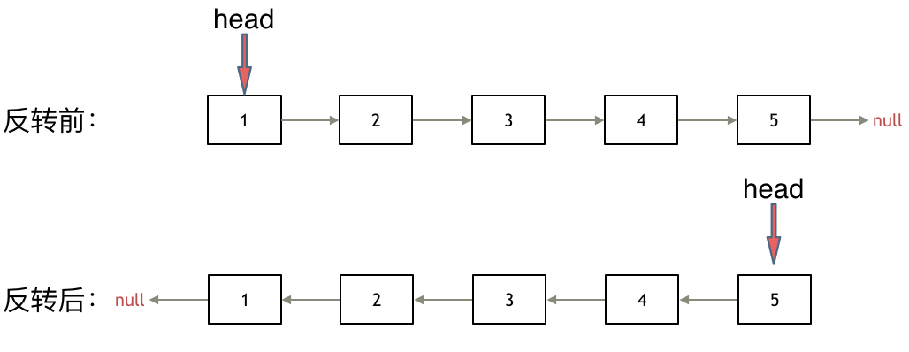
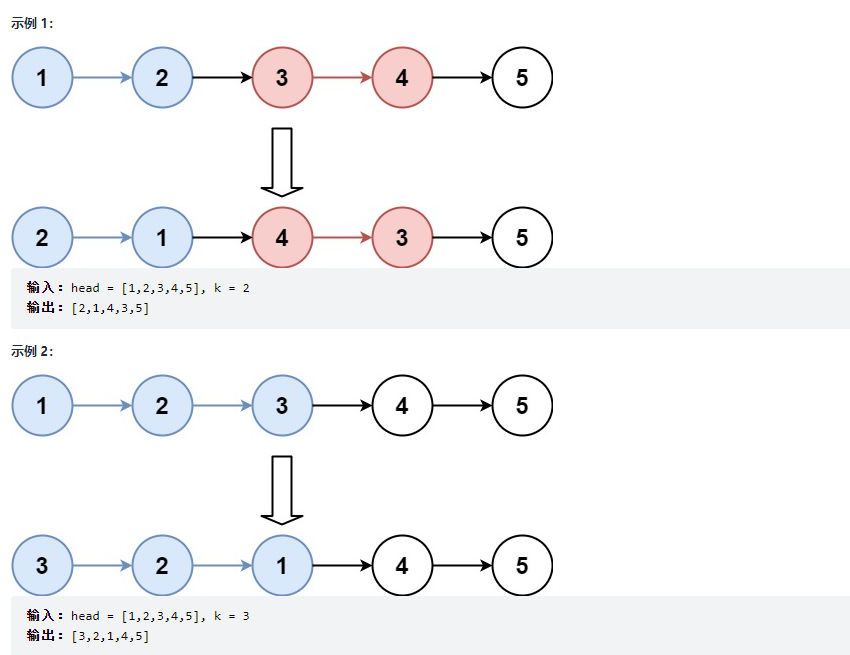

# Table of Contents

* [其他题目](#其他题目)
* [[160]相交链表](#160相交链表)
* [[24]两两交换链表中的节点](#24两两交换链表中的节点)
* [[206]反转链表](#206反转链表)
* [[25] K个一组翻转链表](#25-k个一组翻转链表)
* [[234]回文链表](#234回文链表)


# 其他题目

[单链表的六大解题套路](../C.数据结构与算法/labuladong/单链表的六大解题套路.md)

# [160]相交链表


如果用两个指针 `p1` 和 `p2` 分别在两条链表上前进，并不能**同时**走到公共节点，也就无法得到相交节点 `c1`。

**所以，解决这个问题的关键是，通过某些方式，让 `p1` 和 `p2` 能够同时到达相交节点 `c1`**。

所以，我们可以让 `p1` 遍历完链表 `A` 之后开始遍历链表 `B`，让 `p2` 遍历完链表 `B` 之后开始遍历链表 `A`，这样相当于「逻辑上」两条链表接在了一起。


```java
public ListNode getIntersectionNode(ListNode headA, ListNode headB) {

        if (null == headA || null == headB) {
            return null;
        }

        ListNode p1 = headA;
        ListNode p2 = headB;

        while (p1 != p2) {
            if (p1 == null) {
                p1 = headB;
            } else {
                p1 = p1.next;
            }
            if (p2 == null) {
                p2 = headA;
            } else {
                p2 = p2.next;
            }

        }
        return p1;
    }
```


# [24]两两交换链表中的节点


这个题有点绕

1. 首先要用虚拟头节点来解决这个问题
2. 画图 


```java
  public static ListNode swapPairs(ListNode head) {

        if (null == head) {
            return null;
        }
        if (null == head.next) {
            return head;
        }

        ListNode dummy = new ListNode(0);
        dummy.next = head;

        ListNode temp = dummy;

        if (temp.next != null && temp.next.next != null) {
            //当前节点
            ListNode cur = temp.next;
            //下一个节点
            ListNode next = temp.next.next;

            //头节点的下一个是 next
            temp.next = next;
            //当前节点 的next指向  下一个节点的 下一个节点
            cur.next = next.next;
            //下一个节点 指向当前 节点
            next.next = cur;
			// 指针走到 下一个节点 依次循环
            temp = cur;
        }
        return dummy.next;
    }
```


#  [206]反转链表

[https://leetcode-cn.com/problems/reverse-linked-list/](https://leetcode-cn.com/problems/reverse-linked-list/)


如果再定义一个新的链表，实现链表元素的反转，其实这是对内存空间的浪费。

其实只需要改变链表的next指针的指向，直接将链表反转 ，而不用重新定义一个新的链表，如图所示:




之前链表的头节点是元素1， 反转之后头结点就是元素5 ，这里并没有添加或者删除节点，仅仅是改变next指针的方向。

那么接下来看一看是如何反转的呢？

我们拿有示例中的链表来举例，如动画所示：


**首先定义三个节点？为什么要三个呢？**

首先定义一个cur指针，指向头结点，再定义一个pre指针，初始化为null。

然后就要开始反转了，首先要把 cur->next 节点用tmp指针保存一下，也就是保存一下这个节点。

为什么要保存一下这个节点呢，因为接下来要改变 cur->next 的指向了，将cur->next 指向pre ，此时已经反转了第一个节点了。

接下来，就是循环走如下代码逻辑了，继续移动pre和cur指针。

最后，cur 指针已经指向了null，循环结束，链表也反转完毕了。 此时我们return pre指针就可以了，pre指针就指向了新的头结点。


常见的有三种解法。我觉得双指针的好理解下。


+ 双指针

  ```java
  // 双指针
  class Solution {
      public ListNode reverseList(ListNode head) {
          ListNode prev = null;
          ListNode cur = head;
          ListNode temp = null;
          while (cur != null) {
              temp = cur.next;// 保存下一个节点
              cur.next = prev;//当前节点next反转
              prev = cur;// 前移
              cur = temp;// 前移
          }
          return prev;
      }
  }
  ```

  

+ 递归1

  ```jva
  // 递归 
  class Solution {
      public ListNode reverseList(ListNode head) {
          return reverse(null, head);
      }
  
      private ListNode reverse(ListNode prev, ListNode cur) {
          if (cur == null) {
              return prev;
          }
          ListNode temp = null;
          temp = cur.next;// 先保存下一个节点
          cur.next = prev;// 反转
          // 更新prev、cur位置
          // prev = cur;
          // cur = temp;
          return reverse(cur, temp);
      }
  }
  ```

  

+ 递归2

  ```java
  // 从后向前递归
  class Solution {
      ListNode reverseList(ListNode head) {
          // 边缘条件判断
          if(head == null) return null;
          if (head.next == null) return head;
          
          // 递归调用，翻转第二个节点开始往后的链表
          ListNode last = reverseList(head.next);
          // 翻转头节点与第二个节点的指向
          head.next.next = head;
          // 此时的 head 节点为尾节点，next 需要指向 NULL
          head.next = null;
          return last;
      } 
  }
  ```


# [25] K个一组翻转链表

[https://leetcode-cn.com/problems/reverse-nodes-in-k-group/](https://leetcode-cn.com/problems/reverse-nodes-in-k-group/)

[参考资料](https://mp.weixin.qq.com/s/A-dQ9spsP_Iu1Y4iCRP9nA)

首先你要会翻转链表





我们应该先按照K个节点去翻转链表,然后在串起来

我们以 1->2->3->4->5来分析代码。


「反转以 `a` 为头结点的链表」其实就是「反转 `a` 到 null 之间的结点」，那么如果让你「反转 `a` 到 `b` 之间的结点」，你会不会？

只要更改函数签名，并把上面的代码中 `null` 改成 `b` 即可：


```java
/** 反转区间 [a, b) 的元素，注意是左闭右开 */
ListNode reverse(ListNode a, ListNode b) {
    ListNode pre, cur, nxt;
    pre = null; cur = a; nxt = a;
    // while 终止的条件改一下就行了
    while (cur != b) {
        nxt = cur.next;
        cur.next = pre;
        pre = cur;
        cur = nxt;
    }
    // 返回反转后的头结点
    return pre;
}
```


```java
ListNode reverseKGroup(ListNode head, int k) {
    if (head == null) return null;
    // 区间 [a, b) 包含 k 个待反转元素
    ListNode a, b;
    a = b = head;
    for (int i = 0; i < k; i++) {
        // 不足 k 个，不需要反转，base case
        //如果是12345 k=3  45是不用翻转的
        if (b == null) return head;
        b = b.next;
    }
    // 反转前 k 个元素
    ListNode newHead = reverse(a, b);
    // 递归反转后续链表并连接起来
    //这里的a对于 12345来说就是1 因为123 翻转为了321 所以需要用1来连接后面翻转的元素
    a.next = reverseKGroup(b, k);
    return newHead;
}

```


# [234]回文链表

[234. 回文链表 - 力扣（LeetCode） (leetcode-cn.com)](https://leetcode-cn.com/problems/palindrome-linked-list/)


+ 这个可以将原链表翻转，在比较。
+ 找到链表的重点，反转前面或者后面，在比较


1. 找链表中点，分为奇数和偶数的情况

   ```java
   ListNode slow = head;
   ListNode fast = head;
   
   while (fast!=null&&fast.next!=null){
       slow = slow.next;
       fast = fast.next.next;
   }
   ```

2. 反转链表,**这里要注意引用转递**

   ```java
   public ListNode reverseList(ListNode head) {
           ListNode prev = new ListNode(-1);
           prev = prev.next;
   
           ListNode cur = head;
           ListNode temp = null;
           while (cur != null) {
               temp = cur.next;// 保存下一个节点
               cur.next = prev;//当前节点next反转
               prev = cur;// 前移
               cur = temp;// 前移
           }
           return prev;
       }
   ```

   

3. 进行比较

```java

  //头部到中点
  ListNode left = head;
//尾部到中点
  ListNode right = reverseList(slow);
  while (left != null && right != null) {
            if (left.val != right.val) {
                return false;
            }
            // 后移，继续遍历比较
            left = left.next;
            right = right.next;
        }
```

