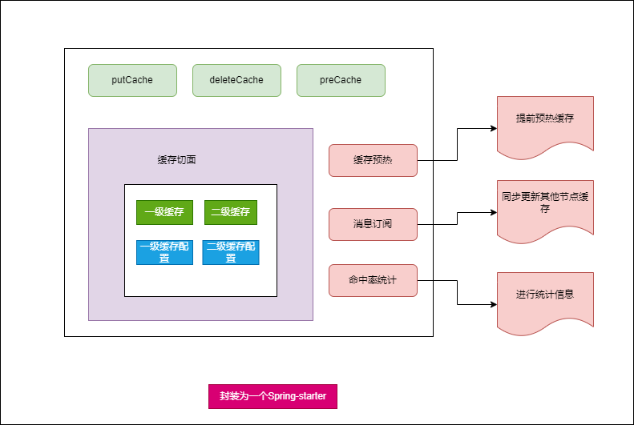
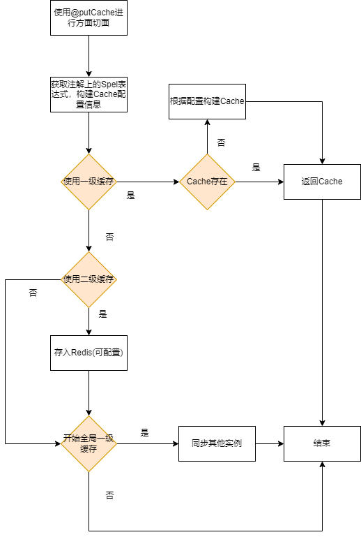
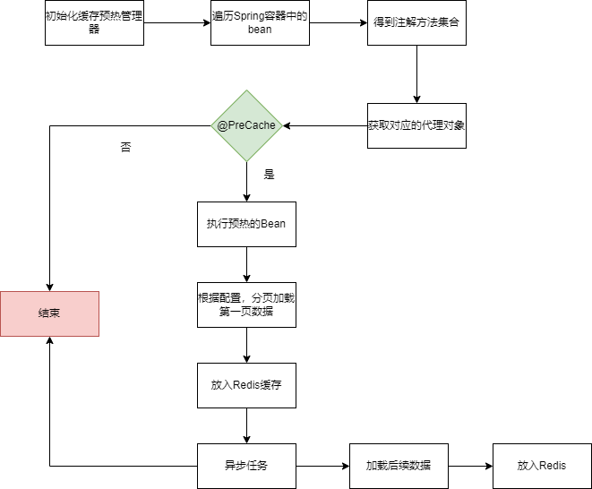

# 架构设计

1. 整体服务作为一个starter,便于应用层可以直接引入。
2. 支持参数可配置化。比如是否开启一级缓存配置、缓存个数、缓存时间、缓存实现等等其他参数。
3. 使用注解，应用层使用更方便，代码更整洁。如添加缓存、查询缓存、删除缓存、预热缓存等。
4. 支持不同的过期策略，如Lru、Lfu等等
5. 支持命中率查询，并做统计。

# 架构图

# 新增缓存

# 查询缓存

1. 根据注解获取配置信息
2. 获取缓存信息->一级缓存->二级缓存.
3. 如果一级缓存有数据，直接返回数据。
4. 如果使用二级缓存，且二级缓存有数据，直接返回，否则加**分布式锁**，也可考虑使用**本地锁**，多线程重入即可，在节点不多的情况下，同一时间，不同请求节点也不同。 重新构建redis数据。并通知其他实例缓存，
5. 返回数据。

# 删除缓存

同查询缓存，不过要注意的就是需要通知其他实例删除缓存。

# 缓存预热

1. 缓存预热管理器在容器初始化后，遍历容器中所有Bean。
2. 遍历Bean的方法，找出标注了`@PreCache`注解的方法集合。
3. 获取目标对象的代理对象。
4. 根据注解参数设置，进行预热。
5. 获取**分布式锁。加载第一页或者前几页数据。写入Redis缓存。**
6. 写异步任务，预热后面数据，写入Redis缓存。

# 缓存命中统计

1. 命中率数据应该是定时刷新的。
2. 每次刷新前清空上次统计数据，如果有需要，可以在存入的时候，加入批次号，做同比和环比用。
3. 执行定时任务。
5. 本地可以用一个队列，查询一次就将是否命中结果入队，如果队列长度超过**配置请求次数**就出队一次结果
6. 写入统计信息到Redis。

# 缓存击穿

1. 互斥锁方案，保证同一时间只有一个业务线程更新缓存，未能获取互斥锁的请求，要么等待锁释放后重新读取缓存，要么就返回空值或者默认值。
2. 不给热点数据设置过期时间，由**后台异步**更新缓存，或者在热点数据准备要过期前，提前通知后台线程更新缓存以及重新设置过期时间；

# 缓存穿透

1. 开启【是否穿透配置】
2. 是否使用布隆过滤器策略,是的话，过滤不存在数据库的数据。
3. 是否使用缓存默认值策略。
   1. 对于同一个Key，只要**任意一个请求访问数据后，就缓存空值或默认值**。
   2. 获取分布式锁，进行更新。

# 缓存淘汰策略实现

1. 根据参数配置决定开启那种淘汰策略。

2. Lru和Lfu有现成的例子进行参考。

3. 如果Lru和Lfu不能满足要求，那么可参考Mysql中的buffer-pool的冷热双链以及 热链(4/1+3/4)来实现。

   