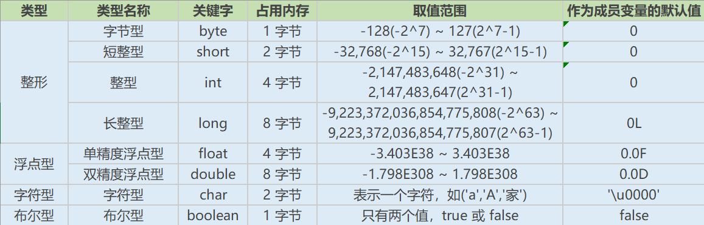
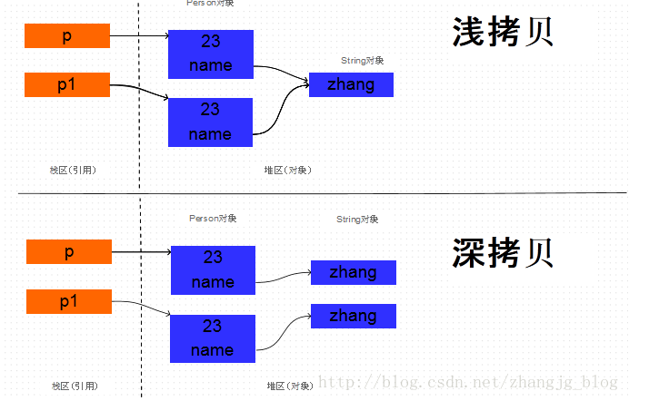

# Table of Contents

* [题目集合](#题目集合)
* [抽象封装继承 多态](#抽象封装继承-多态)
* [java 数据类型分类](#java-数据类型分类)
* [**final 有什么用？**](#final-有什么用)
* [**static存在的主要意义**](#static存在的主要意义)
* [**break ,continue ,return 的区别及作用**](#break-continue-return-的区别及作用)
* [**重载（Overload）和重写（Override）的区别。重载的方法能否根据返回类型进行区分？**](#重载overload和重写override的区别重载的方法能否根据返回类型进行区分)
* [**对象相等判断**](#对象相等判断)
* [**BIO,NIO,AIO 有什么区别?**](#bionioaio-有什么区别)
* [**什么是反射机制？**](#什么是反射机制)
* [**什么是字符串常量池？**](#什么是字符串常量池)
* [**Integer a= 127 与 Integer b = 127相等吗**](#integer-a-127-与-integer-b--127相等吗)
* [异常](#异常)
* [**常用的集合类有哪些？**](#常用的集合类有哪些)
* [集合源码：](#集合源码)
* [深拷贝和浅拷贝](#深拷贝和浅拷贝)
* [**queue**](#queue)
* [HashMap](#hashmap)
* [ConcurrentHashMap](#concurrenthashmap)


# 题目集合

**Java面试题**[**https://thinkwon.blog.csdn.net/article/details/104390612**](https://thinkwon.blog.csdn.net/article/details/104390612)

**Java集合面试题**  [**https://thinkwon.blog.csdn.net/article/details/104588551**](https://thinkwon.blog.csdn.net/article/details/104588551)

**异常面试题：** [**https://thinkwon.blog.csdn.net/article/details/104390689**](https://thinkwon.blog.csdn.net/article/details/104390689)


# 抽象封装继承 多态

抽象

抽象是将一类对象的共同特征总结出来构造类的过程，包括数据抽象和行为抽象两方面。抽象只关注对象有哪些属性和行为，并不关注这些行为的细节是什么。

封装

封装把一个对象的属性私有化，同时提供一些可以被外界访问的属性的方法，隐藏对象的属性和实现细节，仅对外提供公共访问方式，将变化隔离，便于使用，**提高复用性和安全性。**

继承

继承是使用已存在的类的定义作为基础建立新类的技术，新类的定义可以增加新的数据或新的功能，也可以用父类的功能，但不能选择性地继承父类。通过使用继承我们能够非常方便地复用以前的代码。**通过使用继承可以提高代码复用性，继承是多态的前提。**

多态

**所谓多态就是指程序中定义的引用变量所指向的具体类型和通过该引用变量发出的方法调用在编程时并不确定，而是在程序运行期间才确定**，即一个引用变量到底会指向哪个类的实例对象，该引用变量发出的方法调用到底是哪个类中实现的方法，必须在由程序运行期间才能决定。**父类或接口定义的引用变量可以指向子类或具体实现类的实例对象。提高了程序的拓展性。简单的来说：父类的引用指向子类对象**

**什么是多态机制？Java语言是如何实现多态的？**

在Java中有两种形式可以实现多态：继承（多个子类对同一方法的重写）和接口（实现接口并覆盖接口中同一方法）。

**方法重载（overload）实现的是编译时的多态性（也称为前绑定），而方法重写（override）实现的是运行时的多态性（也称为后绑定）。**

多态分为编译时多态和运行时多态。其中编辑时多态是静态的，主要是指方法的重载，它是根据参数列表的不同来区分不同的函数，通过编辑之后会变成两个不同的函数，在运行时谈不上多态。而运行时多态是动态的，它是通过动态绑定来实现的，也就是我们所说的多态性。

多态的实现

**Java实现多态有三个必要条件：继承、重写、向上转型。**

**继承：在多态中必须存在有继承关系的子类和父类。**

**重写：子类对父类中某些方法进行重新定义，在调用这些方法时就会调用子类的方法。**

**向上转型：在多态中需要将子类的引用赋给父类对象，只有这样该引用才能够具备技能调用父类的方法和子类的方法。**

只有满足了上述三个条件，我们才能够在同一个继承结构中使用统一的逻辑实现代码处理不同的对象，从而达到执行不同的行为。

对于Java而言，它多态的实现机制遵循一个原则：当超类对象引用变量引用子类对象时，被引用对象的类型而不是引用变量的类型决定了调用谁的成员方法，但是这个被调用的方法必须是在超类中定义过的，也就是说被子类覆盖的方法。

Java源程序经过编译器编译后变成字节码，字节码由虚拟机解释执行，虚拟机将每一条要执行的字节码送给解释器，解释器将其翻译成二进制

Java源代码---->编译器---->jvm可执行的Java字节码(即虚拟指令)---->jvm---->jvm中解释器----->机器可执行的二进制机器码---->程序运行。


# java 数据类型分类

· 基本数据类型

**o** **数值型**

**§** **整数类型(byte,short,int,long)**

**§** **浮点类型(float,double)**

**o** **字符型(char)**

**o** **布尔型(boolean)**

· 引用数据类型

**o** **类(class)**

**o** **接口(interface)**

**o** **数组([])**




**用最有效率的方法计算 2 乘以 8**

2 << 3（左移 3 位相当于乘以 2 的 3 次方，右移 3 位相当于除以 2 的 3 次方）。

**Math.round(11.5) 等于多少？Math.round(-11.5)等于多少**

Math.round(11.5)的返回值是 12，Math.round(-11.5)的返回值是-11。四舍五入的原理是在参数上加 0.5 然后进行下取整。


private : 在同一类内可见。使用对象：变量、方法。 注意：不能修饰类（外部类）

default (即缺省，什么也不写，不使用任何关键字）: 在同一包内可见，不使用任何修饰符。使用对象：类、接口、变量、方法。

protected : 对同一包内的类和所有子类可见。使用对象：变量、方法。 注意：不能修饰类（外部类）。

public : 对所有类可见。使用对象：类、接口、变量、方法

**this关键字的用法**

1.普通的直接引用，this相当于是指向当前对象本身。

2.形参与成员名字重名，用this来区分：

3.引用本类的构造函数

**super关键字的用法**

1.普通的直接引用

2.子类中的成员变量或方法与父类中的成员变量或方法同名时，用super进行区分

3.引用父类构造函数


· super（参数）：调用父类中的某一个构造函数（应该为构造函数中的第一条语句）。

· this（参数）：调用本类中另一种形式的构造函数（应该为构造函数中的第一条语句）。

·

# **final 有什么用？**

**用于修饰类、变量和方法；**

**·** **被final修饰的类不可以被继承**

**·** **被final修饰的方法不可以被重写**

**·** **被final修饰的变量不可以被改变，被final修饰不可变的是变量的引用，而不是引用指向的内容，引用指向的内容是可以改变的**


#  **static存在的主要意义**

static的主要意义是在于**创建独立于具体对象的域变量或者方法**。以致于即使没有创建对象，也能使用属性和调用方法！

**static关键字还有一个比较关键的作用就是 用来形成静态代码块以优化程序性能。static块可以置于类中的任何地方，类中可以有多个static块。在类初次被加载的时候，会按照static块的顺序来执行每个static块，并且只会执行一次。**

为什么说static块可以用来优化程序性能，是因为它的特性:只会在类加载的时候执行一次。因此，很多时候会将一些只需要进行一次的初始化操作都放在static代码块中进行。

**static的独特之处**

**修饰成员变量和方法，被对象共享**

**随类加载而加载 ，生命周期长，存在于方法区**


**static注意事项**

**1、静态只能访问静态。 2、非静态既可以访问非静态的，也可以访问静态的。**

**优点：节省空间    可用类名直接调用**

**缺点：生命周期长    有访问局限性（静态只能访问静态）**


# **break ,continue ,return 的区别及作用**

break 跳出总上一层循环，不再执行循环(结束当前的循环体)

continue 跳出本次循环，继续执行下次循环(结束正在执行的循环 进入下一个循环条件)

return 程序返回，不再执行下面的代码(结束当前的方法 直接返回)


#  **重载（Overload）和重写（Override）的区别。重载的方法能否根据返回类型进行区分？**

方法的重载和重写都是实现多态的方式，区别在于前者实现的是编译时的多态性，而后者实现的是运行时的多态性。

重载：发生在同一个类中，方法名相同参数列表不同（**参数类型不同、个数不同、顺序不同**），与方法返回值和访问修饰符无关，即重载的方法不能根据返回类型进行区分

重写：发生在父子类中，方法名、参数列表必须相同，返回值小于等于父类，抛出的异常小于等于父类，访问修饰符大于等于父类（里氏代换原则）；如果父类方法访问修饰符为private则子类中就不是重写。


# **对象相等判断**


**== 和 equals 的区别是什么**

== : 它的作用是判断两个对象的地址是不是相等。即，判断两个对象是不是同一个对象。(基本数据类型 == 比较的是值，引用数据类型 == 比较的是内存地址)

equals() : 它的作用也是判断两个对象是否相等。但它一般有两种使用情况：

情况1：类没有覆盖 equals() 方法。则通过 equals() 比较该类的两个对象时，等价于通过“==”比较这两个对象。

情况2：类覆盖了 equals() 方法。一般，我们都覆盖 equals() 方法来两个对象的内容相等；若它们的内容相等，则返回 true (即，认为这两个对象相等)。

举个例子：

public class test1 {

public static void main(String[] args) {

String a = new String("ab"); // a 为一个引用

String b = new String("ab"); // b为另一个引用,对象的内容一样

String aa = "ab"; // 放在常量池中

String bb = "ab"; // 从常量池中查找

if (aa == bb) // true

System.out.println("aa==bb");

if (a == b) // false，非同一对象

System.out.println("a==b");

if (a.equals(b)) // true

System.out.println("aEQb");

if (42 == 42.0) { // true

System.out.println("true");

}

}

}

说明：

· String中的equals方法是被重写过的，因为object的equals方法是比较的对象的内存地址，而String的equals方法比较的是对象的值。

· 当创建String类型的对象时，虚拟机会在常量池中查找有没有已经存在的值和要创建的值相同的对象，如果有就把它赋给当前引用。如果没有就在常量池中重新创建一个String对象。


hashCode()与equals()的相关规定

如果两个对象相等，则hashcode一定也是相同的

两个对象相等，对两个对象分别调用equals方法都返回true

两个对象有相同的hashcode值，它们也不一定是相等的

因此，equals 方法被覆盖过，则 hashCode 方法也必须被覆盖

# **BIO,NIO,AIO 有什么区别?**

可以先看下面这个

+ [IO多路复用](../学习/A.操作系统/IO多路复用.md)

+ [Reactor和Proactor.md](../学习/A.操作系统/Reactor和Proactor.md)

Java IO

IO，常协作I/O，是Input/Output的简称，即输入/输出。通常指数据在内部存储器（内存）和外部存储器（硬盘、优盘等）或其他周边设备之间的输入和输出。

输入/输出是信息处理系统（例如计算机）与外部世界（可能是人类或另一信息处理系统）之间的通信。

输入是系统接收的信号或数据，输出则是从其发送的信号或数据。

在Java中，提供了一些列API，可以供开发者来读写外部数据或文件。我们称这些API为Java IO。

IO是Java中比较重要，且比较难的知识点，主要是因为随着Java的发展，目前有三种IO共存。分别是BIO、NIO和AIO。

首先，我们站在宏观的角度，重新画一下重点：

**BIO （Blocking I/O）：同步阻塞I/O模式。**

**NIO （New I/O）：同步非阻塞模式。【没有通知机制，需要轮询，例如每个几分钟去看下水烧开没】**

**AIO （Asynchronous I/O）：异步非阻塞I/O模型。**

同步阻塞模式：这种模式下，我们的工作模式是先来到厨房，开始烧水，并坐在水壶面前一直等着水烧开。

同步非阻塞模式：这种模式下，我们的工作模式是先来到厨房，开始烧水，但是我们不一直坐在水壶前面等，而是回到客厅看电视，然后每隔几分钟到厨房看一下水有没有烧开。

异步非阻塞I/O模型：这种模式下，我们的工作模式是先来到厨房，开始烧水，我们不一一直坐在水壶前面等，也不隔一段时间去看一下，而是在客厅看电视，水壶上面有个开关，水烧开之后他会通知我。

**阻塞VS非阻塞：人是否坐在水壶前面一直等。**

**同步VS异步：水壶是不是在水烧开之后主动通知人。**

适用场景

**BIO方式适用于连接数目比较小且固定的架构**，这种方式对服务器资源要求比较高，并发局限于应用中，JDK1.4以前的唯一选择，但程序直观简单易理解。

**NIO方式适用于连接数目多且连接比较短（轻操作）的架构**，比如聊天服务器，并发局限于应用中，编程比较复杂，JDK1.4开始支持。

**AIO方式适用于连接数目多且连接比较长（重操作）的架构**，比如相册服务器，充分调用OS参与并发操作，编程比较复杂，JDK7开始支持。


BIO NIO AIO介绍如下：原博客为：https://segmentfault.com/a/1190000012976683

**BIO**

BIO 全称Block-IO 是一种**阻塞同步**的通信模式。我们常说的Stock IO 一般指的是BIO。是一个比较传统的通信方式，模式简单，使用方便。但并发处理能力低，通信耗时，依赖网速。

BIO 设计原理：

**服务器通过一个Acceptor线程负责监听客户端请求和为每个客户端创建一个新的线程进行链路处理。典型的一请求一应答模式。若客户端数量增多，频繁地创建和销毁线程会给服务器带来很大的压力。后改良为用线程池的方式代替新增线程，被称为伪异步IO。**

服务器提供IP地址监听和的端口，客户端通过TCP的三次握手与服务器连接，连接成功后，双放才能通过套接字(Stock)通信。

小结：BIO模型中通过Socket和ServerSocket完成套接字通道的实现。阻塞，同步，建立连接耗时。

BIO服务器代码，负责启动服务，阻塞服务，监听客户端请求，新建线程处理任务。

**NIO**

NIO 全称New IO，也叫Non-Block IO 是一种**非阻塞同步**的通信模式。

NIO 设计原理：

**NIO 相对于BIO来说一大进步。客户端和服务器之间通过Channel通信。NIO可以在Channel进行读写操作。这些Channel都会被注册在Selector多路复用器上。Selector通过一个线程不停的轮询这些Channel。找出已经准备就绪[节省了连接的时间]的Channel执行IO操作。****NIO 通过一个线程轮询，实现千万个客户端的请求，这就是非阻塞NIO的特点。**

1）缓冲区Buffer：它是NIO与BIO的一个重要区别。BIO是将数据直接写入或读取到Stream对象中。而NIO的数据操作都是在缓冲区中进行的。缓冲区实际上是一个数组。Buffer最常见的类型是ByteBuffer，另外还有CharBuffer，ShortBuffer，IntBuffer，LongBuffer，FloatBuffer，DoubleBuffer。

2）通道Channel：和流不同，通道是双向的。NIO可以通过Channel进行数据的读，写和同时读写操作。通道分为两大类：一类是网络读写（SelectableChannel），一类是用于文件操作（FileChannel），我们使用的SocketChannel和ServerSocketChannel都是SelectableChannel的子类。

3）多路复用器Selector：NIO编程的基础。多路复用器提供选择已经就绪的任务的能力。就是Selector会不断地轮询注册在其上的通道（Channel），如果某个通道处于就绪状态，会被Selector轮询出来，然后通过SelectionKey可以取得就绪的Channel集合，从而进行后续的IO操作。服务器端只要提供一个线程负责Selector的轮询，就可以接入成千上万个客户端，这就是JDK NIO库的巨大进步。

说明：这里的代码只实现了客户端发送请求，服务端接收数据的功能。其目的是简化代码，方便理解。github源码中有完整代码。

小结：NIO模型中通过SocketChannel和ServerSocketChannel完成套接字通道的实现。非阻塞/阻塞，同步，避免TCP建立连接使用三次握手带来的开销。


**NIO一个重要的特点是：socket主要的读、写、注册和接收函数，在等待就绪阶段都是非阻塞的，真正的I/O操作是同步阻塞的（消耗CPU但性能非常高）。**


NIO

channel介绍：http://ifeve.com/channels/


buffer介绍：http://ifeve.com/buffers/

selector介绍：http://ifeve.com/selectors/

epoll介绍：<https://www.jianshu.com/p/e4d1c485c32a>


应用：https://tech.meituan.com/2016/11/04/nio.html


视频很好：<https://www.bilibili.com/video/BV19D4y1o797?spm_id_from=333.788.b_636f6d6d656e74.5>


**AIO**

AIO 也叫NIO2.0 是一种非阻塞异步的通信模式。在NIO的基础上引入了新的异步通道的概念，并提供了异步文件通道和异步套接字通道的实现。

AIO 并没有采用NIO的多路复用器，而是使用异步通道的概念。其read，write方法的返回类型都是Future对象。而Future模型是异步的，其核心思想是：去主函数等待时间。

小结：AIO模型中通过AsynchronousSocketChannel和AsynchronousServerSocketChannel完成套接字通道的实现。非阻塞，异步。

https://www.cnblogs.com/jing99/p/12033117.html


#  **什么是反射机制？**

JAVA反射机制是在运行状态中，对于任意一个类，都能够知道这个类的所有属性和方法；对于任意一个对象，都能够调用它的任意一个方法和属性；这种动态获取的信息以及动态调用对象的方法的功能称为java语言的反射机制。

**Java获取反射的三种方法**

1.通过new对象实现反射机制 2.通过路径实现反射机制 3.通过类名实现反射机制

```java
public class Student {

private int id;

String name;

protected boolean sex;

public float score;

}

public class Get {

//获取反射机制三种方式

public static void main(String[] args) throws ClassNotFoundException {

//方式一(通过建立对象)

Student stu = new Student();

Class classobj1 = stu.getClass();

System.out.println(classobj1.getName());

//方式二（所在通过路径-相对路径）

Class classobj2 = Class.forName("fanshe.Student");

System.out.println(classobj2.getName());

//方式三（通过类名）

Class classobj3 = Student.class;

System.out.println(classobj3.getName());

}

}
```


# **什么是字符串常量池？**

>  就是为了复用，提供效率

字符串常量池位于堆内存中，专门用来存储字符串常量，可以提高内存的使用率，避免开辟多块空间存储相同的字符串，在创建字符串时 JVM 会首先检查字 符串常量池，如果该字符串已经存在池中，则返回它的引用，如果不存在，则实例化一个字符串放到池中，并返回其引用。

**String 底层就是一个 char 类型的数组**


**String有哪些特性**

· 不变性：String 是只读字符串，是一个典型的 immutable 对象，对它进行任何操作，其实都是创建一个新的对象，再把引用指向该对象。不变模式的主要作用在于当一个对象需要被多线程共享并频繁访问时，可以保证数据的一致性。

· 常量池优化：String 对象创建之后，会在字符串常量池中进行缓存，如果下次创建同样的对象时，会直接返回缓存的引用。

· final：使用 final 来定义 String 类，表示 String 类不能被继承，提高了系统的安全性。

**String str="i"与 String str=new String(“i”)一样吗？**

不一样，因为内存的分配方式不一样。String str="i"的方式，java 虚拟机会将其分配到常量池中；而 String str=new String(“i”) 则会被分到堆内存中。

**String s = new String(“xyz”);创建了几个字符串对象**

一个或者2个，如果字符串常量池中没有就是2 否则就是1个

两个对象，一个是静态区的"xyz"，一个是用new创建在堆上的对象。


**String 类的常用方法都有那些？**

· indexOf()：返回指定字符的索引。

· charAt()：返回指定索引处的字符。

· replace()：字符串替换。

· trim()：去除字符串两端空白。

· split()：分割字符串，返回一个分割后的字符串数组。

· getBytes()：返回字符串的 byte 类型数组。

· length()：返回字符串长度。

· toLowerCase()：将字符串转成小写字母。

· toUpperCase()：将字符串转成大写字符。

· substring()：截取字符串。

·

**在使用 HashMap 的时候，用 String 做 key 有什么好处？**

HashMap 内部实现是通过 key 的 hashcode 来确定 value 的存储位置，因为字符串是不可变的，所以当创建字符串时，它的 hashcode 被缓存下来，不需要再次计算，所以相比于其他对象更快。

String不可变，StringBuffer StringBuilder可变。

StringBuffer对方法加了同步锁或者对调用的方法加了同步锁，所以是线程安全的。StringBuilder并没有对方法进行加同步锁，所以是非线程安全的。

性能

每次对String 类型进行改变的时候，都会生成一个新的String对象，然后将指针指向新的String 对象。StringBuffer每次都会对StringBuffer对象本身进行操作，而不是生成新的对象并改变对象引用。相同情况下使用StirngBuilder 相比使用StringBuffer 仅能获得10%~15% 左右的性能提升，但却要冒多线程不安全的风险。

# **Integer a= 127 与 Integer b = 127相等吗**

对于对象引用类型：==比较的是对象的内存地址。

对于基本数据类型：==比较的是值。

如果整型字面量的值在-128到127之间，那么自动装箱时不会new新的Integer对象，而是直接引用常量池中的Integer对象，超过范围 a1==b1的结果是false


# 异常

**1. Throwable**

Throwable 是 Java 语言中所有错误与异常的超类。

Throwable 包含两个子类：Error（错误）和 Exception（异常），它们通常用于指示发生了异常情况。

\2. Error（错误）

定义：Error 类及其子类。程序中无法处理的错误，表示运行应用程序中出现了严重的错误。

特点：此类错误一般表示代码运行时 JVM 出现问题。通常有 Virtual MachineError（虚拟机运行错误）、NoClassDefFoundError（类定义错误）等。比如 OutOfMemoryError：内存不足错误；StackOverflowError：栈溢出错误。此类错误发生时，JVM 将终止线程。

这些错误是不受检异常，非代码性错误。因此，当此类错误发生时，应用程序不应该去处理此类错误。按照Java惯例，我们是不应该实现任何新的Error子类的！

**3. Exception（异常）**

程序本身可以捕获并且可以处理的异常。Exception 这种异常又分为两类：运行时异常和编译时异常。

**运行时异常**

定义：RuntimeException 类及其子类，表示 JVM 在运行期间可能出现的异常。

特点：Java 编译器不会检查它。也就是说，当程序中可能出现这类异常时，倘若既"没有通过throws声明抛出它"，也"没有用try-catch语句捕获它"，还是会编译通过。比如NullPointerException空指针异常、ArrayIndexOutBoundException数组下标越界异常、ClassCastException类型转换异常、ArithmeticExecption算术异常。此类异常属于不受检异常，一般是由程序逻辑错误引起的

**编译时异常**

定义: Exception 中除 RuntimeException 及其子类之外的异常。

特点: Java 编译器会检查它。如果程序中出现此类异常，比如 ClassNotFoundException（没有找到指定的类异常），IOException（IO流异常），要么通过throws进行声明抛出，要么通过try-catch进行捕获处理，否则不能通过编译。

• finally – finally语句块总是会被执行。它主要用于回收在try块里打开的物力资源(如数据库连接、网络连接和磁盘文件)。只有finally块，执行完成之后，才会回来执行try或者catch块中的return或者throw语句，如果finally中使用了return或者throw等终止方法的语句，则就不会跳回执行，直接停止。


数组是固定长度的；集合可变长度的

# **常用的集合类有哪些？**

Map接口和Collection接口是所有集合框架的父接口：

\1. Collection接口的子接口包括：Set接口和List接口

\2. Map接口的实现类主要有：HashMap、TreeMap、Hashtable、ConcurrentHashMap以及Properties等

\3. Set接口的实现类主要有：HashSet、TreeSet、LinkedHashSet等

\4. List接口的实现类主要有：ArrayList、LinkedList、Stack以及Vector等

· List：一个有序（元素存入集合的顺序和取出的顺序一致）容器，元素可以重复，可以插入多个null元素，元素都有索引。常用的实现类有 ArrayList、LinkedList 和 Vector。

· Set：一个无序（存入和取出顺序有可能不一致）容器，不可以存储重复元素，只允许存入一个null元素，必须保证元素唯一性。Set 接口常用实现类是 HashSet、LinkedHashSet 以及 TreeSet。

**Java集合的快速失败机制 “fail-fast”？**

是java集合的一种错误检测机制，当多个线程对集合进行结构上的改变的操作时，有可能会产生 fail-fast 机制。

例如：假设存在两个线程（线程1、线程2），线程1通过Iterator在遍历集合A中的元素，在某个时候线程2修改了集合A的结构（是结构上面的修改，而不是简单的修改集合元素的内容），那么这个时候程序就会抛出 ConcurrentModificationException 异常，从而产生fail-fast机制。

延伸：为什么阿里巴巴开发手册禁止foreach循环里进行元素的remove和add操作，remove元素建议使用Iterator方式，如果是并发操作，

需要对Iterator对象进行加锁

1.可以使用java8提供的list.removeIf("a"::eaquals)进行元素的删除操作

2.高级for循环是java语法糖，经过编译之后还原成迭代器。

3.使用迭代器进行循环的时候，会先判断集合中用于统计结构改变的modCount和迭代器中预期结构发生改变的expectedModCount

是否相等，如果不相当，则会抛出ConcurrentModificationException。

3.由于ArrayList的“fail-fast”机制，调用remove方法会触发modcount++操作，但是对expectedModCount没有任何操作，这样在

使用迭代器进行遍历的时候就会出现两个变量不一致的情况，会抛出异常。

4.使用迭代器的remove方法时，会手动讲modCount的值赋值给expectedModCount，保证两者值相同。

5.CopyOnWriteArrayList不会出现以上情况，是因为该list是ArrayList的线程安全的版本，是基于原数据的快照的list，不会抛出该异常

延伸：ArrayList线程不安全的原因是什么？

1.覆盖值

2.数组越界 


<https://blog.csdn.net/toocruel/article/details/82753615>

​          HashMap相关面试题【包含JDK1.7的头插法如何导致死循环】

https://blog.csdn.net/v123411739/article/details/106324537

**遍历一个 List 有哪些不同的方式？每种方法的实现原理是什么？Java 中 List 遍历的最佳实践是什么？**

遍历方式有以下几种：

\1. for 循环遍历，基于计数器。在集合外部维护一个计数器，然后依次读取每一个位置的元素，当读取到最后一个元素后停止。

\2. 迭代器遍历，Iterator。Iterator 是面向对象的一个设计模式，目的是屏蔽不同数据集合的特点，统一遍历集合的接口。Java 在 Collections 中支持了 Iterator 模式。

\3. foreach 循环遍历。foreach 内部也是采用了 Iterator 的方式实现，使用时不需要显式声明 Iterator 或计数器。优点是代码简洁，不易出错；缺点是只能做简单的遍历，不能在遍历过程中操作数据集合，例如删除、替换。

最佳实践：Java Collections 框架中提供了一个 RandomAccess 接口，用来标记 List 实现是否支持 Random Access。

· 如果一个数据集合实现了该接口，就意味着它支持 Random Access，按位置读取元素的平均时间复杂度为 O(1)，如ArrayList。

· 如果没有实现该接口，表示不支持 Random Access，如LinkedList。

**说一下 ArrayList 的优缺点**

ArrayList的优点如下：

· ArrayList 底层以数组实现，是一种随机访问模式。ArrayList 实现了 RandomAccess 接口，因此查找的时候非常快。

· ArrayList 在顺序添加一个元素的时候非常方便。

ArrayList 的缺点如下：

· 删除元素的时候，需要做一次元素复制操作。如果要复制的元素很多，那么就会比较耗费性能。

· 插入元素的时候，也需要做一次元素复制操作，缺点同上。

ArrayList 比较适合顺序添加、随机访问的场景。

**ArrayList 和 LinkedList 的区别是什么？**

· 数据结构实现：ArrayList 是动态数组的数据结构实现，而 LinkedList 是双向链表的数据结构实现。

· 随机访问效率：ArrayList 比 LinkedList 在随机访问的时候效率要高，因为 LinkedList 是线性的数据存储方式，所以需要移动指针从前往后依次查找。

· 增加和删除效率：在非首尾的增加和删除操作，LinkedList 要比 ArrayList 效率要高，因为 ArrayList 增删操作要影响数组内的其他数据的下标。

· 内存空间占用：LinkedList 比 ArrayList 更占内存，因为 LinkedList 的节点除了存储数据，还存储了两个引用，一个指向前一个元素，一个指向后一个元素。

· 线程安全：ArrayList 和 LinkedList 都是不同步的，也就是不保证线程安全；

综合来说，在需要频繁读取集合中的元素时，更推荐使用 ArrayList，而在插入和删除操作较多时，更推荐使用 LinkedList


# 集合源码：


[树基础.md](../学习/C.数据结构与算法/dataStructures/树基础.md)


平衡二叉树

是一种二叉排序树，其中每一个节点的左子树和右子树的高度差至多等于1，我们将二叉树上结点的左子树深度减去右子树深度的值称为平衡因子BF (Balance Factor)，那么平衡二叉树上所有结点的平衡因子只可能是-1 、0 和1。

不管我们是执行插入还是删除操作，只要不满足上面的条件，就要通过旋转来保持平衡，而旋转是非常耗时的，由此我们可以知道AVL树适合用于插入删除次数比较少，但查找多的情况。

查找效率最好，最坏情况都是O(logN)数量级的。


二叉查找树

1.左子树上所有结点的值均小于或等于它的根结点的值。

2.右子树上所有结点的值均大于或等于它的根结点的值。

3.左、右子树也分别为二叉排序树。

但是会出现瘸子的问题，变成线性查找：时间复杂度最好情况是O(logn) ，最坏情况下时间复杂度O(n)


红黑树

1.节点是红色或黑色。

2.根节点是黑色。

3.每个叶子节点都是黑色的空节点（NIL节点）。

4 每个红色节点的两个子节点都是黑色。(从每个叶子到根的所有路径上不能有两个连续的红色节点)

5.从任一节点到其每个叶子的所有路径都包含相同数目的黑色节点。

这样保障了红黑树的最长路径不会超过最短路径2倍

红黑树是一种弱平衡二叉树(由于是弱平衡，可以推出，相同的节点情况下，AVL树的高度低于红黑树)，相对于要求严格的AVL树来说，它的旋转次数少，所以对于搜索、插入、删除操作较多的情况下，我们就用红黑树。

定理：一棵含有n个节点的红黑树的高度至多为2log(n+1).


**每个遍历方法的实现原理是什么？**

1、传统的for循环遍历，基于计数器的：

​        遍历者自己在集合外部维护一个计数器，然后依次读取每一个位置的元素，当读取到最后一个元素后，停止。主要就是需要按元素的位置来读取元素。

2、迭代器遍历，Iterator：

​        每一个具体实现的数据集合，一般都需要提供相应的Iterator。相比于传统for循环，Iterator取缔了显式的遍历计数器。所以基于顺序存储集合的Iterator可以直接按位置访问数据。而基于链式存储集合的Iterator，正常的实现，都是需要保存当前遍历的位置。然后根据当前位置来向前或者向后移动指针。

3、foreach循环遍历：

​        根据反编译的字节码可以发现，foreach内部也是采用了Iterator的方式实现，只不过Java编译器帮我们生成了这些代码。适合链表集合


list集合equal是比较每个元素是否相等,hahcode是通过每个元素的hashcode得出的


**arrayList**

默认时为空，添加进第一个元素后，就会直接扩展到DEFAULT_CAPACITY，也就是10

ArrayList的扩容机制:首先创建一个空数组*elementData*，第一次插入数据时直接扩充至10，然后如果*elementData*的长度不足，就扩充1.5倍，如果扩充完还不够，就使用需要的长度作为*elementData*的长度。

优化：定义前确定大小，插入前一次性提前扩容：调用java.util.ArrayList#ensureCapacity方法


序列化：

<https://baijiahao.baidu.com/s?id=1633305649182361563&wfr=spider&for=pc>

<https://www.cnblogs.com/zzzt20/p/12451651.html>


<https://www.cnblogs.com/9dragon/p/10901448.html>


# 深拷贝和浅拷贝

clone方法介绍：<https://blog.csdn.net/zhangjg_blog/article/details/18369201/>

由于age是基本数据类型， 那么对它的拷贝没有什么疑议，直接将一个4字节的整数值拷贝过来就行。但是name是String类型的， 它只是一个引用， 指向一个真正的String对象，那么对它的拷贝有两种方式： 直接将源对象中的name的引用值拷贝给新对象的name字段， 或者是根据原Person对象中的name指向的字符串对象创建一个新的相同的字符串对象，将这个新字符串对象的引用赋给新拷贝的Person对象的name字段。这两种拷贝方式分别叫做浅拷贝和深拷贝。深拷贝和浅拷贝的原理如下图所示：



实现深拷贝的方法：https://www.cnblogs.com/xinruyi/p/11537963.html

一般来说有这么几种办法做深度复制：

1.实现clonable接口，自己去写clone方法，这种方法没有通用性，优点在于实现简单，并且可以实现定制化

2.基于反射，BeanUtil, Spring 核心包提供的一个工具类，基本原理就是获取class实例化，在通过反射整体复制属性

3.基于serialize,deserialize实现，这种办法比较多，实际上本质上和反射没有太大差别，反射相当于jvm提供，而serialize是基于上层协议。具体实现可以了解rmi, thrift, protobuf这些都是序列化方式

4.基于Unsafe内存，这种方法极不推荐使用，直接复制对象内存空间，容易造成内存泄露。推荐你可以看一下我的这篇博文https://blog.csdn.net/cun_chen/article/details/50397071


# **queue**

基本方法区别

**offer，add区别：** 一些队列有大小限制，因此如果想在一个满的队列中加入一个新项，多出的项就会被拒绝。 这时新的 offer 方法就可以起作用了。它不是对调用 add() 方法抛出一个 unchecked 异常，而只是得到由 offer() 返回的 false。

**poll，remove区别：** remove() 和 poll() 方法都是从队列中删除第一个元素（head）。remove() 的行为与 Collection 接口的版本相似， 但是新的 poll() 方法在用空集合调用时不是抛出异常，只是返回 null。因此新的方法更适合容易出现异常条件的情况。

**peek，element区别：** element() 和 peek() 用于在队列的头部查询元素。与 remove() 方法类似，在队列为空时， element() 抛出一个异常，而 peek() 返回 null。


双端队列：deque

可以实现栈：

//与addFirst()等价

void push(E e);


//与removeFirst()等价

E pop();


<https://www.jianshu.com/p/82696b0f222c?utm_campaign>


treemap

底层实现红黑树

<https://www.jianshu.com/p/ae2a445b231f>


# HashMap

[HashMap.md](../学习/D.java/collection/HashMap.md)


**hashMap**

容量初始化大小16，最大2^ 30，默认扩容因子0.75，链表长度>=8则转为红黑树，树的大小<=6就转为链表，至少容量到64才可以转为树


**put方法调用过程**

先看是不是为空，

为空则先初始化一下，即调用(2)resize方法，

然后查找hash%length位置上有没有数据，

​     没有则建立新节点放入。

​     有数据则看当前节点是不是链表，

​          是链表则遍历找到hash相等，key相等的的元素替换value，没有找到则插入到最后面，然后看长度是不是超过8，超过8就(1)树化,即treeifyBin方法

​          是树则插入树中，即调用(3)TreeNode.putTreeVal方法


(1)其中树化时先看table是不是空，或table大小是不是小于树化最小值，是则需要重新调整表，即调用(2)resize方法扩容。否则循环根据当前元素生成treeNode，依次挂在红黑树尾部，顺序和链表一致。这个table位置指向新的红黑树，最好，因为链表顺序不符合顺序，所以需要调整红黑树顺序，即调用treeify方法。treeify方法会循环刚才的链表树结点，比较hash和key值和跟结点的大小，小就往左走，大就往右走，如果走到左/右结点为空，则创插入左/右结点，然后再进行平衡。


(2)扩容的过程

首先看原来table大小是不是>0，

​     是则看是不是>最大值2^30，是则把阀值threshold设置为integer最大值，否则扩大2倍

​     否则设置默认大小16，阀值16*0.75

扩容完成后进行数据拷贝，遍历table,

如果是树节点则将节点分为两部分，分别在原位置上和原位置+旧数组长度的位置上，然后根据长度做treeify和untreeify处理。

如果是链表则重新进行定位(定位方式比1.7做了优化，并没有每个都去重新计算hash和位置，而是将节点分为两个链表，一个在原位置上，一个在原位置+旧数组长度的位置上)


(3)先比较根结点和当前hash值，小就往左走，大就往右走，如果相等了，则替换。如果走到左/右结点为空，则创建新树结点插入，然后调整平衡。


<https://joonwhee.blog.csdn.net/article/details/78996181?utm_medium=distribute.pc_relevant_t0.none-task-blog-OPENSEARCH-1.control&depth_1-utm_source=distribute.pc_relevant_t0.none-task-blog-OPENSEARCH-1.control>

在前面分析增删时，可以发现与红黑树相关的操作都是通过TreeNode来实现的，下面我们就来看看TreeNode的具体实现：

TreeNode算上其继承来的成员变量，共有11个：

final int hash;

final K key;

V value;

Node<K,V> next;

Entry<K,V> before, after;

TreeNode<K,V> parent;  // red-black tree links

TreeNode<K,V> left;

TreeNode<K,V> right;

TreeNode<K,V> prev;    // needed to unlink next upon deletion

boolean red;


**get方法调用过程**

对table进行校验：table不为空 && table长度大于0 &&table索引位置(使用table.length - 1和hash值进行位与运算)的节点不为空

检查first节点的hash值和key是否和入参的一样，

​     如果一样则first即为目标节点，直接返回first节点

​     如果first不是目标节点，并且first的next节点不为空则继续遍历

​              如果是红黑树节点，则调用红黑树的查找目标节点方法(4)getTreeNode

​              如果不是树结点，则执行链表节点的查找，向下遍历链表, 直至找到节点的key和入参的key相等时,返回该节点


(4)首先找到红黑树的根节点

​        如果传入的hash值小于当前节点的hash值，则往p节点的左边遍历

​        如果传入的hash值大于当前节点的hash值，则往p节点的右边遍历

​        如果传入的hash值和key值等于当前节点的hash值和key值,则p节点为目标节点,返回p节点

​        p节点的左节点为空则将向右遍历

​        p节点的右节点为空则向左遍历

​        代码走到此处, 代表key所属类没有实现Comparable, 直接指定向p的右边遍历

​        代码走到此处代表“pr.find(h, k, kc)”为空, 因此直接向左遍历


hashMap中的hash函数介绍


<https://www.cnblogs.com/zhengwang/p/8136164.html>


hashMap 1.7扩容导致的循环问题

<https://www.jianshu.com/p/4d1cad21853b?utm_campaign=hugo>


什么时候会触发扩容？


很多人在这个问题上会掉进陷阱里。我会这样问，是数组中占用位置个数大于扩容因子的时候还是HashMap元素总数大于扩容因子的时候需要扩容？


如果对HashMap理解不透彻，这里很容易就答错了。这里HashMap中元素总个数达到阈值时就会扩容。很多人可能会疑问，为什么是总个数，而不是数组占用个数呢？


想象一下这个情况：假设有12个元素都落到了数组的同一个位置（当然现实情况这种机率非常非常小，几乎没有），数组只占用了一个位置， 那么为什么要扩容呢，还有那么多位置没用呢? 其实这里之所以要扩容，是有一个隐含的逻辑，如果元素总个数大于阈值，而数组占用位置没达到阈值，说明这些元素在当前长度下，分布是“不均匀”的，扩容是为了让其分布“更均匀”。


为什么要是2的幂次方呢？


1.7和1.8的区别

<https://blog.csdn.net/Vince_Wang1/article/details/105888297?utm_source=app>


# ConcurrentHashMap

面试题：<https://zhuanlan.zhihu.com/p/138562977>


源码分析：[https://www.cnblogs.com/zerotomax/p/8687425.html#go0]


**ConcurrentHashMap几个重要方法**

在ConcurrentHashMap中使用了unSafe方法，通过直接操作内存的方式来保证并发处理的安全性，使用的是硬件的安全机制。

/*

\* 用来返回节点数组的指定位置的节点的原子操作

*/

@SuppressWarnings("unchecked")

static final <K,V> Node<K,V> tabAt(Node<K,V>[] tab, int i) {

return (Node<K,V>)U.getObjectVolatile(tab, ((long)i << ASHIFT) + ABASE);

}


/*

\* cas原子操作，在指定位置设定值

*/

static final <K,V> boolean casTabAt(Node<K,V>[] tab, int i,

Node<K,V> c, Node<K,V> v) {

return U.compareAndSwapObject(tab, ((long)i << ASHIFT) + ABASE, c, v);

}

/*

\* 原子操作，在指定位置设定值。利用volatile方法设置第i个节点的值，这个操作一定是成功的。

*/

static final <K,V> void setTabAt(Node<K,V>[] tab, int i, Node<K,V> v) {

U.putObjectVolatile(tab, ((long)i << ASHIFT) + ABASE, v);

}


**ConcurrentHashMap的put操作详解**

判断K,V都不能为空，否则的话跑出异常


首先会去判断保存这些键值对的数组是不是初始化了，如果没有的话就初始化数组

然后通过计算hash值来确定放在数组的哪个位置，

​     调用cas方法如果这个位置上的结点为空则设置为新创建的一个结点

​     不为空则查看结点hash值是不是-1，是则表示当前正在对这个数组进行扩容，复制到新的数组，则当前线程也去帮助复制

最后一种情况就是，如果这个节点，不为空，也不在扩容，则通过synchronized来加锁，锁是当前结点，进行添加操作

然后判断当前取出的节点位置存放的是链表还是树(hash>=0则是链表)

​     如果是链表的话，则遍历整个链表，如果key相等，并且key的hash值也相等的话，则覆盖值。否则新建结点添加到链表的末尾

​     如果是树的话，则调用putTreeVal(1)方法把这个元素添加到树中去。

最后在添加完成之后，会判断在该节点处共有多少个节点（注意是添加前的个数），如果达到8个以上了的话，则调用treeifyBin(2)方法来尝试将处的链表转为树，或者扩容数组

最后结点树+1


(1)先比较根结点和当前hash值，小就往左走，大就往右走，如果相等了，则替换。如果走到左/右结点为空，则创建新树结点插入，然后调整平衡。


(2)其中树化时先看table是不是空，或table大小是不是小于树化最小值64，是则需要重新调整表，即调用(3)tryPresize(原数组大小<<1)方法扩容。

否则如果当前结点不为空并且hash值>0则上锁synchronized，然后把Node组成的链表，转化为TreeNode的链表，头结点任然放在相同的位置

最后把TreeNode的链表放入新创建的TreeBin中。创建TreeBin的过程基本和treeify一样。会循环刚才的链表树结点，比较hash和key值和跟结点的大小，小就往左走，大就往右走，如果走到左/右结点为空，则创插入左/右结点，然后再进行平衡。


(3)tryPresize(int size)

扩容首先如果给定的大小大于等于数组容量的一半，则直接使用最大容量，否则使用tableSizeFor(size + (size >>> 1) + 1)算出来。table一直要扩容到这个值小于等于sizeCtrl(数组长度的3/4)或者数组长度大于最大长度的时候才退出扩容。**所以在一次扩容之后，不是原来长度的两倍，而是2的n次方倍**

​         如果数组table还没有被初始化，则先通过CAS把sizeCtl设为-1，然后初始化一个大小为sizeCtrl和刚刚算出来的c中较大的一个大小的数组。然后sizeCtrl=数组大小*0.75

​         如果table不为空，

​                 则看sizeCtl是否<0，是则正在扩容Table的话，则帮助扩容。使用CAS将sizeCtl设置为sizeCtl+1。调用(4)transfer方法。在transfer的时候，sc表示在transfer工作的线程数

​                 没有在初始化或扩容，则调用(4)transfer方法开始扩容


(4)把数组中的节点复制到新的数组的相同位置，或者移动到扩张部分的相同位置。每个CPU最少处理16个长度的数组元素,也就是说，如果一个数组的长度只有16，那只有一个线程会对其进行扩容的复制移动操作。


首先会计算一个步长，表示一个线程处理的数组长度，用来控制对CPU的使用，

如果复制的目标nextTab为null的话，则初始化一个table两倍长的nextTab(因为如果有一个线程开始了表的扩张的时候，其他线程也会进来帮忙扩张，

而只是第一个开始扩张的线程需要初始化下目标数组)

然后创建一个fwd节点，其中保存了新数组nextTable的引用，这个是用来控制并发的，当一个节点为空或已经被转移之后，就设置为fwd节点

通过for自循环处理每个槽位中的链表元素，默认advace为真，通过CAS设置transferIndex属性值，并初始化i和bound值，i指当前处理的槽位序号，

bound指需要处理的槽位边界，先处理槽位15的节点；在当前假设条件下，槽位15中没有节点，则通过CAS插入在第二步中初始化的ForwardingNode节点，用于告诉其它线程该槽位已经处理过了；

如果槽位15已经被线程A处理了，那么线程B处理到这个节点时，取到该节点的hash值应该为MOVED，值为-1，则直接跳过，继续处理下一个槽位14的节点；

​     如果是一个链表结构，上synchronized锁，先定义两个变量节点ln和hn，按我的理解应该是lowNode和highNode，分别保存hash值的第X位为0和1的节点

使用fn&n可以快速把链表中的元素区分成两类，A类是hash值的第X（x为数组长度的2的幂次方，这里为4）位为0，B类是hash值的第X位为1，

并通过lastRun记录最后需要处理的节点(即最后一个颜色反转的结点，这个结点后的链表可以不动了)，再重新遍历链表，以lastRun节点为终止条件，

根据第X位的值用**头插法**分别构造ln链表和hn链表(所以和原来链表相比，顺序可能不一样)

最后通过CAS把ln链表设置到新数组的i位置，hn链表设置到i+原数组长度的位置

​     如果该槽位是红黑树结构，则构造树节点lo和hi，遍历红黑树中的节点，同样根据hash&n算法，把节点分为两类，

分别插入到lo和hi为头的链表中，根据lo和hi链表中的元素个数分别生成ln和hn节点，其中ln节点的生成逻辑如下：

​                   （1）如果lo链表的元素个数小于等于UNTREEIFY_THRESHOLD，默认为6，则通过untreeify方法把树节点链表转化成普通节点链表；

​                 （2）否则判断hi链表中的元素个数是否等于0：如果等于0，表示lo链表中包含了所有原始节点，则设置原始红黑树给ln，否则根据lo链表重新构造红黑树。

​                     hi的处理同上面两步

​     最后，同样的通过CAS把ln设置到新数组的i位置，hn设置到i+原数组长度位置。


以上扩容内容可以参考博客：https://www.jianshu.com/p/f6730d5784ad

扩容源码分析的真好：<https://www.cnblogs.com/FondWang/p/12142149.html>


**ConcurrentHashMap的get方法调用过程**

对table进行校验：table不为空 && table长度大于0 &&table索引位置(使用table.length - 1和hash值进行位与运算)的节点不为空

检查first节点的hash值和key是否和入参的一样，

​     如果一样则first即为目标节点，直接返回first节点

​     如果first不是目标节点，则判断hash是否<0

​             <0说明是红黑树节点，则调用红黑树的查找目标节点方法(4)find。find会遍历**树的链表？？？**直至找到节点的key和入参的key相等

​              如果不是树结点，则遍历链表, 直至找到节点的key和入参的key相等时,返回该val


**JDK8中ConcurrentHashMap的实现使用的是锁分离思想，只是锁住的是一个node，而锁住Node之前的操作是基于在volatile和CAS之上无锁并且线程安全的。**


**那么在扩容的时候，可以不可以对数组进行读写操作呢？**

事实上是可以的。当在进行数组扩容的时候，如果当前节点还没有被处理（也就是说还没有设置为fwd节点），那就可以进行设置操作。

如果该节点已经被处理了，则当前线程也会加入到扩容的操作中去。

　　

**那么，多个线程又是如何同步处理的呢？**

在ConcurrentHashMap中，同步处理主要是通过Synchronized和unsafe两种方式来完成的。

·在取得sizeCtl、某个位置的Node的时候，使用的都是unsafe的方法，来达到并发安全的目的

·当需要在某个位置设置节点的时候，则会通过Synchronized的同步机制来锁定该位置的节点。

·在数组扩容的时候，则通过处理的步长和fwd节点来达到并发安全的目的，通过设置hash值为MOVED

·当把某个位置的节点复制到扩张后的table的时候，也通过Synchronized的同步机制来保证现程安全


**ConcurrentHashMap是如何实现线程安全的**

很好的参考博客：<https://blog.csdn.net/qq_41737716/article/details/90549847>


static class Node<K,V> implements Map.Entry<K,V> {

final int hash;

final K key;

volatile V val;

volatile Node<K,V> next;

...

}

**值得注意的是，value和next指针使用了volatile来保证其可见性**

**table变量使用了volatile来保证其可见性，所以每次获取到的都是最新写入的值**


**如果多个线程同时调用initTable初始化Node数组，是如何处理的呢？**

首先：每次循环都获取最新的Node数组tab引用,并判空

其次：使用sizeCtl作为标记坑位，若为-1也就是小于0，代表有线程在进行初始化工作了。则Thread.yield()。让出CPU时间片

​         否则CAS操作，将本实例的sizeCtl变量设置为-1。如果CAS操作成功了，代表本线程将负责初始化工作。

​         然后再检查一遍数组是否为空，然后进行初始化数组

​         最后给sizeCtl赋值0.75*size(由于这里只会有一个线程在执行，直接赋值即可，没有线程安全问题。只需要保证可见性)

**总结一下初始化的多线程解决方法：**

就算有多个线程同时进行put操作，在初始化数组时使用了乐观锁CAS操作来决定到底是哪个线程有资格进行初始化，其他线程均只能等待。

用到的并发技巧：

· volatile变量（sizeCtl）：它是一个标记位，用来告诉其他线程这个坑位有没有人在，其线程间的可见性由volatile保证。

· CAS操作：CAS操作保证了设置sizeCtl标记位的原子性，保证了只有一个线程能设置成功


**put操作的线程安全问题解决**

首先：Unsafe类volatile的方式(关键三个方法中的tabAt方法)取出hashCode散列后通过与运算得出的Node数组下标值对应的Node对象

​     为空，则直接CAS方式插入新建结点。

​     查看是否在扩容，是就帮助扩容

​     都不是则对Node对象进行加锁，二次确认此Node对象还是原来的那一个(tabAt(tab, i) == f)。然后做插入操作。


由于其减小了锁的粒度(以头结点为锁)，若Hash完美不冲突的情况下(在不同的hash位置做插入)，可同时支持n个线程同时put操作，n为Node数组大小，在默认大小16下，可以支持最大同时16个线程无竞争同时操作且线程安全。当hash冲突严重时，Node链表越来越长，将导致严重的锁竞争，此时会进行扩容，将Node进行再散列。总结一下用到的并发技巧：

\1. 减小锁粒度：将Node链表的头节点作为锁，若在默认大小16情况下，将有16把锁，大大减小了锁竞争（上下文切换），就像开头所说，将串行的部分最大化缩小，在理想情况下线程的put操作都为并行操作。同时直接锁住头节点，保证了线程安全

\2. Unsafe的getObjectVolatile方法：此方法确保获取到的值为最新


**扩容操作的线程安全**

在扩容时，ConcurrentHashMap支持多线程并发扩容，在扩容过程中同时支持get查数据，若有线程put数据，还会帮助一起扩容，这种无阻塞算法，将并行最大化的设计，堪称一绝。

首先根据机器CPU核心数来计算，一条线程负责Node数组中多长的迁移量

nextTab若为空代表线程是第一个进行迁移的。则初始化nextTab

然后创建ForwardingNode对象，此对象的hash变量为-1。在get或者put时若遇到此Node，则可以知道当前Node正在迁移

从i=15开始，取出Node数组下标为15的那个Node，

​         若为空则不需要迁移，直接设置占位标示fwd，代表此Node已处理完成

​         若检测此Node的hash是否为MOVED。如果是占位Node，证明此节点已经处理过了，跳过，继续循环

​         以上都不是则锁住这个Node，二次确认Node是原先的Node。然后做分开为lo和ho 。最后通过CAS将lo和ho设置到相应位置。并把ForwardingNode结点设置给原数组这个位置


**扩容时的get操作**

假设Node下标为16的Node节点正在迁移，突然有一个线程进来调用get方法，正好key又散列到下标为16的节点，此时怎么办？


找到get位置到头结点，如果hash值小于0，则有可能是fwd节点。调用ForwardingNode节点对象的find方法查找值。这里的查找，是去新Node数组中查找的

否则遍历查找key hash相同的结点


到这里应该可以恍然大悟了，之所以占位Node需要保存新Node数组的引用也是因为这个，它可以支持在迁移的过程中照样不阻塞地查找值，可谓是精妙绝伦的设计。


**多线程协助扩容**

在put操作时，假设正在迁移，正好有一个线程进来，想要put值到迁移的Node上，怎么办？

若此时发现了占位Node(hash==-1)，证明此时HashMap正在迁移，则sizeCtl加一，标示多一个线程进来协助扩容进行协助迁移transfer(tab, nextTab);


ConcurrentHashMap源码视频

<https://www.bilibili.com/video/BV17i4y1x71z?from=search&seid=13607205829383434463>

