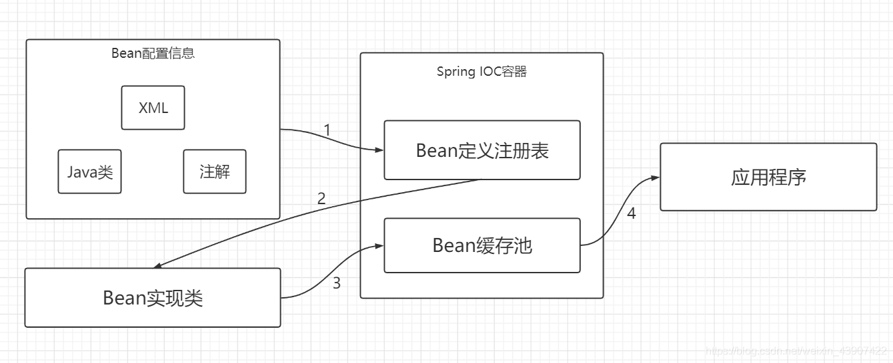
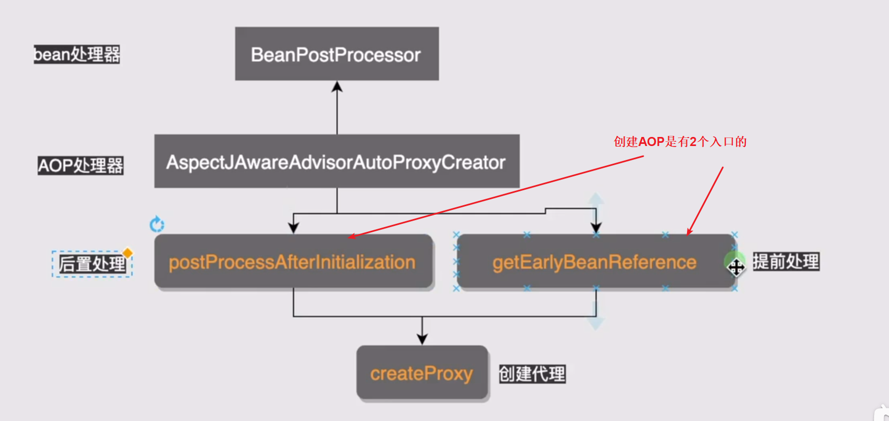
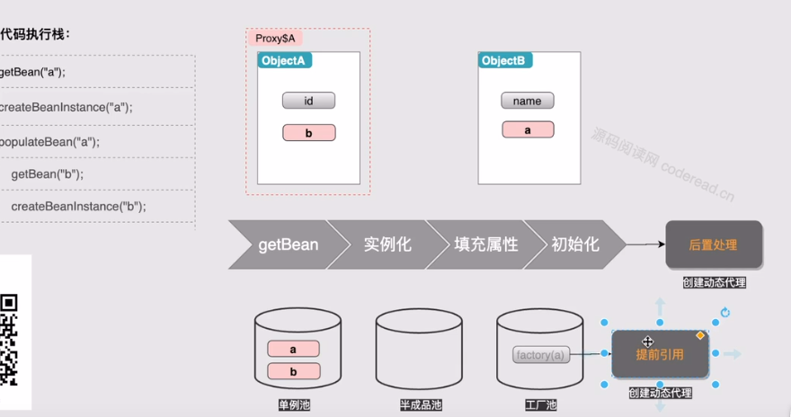

# Table of Contents

* [相关](#相关)
* [Spring IOC](#spring-ioc)
  * [Spring IOC和工厂模式的区别](#spring-ioc和工厂模式的区别)
* [AOP有哪些 AOP是怎么实现的](#aop有哪些-aop是怎么实现的)
* [Spring三级缓存](#spring三级缓存)
* [Spiing事务有哪些](#spiing事务有哪些)
* [什么情况Spring事务会失效](#什么情况spring事务会失效)
* [spring依赖注入方式](#spring依赖注入方式)
* [Spring中的代理模式](#spring中的代理模式)
* [Spring、SpringMVC、Spring Boot、Spring Cloud 概念、关系及区别](#springspringmvcspring-bootspring-cloud-概念关系及区别)

# 相关

 + [Spring MVC面试题](https://thinkwon.blog.csdn.net/article/details/104397427)

+ [IOC](https://blog.csdn.net/weixin_48182198/article/details/107593961)
+ [SpringIoc面试题](https://blog.csdn.net/weixin_48182198/article/details/107593961)

+ Springboot面试题  [**https://thinkwon.blog.csdn.net/article/details/104397299**](https://thinkwon.blog.csdn.net/article/details/104397299)

+ Spring面试  [**https://thinkwon.blog.csdn.net/article/details/104397516**](https://thinkwon.blog.csdn.net/article/details/104397516)

+ Springcloud 面试题 <https://blog.csdn.net/m0_48795607/article/details/115917190?utm_medium=distribute.pc_relevant_bbs_down.none-task-blog-baidujs-2.nonecase&depth_1-utm_source=distribute.pc_relevant_bbs_down.none-task-blog-baidujs-2.nonecase>

# Spring IOC

在没有IOC的时候，所有bean的行为都是人为去管理。

作用：
管理对象的创建和依赖关系的维护。对象的创建并不是一件简单的事，在对象关系比较复杂时，如果依赖关系需要程序猿来维护的话，那是相当头疼的

解耦，由容器去维护具体的对象

托管了类的产生过程，比如我们需要在类的产生过程中做一些处理，最直接的例子就是代理，如果有容器程序可以把这部分处理交给容器，应用程序则无需去关心类是如何完成代理的

原理：Spring 中的 IoC 的实现原理就是**工厂模式加反射机制。**

> 如何实现的呢？

Spring加载Xml或者扫描的方式，将bean的属性以key-value形式存放起来，用到的时候，根据key取到value，根据反射创建对象。

> Spring创建流程分析

+ [IOC容器初始化](../学习/H.Spring/IOC容器初始化.md)

## Spring IOC和工厂模式的区别

<https://blog.csdn.net/weixin_43907422/article/details/105933374>

# AOP有哪些 AOP是怎么实现的

[Aop](../学习/H.Spring/Aop.md)

# Spring三级缓存

可以先从bean的生命周期开始讲起

如何解决Spring循环依赖？

+ 死循环依赖

  二级缓存：存放的是半成品。目的是解决'死循环依赖的问题'

  如果不先放个半成品，是会死循环的。

+ AOP代理下问题

  AOP是在初始化后，执行bpp,产生的代理对象

  但是由于循环依赖问题，需要在属性装配的时候就要产生，那么就需要一个工厂池来存放代理对象。

  **注意这里，只是创建，如果没有对象引用，是不会真正生成代理对象的**

  

  三级缓存：主要是为了解决AOP下，循环依赖的问题。

视频讲解，不错，**强烈推荐！**。<https://www.bilibili.com/video/BV1ET4y1N7Sp?from=search&seid=4691802828216322557>

> Spring三级缓存需要注意的点！！
> 为什么要判断原始对象和二级缓存的是否一样？

[Spring 解决循环依赖] <https://mp.weixin.qq.com/s?__biz=MzUxODkzNTQ3Nw==&mid=2247485600&idx=1&sn=0c49b94e7fbd35c88c4470e936023e3e&chksm=f9800e7acef7876ca05ab45ce9420ea140f188e84153f23d0af9d044f475458ad38d49a6546a&scene=21#wechat_redirect>

视频二：<https://www.bilibili.com/video/BV15y4y1z7E4?from=search&seid=4691802828216322557>

+ [Spring三级缓存源码分析](../学习/H.Spring/Spring三级缓存.md)  ： 其实有点类似  Two Sum 用Map的解决思路
+ [Async](../学习/H.Spring/Async.md)

# Spiing事务有哪些

# 什么情况Spring事务会失效

Srping事务失效的场景： [**https://blog.csdn.net/dhklsl/article/details/88354216**](https://blog.csdn.net/dhklsl/article/details/88354216)

1. spring的事务注解@Transactional只能放在public修饰的方法上才起作用，如果放在其他非public（private，protected）方法上，虽然不报错，但是事务不起作用

   为什么？源码是这么判断的

2. 代理类调用目标类方法，事务是通过AOP实现的。

   可以用 Spring上下文.get(bean)拿到代理类，进行事务的调用。

3. 如使用mysql且引擎是MyISAM，则事务会不起作用，原因是MyISAM不支持事务，可以改成InnoDB引擎

4. 默认的spring事务只会捕获RuntimeException,如果是非运行时异常也需要进行事务回滚的话,可以在@Transactional注解中加上rollbackfor = Exception.class属性;

5. 在业务中抛出异常时,本应该被事务管理器捕获的异常,被手动catch处理了,或者事务结果未满足具体业务需求的,如果需要手动catch异常做业务处理,需要在catch里手动回滚事务TransactionAspectSupport.currentTransactionStatus().setRollbackOnly(),或者在catch中主动抛出异常throw new RuntimeException();.
   

# spring依赖注入方式

https://blog.csdn.net/zhaohong_bo/article/details/89916494

spring有4种依赖注入方式：

Set方法注入

构造器注入

静态工厂的方法注入

实例工厂的方法注入

按照实现方式分为两类：

注解（如@Autowired）

配置文件（如xml）

# Spring中的代理模式
+ [Async](../学习/H.Spring/Spring经典的9种设计模式.md)

# Spring、SpringMVC、Spring Boot、Spring Cloud 概念、关系及区别

Spring MVC是基于Servlet实现的一个前端MVC框架，主要解决WEB项目开发的问题。
Spring boot，约定优于配置，简化了spring的配置流程。

Spring Cloud是一系列框架的有序集合。

