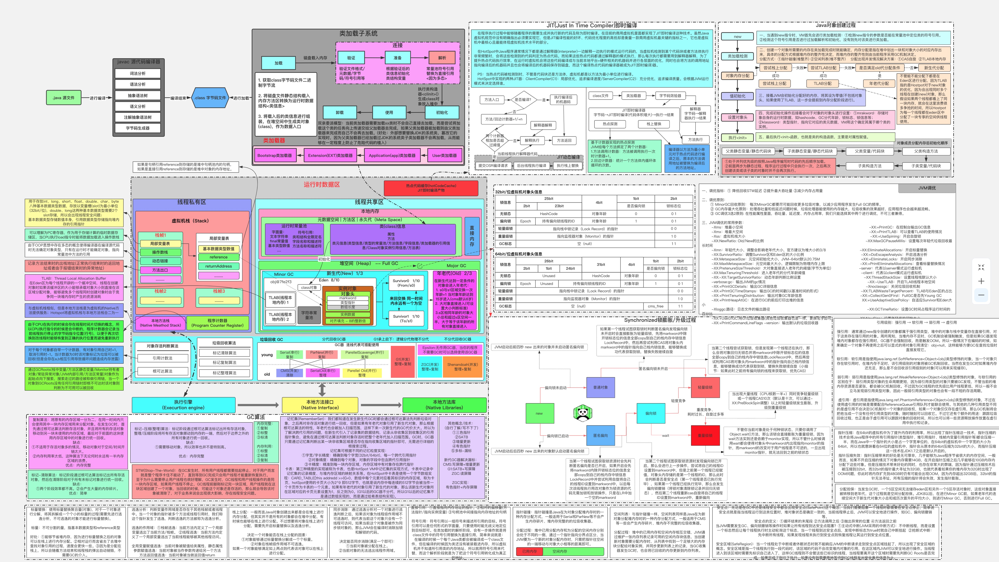

# Table of Contents

* [JVM内存区域](#jvm内存区域)
* [类加载机制](#类加载机制)
* [类加载器](#类加载器)
* [对象的创建](#对象的创建)
* [内存泄漏和内存溢出](#内存泄漏和内存溢出)
* [垃圾回收基础](#垃圾回收基础)
* [垃圾收集器](#垃圾收集器)
* [如何排查 OOM 的问题？](#如何排查-oom-的问题)
* [**java jvm 调优**](#java-jvm-调优)
* [**了解GC产生的原因**：](#了解gc产生的原因)
* [**排查FGC问题**](#排查fgc问题)
* [FGC频繁的线上案例介绍](#fgc频繁的线上案例介绍)
* [参考资料](#参考资料)

# JVM内存区域

[jvm内存区域](../学习/F.Jvm/jvm内存区域.md)

# 类加载机制

[类加载机制](../学习/F.Jvm/类加载机制.md)

# 类加载器
[类加载器](../学习/F.Jvm/类加载器.md)

**双亲委派模型和破坏双亲委派模型:**[**https://www.cnblogs.com/joemsu/p/9310226.html**](https://www.cnblogs.com/joemsu/p/9310226.html)

# 对象的创建

虚拟机遇到一条new指令时，先检查运行时常量池是否已经加载相应的类，如果没有，必须先执行相应的类加载。类加载通过后，接下来分配内存。若Java堆中内存是绝对规整的，使用“指针碰撞“方式分配内存；如果不是规整的，就从空闲列表中分配，叫做”空闲列表“方式。（当使用Serial、ParNew等带压缩整理过程的收集器时，系统采用的分配算法是指针碰撞。而当使用CMS这种基于清除（Sweep）算法的收集器时，理论上[1]就只能采用较为复杂的空闲列表来分配内存。）划分内存时还需要考虑一个问题-并发，也有两种方式: CAS同步处理，或者本地线程分配缓冲(Thread Local Allocation Buffer, TLAB)。然后内存空间初始化操作，接着是做一些必要的对象设置(元信息、哈希码…)，最后执行<init>方法。

 

为对象分配内存

· 指针碰撞：如果Java堆的内存是规整，即所有用过的内存放在一边，而空闲的的放在另一边。分配内存时将位于中间的指针指示器向空闲的内存移动一段与对象大小相等的距离，这样便完成分配内存工作。

· 空闲列表：如果Java堆的内存不是规整的，则需要由虚拟机维护一个列表来记录那些内存是可用的，这样在分配的时候可以从列表中查询到足够大的内存分配给对象，并在分配后更新列表记录。

 

选择哪种分配方式是由 Java 堆是否规整来决定的，而 Java 堆是否规整又由所采用的垃圾收集器是否带有压缩整理功能决定。

# 内存泄漏和内存溢出

[内存泄漏和内存溢出](../学习/F.Jvm/内存泄漏和内存溢出.md)

# 垃圾回收基础
[垃圾回收基础](../学习/F.Jvm/垃圾回收基础.md)

# 垃圾收集器
[垃圾收集器](../学习/F.Jvm/垃圾收集器.md)

# 如何排查 OOM 的问题？

- 1.增加两个参数 -XX:+HeapDumpOnOutOfMemoryError -XX:HeapDumpPath=/tmp/heapdump.hprof，当 OOM 发生时自动 dump 堆内存信息到指定目录；
- 2.同时 jstat 查看监控 JVM 的内存和 GC 情况，先观察问题大概出在什么区域；
- 3.使用工具载入到 dump 文件，分析大对象的占用情况。

# **java jvm 调优**

[Jvm调优](../学习/F.Jvm/Jvm调优.md)

**初始阶段**

**一 回收器选择**

JVM给了三种选择:串行收集器,并行收集器,并发收集器。

串行收集器只适用于小数据量的情况

并行收集器(多个线程用于加速垃圾收集)主要以到达一定的吞吐量为目标,适用于科学技术和后台处理等

并发收集器主要是保证系统的响应时间,减少垃圾收集时的停顿时间.适用于应用服务器,电信领域等.

**在小内存应用上****CMS****的表现大概率仍然要会优于****G1****，而在大内存应用上****G1****则大多能发挥其优势，这个优劣势的****Java****堆容量平衡点通常在****6GB****至****8GB****之间**，当然，以上这些也仅是经验之谈，不同应用需要量体裁衣地实际测试才能得出最合适的结论。

 

> 推荐回答G1

**二** **G1 GC 调优指南**

参数模版

-Xmx**g -Xms**g -XX:MetaspaceSize=512m -XX:+MaxMetaspaceSize=512m 

-XX:G1MaxNewSizePercent=50 -XX:G1NewSizePercent=20

-XX:HeapDumpPath=/home/admin/logs -XX:+DisableExplicitGC

-XX:MetaspaceSize  元空间大小 元空间本质跟永久代类似，都是对JVM规范中方法区的实现。不过**元空间与永久代最大的区别在于：元空间并不在虚拟机中，而是使用本机内存。因此，元空间大小仅受本地内存限制。**

-XX:G1MaxNewSizePercent 新生代占堆的最大比例

 

 

话术：

首先，JVM初始分配的内存由-Xms指定，最大分配的内存由-Xmx指定，默认空余堆内存小于40%时,JVM就会增大堆直到-Xmx的最大限制;空余堆内存大于70%时, JVM会减少堆直到-Xms的最小限制.因此服务器一般设置-Xms,-Xmx相等以避免在每次GC 后调整堆的大小。

· -Xmx其数值可以根据下面的方法推算：

o 在应用正常执行时使用jmap手动触发一次full GC, jmap -histo:live pid

o 然后观察GC日志里面Full GC之后整个heap的剩余空间，jmap -heap pid 这个可以估算为活跃数据的总大小LDS (Live Data Set)

o 然后整个heap的大小可以用经验公式 Xmx = LDS * f 来计算，其中f因子按照经验一般是取3~4。

其次，新生代大小-Xmn**g

除非经过特别调校，否则不推荐手动指定G1新生代大小，可能会对G1内部参数的自动调整产生导致不正确的影响，最坏情况可能导致频繁的Full GC。

然后-Xss:每个线程的Stack大小,每个线程栈默认大小为256K(一般可以满足)

最后，暂停时间-XX:MaxG1PauseMillis=<毫秒>，这个数值默认是200ms，如果业务性能指标没有出现问题，并且对于暂停没有特别要求，不推荐手动指定这个参数。虽然这是个软性限制，G1并不会严格遵守这个时间限制，但这个参数会影响G1内部参数的自动调整，如果指定了一个较小的暂停时间，G1回收器可能会为了尽量满足这个限制而去使用一些比较激进的参数。

 

**JVM参数介绍**

JVM提供了大量命令行参数,打印信息,供调试使用：

-XX:+PrintGC

-XX:+PrintGCDetails

-XX:PrintHeapAtGC:打印GC前后的详细堆栈信息

 

堆设置

-Xms:初始堆大小 

-Xmx:最大堆大小 

-Xmn:新生代大小

-Xss:每个线程的Stack大小,每个线程栈默认大小为256K(一般可以满足)

JVM初始分配的内存由-Xms指定，最大分配的内存由-Xmx指定，默认空余堆内存小于40%时,JVM就会增大堆直到-Xmx的最大限制;空余堆内存大于70%时, JVM会减少堆直到-Xms的最小限制.因此服务器一般设置-Xms,-Xmx相等以避免在每次GC 后调整堆的大小。

可以根据程序创建对象的频率来调整新生代的内存大小，如果程序中创建新对象的频率比较搞可以适当调大新生代，增大新生代后会相应减小老年代大小。此值对系统性能影响较大，Java 官方推荐-Xmn配置为整个堆大小的3/8。

经验之谈：

最好是每10到20秒间运行一次GC,每次在半秒之内完成

**代码方面**

避免使用大对象

问题阶段

# **了解GC产生的原因**：

**1.YGC是什么时候触发的？**

**大多数情况下，对象直接在年轻代中的Eden区进行分配，如果Eden区域没有足够的空间，那么就会触发YGC（Minor GC），YGC处理的区域只有新生代。因为大部分对象在短时间内都是可收回掉的，因此YGC后只有极少数的对象能存活下来，而被移动到S0区（采用的是复制算法）。**

**2.FGC是什么时候触发的**？

>  一句话就是，老年代空间不足以放下新晋入的老年代空间的时候

下面4种情况，对象会进入到老年代中：

YGC时，To Survivor区不足以存放存活的对象，对象会直接进入到老年代。

经过多次YGC后，如果存活对象的年龄达到了设定阈值，则会晋升到老年代中。

动态年龄判定规则，To Survivor区中相同年龄的对象，如果其大小之和占到了 To Survivor区一半以上的空间，那么大于此年龄的对象会直接进入老年代，而不需要达到默认的分代年龄。

大对象：由-XX:PretenureSizeThreshold启动参数控制，若对象大小大于此值，就会绕过新生代, 直接在老年代中分配。

**当晋升到老年代的对象大于了老年代的剩余空间时，就会触发FGC（Major GC），FGC处理的区域同时包括新生代和老年代。**

除此之外，还有以下4种情况也会触发FGC：

老年代的内存使用率达到了一定阈值（可通过参数调整），直接触发FGC。

空间分配担保：在YGC之前，会先检查老年代最大可用的连续空间是否大于新生代所有对象的总空间。如果小于，说明YGC是不安全的，则会查看参数 HandlePromotionFailure 是否被设置成了允许担保失败，如果不允许则直接触发Full GC；如果允许，那么会进一步检查老年代最大可用的连续空间是否大于历次晋升到老年代对象的平均大小，如果小于也会触发 Full GC。

Metaspace（元空间）在空间不足时会进行扩容，当扩容到了-XX:MetaspaceSize 参数的指定值时，也会触发FGC。

System.gc() 或者Runtime.gc() 被显式调用时，触发FGC。

3.**在什么情况下，GC会对程序产生影响？**

**不管YGC还是FGC，都会造成一定程度的程序卡顿（即Stop The World问题：GC线程开始工作，其他工作线程被挂起），即使采用ParNew、CMS或者G1这些更先进的垃圾回收算法，也只是在减少卡顿时间，而并不能完全消除卡顿。**

那到底什么情况下，GC会对程序产生影响呢？根据严重程度从高到底，我认为包括以下4种情况：

**FGC过于频繁**：FGC通常是比较慢的，少则几百毫秒，多则几秒，正常情况FGC每隔几个小时甚至几天才执行一次，对系统的影响还能接受。但是，一旦出现FGC频繁（比如几十分钟就会执行一次），这种肯定是存在问题的，它会导致工作线程频繁被停止，让系统看起来一直有卡顿现象，也会使得程序的整体性能变差。

**YGC耗时过长**：一般来说，YGC的总耗时在几十或者上百毫秒是比较正常的，虽然会引起系统卡顿几毫秒或者几十毫秒，这种情况几乎对用户无感知，对程序的影响可以忽略不计。但是如果YGC耗时达到了1秒甚至几秒（都快赶上FGC的耗时了），那卡顿时间就会增大，加上YGC本身比较频繁，就会导致比较多的服务超时问题。

FGC耗时过长：FGC耗时增加，卡顿时间也会随之增加，尤其对于高并发服务，可能导致FGC期间比较多的超时问题，可用性降低，这种也需要关注。

YGC过于频繁：即使YGC不会引起服务超时，但是YGC过于频繁也会降低服务的整体性能，对于高并发服务也是需要关注的。

其中，「FGC过于频繁」和「YGC耗时过长」，这两种情况属于比较典型的GC问题，大概率会对程序的服务质量产生影响。剩余两种情况的严重程度低一些，但是对于高并发或者高可用的程序也需要关注。

# **排查FGC问题**

>  一般这种情况 可能出现内存泄露  所以先看看最近有没上过线，有分析最近代码改动有没可能造成泄露， 如果没能找到问题 可以线上jmap -histo 直接看线上内存实例 找到占用内存大的实例 这个比生成快照好 快照生成会有停顿 影响用户 或者有条件能隔离服务不接受线上流量。或者使用阿里的arthas分析，**需要先定位到可疑对象。**

1. 确认是哪些对象引起的GC 

2. 找到这些对象是哪里构造的
3. 根据情况进行优化。 

可能原因

大对象：系统一次性加载了过多数据到内存中（比如SQL查询未做分页），导致大对象进入了老年代。

内存泄漏：频繁创建了大量对象，但是无法被回收（比如IO对象使用完后未调用close方法释放资源），先引发FGC，最后导致OOM.

程序频繁生成一些长生命周期的对象，当这些对象的存活年龄超过分代年龄时便会进入老年代，最后引发FGC. （即本文中的案例）

程序BUG导致动态生成了很多新类，使得 Metaspace 不断被占用，先引发FGC，最后导致OOM.

代码中显式调用了gc方法，包括自己的代码甚至框架中的代码。

JVM参数设置问题：包括总内存大小、新生代和老年代的大小、Eden区和S区的大小、元空间大小、垃圾回收算法等等。

排查问题的命令

 

\# 查看堆内存各区域的使用率以及GC情况

jstat -gcutil -h20 pid 1000

\# 查看堆内存中的存活对象，并按空间排序

jmap -histo pid | head -n20

\# dump堆内存文件

jmap -dump:format=b,file=heap pid

 

# FGC频繁的线上案例介绍

\1. 检查JVM配置得到：堆内存为4G，新生代为2G，老年代也为2G，新生代采用ParNew收集器，老年代采用并发标记清除的CMS收集器，当老年代的内存占用率达到80%时会进行FGC。

\2. 观察老年代的内存变化。通过观察老年代的使用情况，可以看到：每次FGC后，内存都能回到500M左右，因此我们排除了内存泄漏的情况。

 

\3. 通过jmap命令查看堆内存中的对象

通过命令 jmap -histo 7276 | head -n20

 

上图中，按照对象所占内存大小排序，显示了存活对象的实例数、所占内存、类名。可以看到排名第一的是：int[]，而且所占内存大小远远超过其他存活对象。至此，我们将怀疑目标锁定在了 int[] .

\4. 进一步dump堆内存文件进行分析

锁定 int[] 后，我们打算dump堆内存文件，通过可视化工具进一步跟踪对象的来源。考虑堆转储过程中会暂停程序，因此我们先从服务管理平台摘掉了此节点，然后通过以下命令dump堆内存：

jmap -dump:format=b,file=heap 7276

通过JVisualVM工具导入dump出来的堆内存文件，同样可以看到各个对象所占空间，其中int[]占到了50%以上的内存，进一步往下便可以找到 int[] 所属的业务对象，发现它来自于架构团队提供的codis基础组件。

 

\5. 通过代码分析可疑对象

通过代码分析，codis基础组件每分钟会生成约40M大小的int数组，用于统计TP99 和 TP90，数组的生命周期是一分钟。而根据第2步观察老年代的内存变化时，发现老年代的内存基本上也是每分钟增加40多M，因此推断：这40M的int数组应该是从新生代晋升到老年代。

我们进一步查看了YGC的频次监控，通过下图可以看到大概1分钟有8次左右的YGC，这样基本验证了我们的推断：因为CMS收集器默认的分代年龄是6次，即YGC 6次后还存活的对象就会晋升到老年代，而codis组件中的大数组生命周期是1分钟，刚好满足这个要求。

 

至此，整个排查过程基本结束了，那为什么程序上线前没出现此问题呢？通过上图可以看到：程序上线前YGC的频次在5次左右，此次上线后YGC频次变成了8次左右，从而引发了此问题。

\6. 解决方案

为了快速解决问题，我们将CMS收集器的分代年龄改成了15次，改完后FGC频次恢复到了2天一次，后续如果YGC的频次超过每分钟15次还会再次触发此问题。当然，我们最根本的解决方案是：优化程序以降低YGC的频率，同时缩短codis组件中int数组的生命周期，这里就不做展开了。

**GC频繁的排查案例**

<https://www.cnblogs.com/beyondbit/p/13225869.html>

**美团jvm案例调优**

<https://tech.meituan.com/2017/12/29/jvm-optimize.html>

**CPU突然飙升原因**

· 宿主机cpu超卖

· 内存问题，导致大量Full GC

· 代码存在死循环

代码存在死循环如何定位

需要先定位到占用大量cpu时间片的java线程，然后排查对应线程的代码定位原因，具体步骤如下：

 

**Step1.** 使用top命令找到CPU占用最高的线程（PID为进程ID），看一下是否为java线程

 

 

**Step2.** 查看CPU占比靠前的java线程，其中的PID为子进程ID，即java线程ID

top -p 2066 -H

 

 

 

**Step3.** 获得java线程的十六进制值，通过jstack定位线程堆栈，找到异常类

printf "%x" 3215

 

 

sudo -u admin /opt/taobao/java/bin/jstack 2066 | grep c8f

 

 

jstack的对象是java进程的PID，而不是java线程的PID

需要切换到admin用户运行命令，否则可能会出现连不上VM的问题

不要使用jstack -F命令，可能会导致应用的所有线程挂起

 

**内存占用飙高怎么办?**

**5.3.1 常见原因**

· 内存溢出

· 内存泄露

· 堆外内存使用不当

 

**5.3.2 原因排查**

一。内存溢出

**堆内存溢出**

outOfMemoryError：java heap space

**方法区内存溢出** 方法区主要存放的是类信息、常量、静态变量等。所以如果程序加载的类过多，或者使用反射、cglib等这种动态代理生成类的技术，就可能导致该区发生内存溢出 

outOfMemoryError：permgem space

**线程栈溢出** 由于递归太深或方法调用层级过多导致的

java.lang.StackOverflowError

**二。内存泄露**

是指程序中动态分配内存给一些临时对象，代码段运行结束后，这些对象已经没有被使用，但由于GC roots可达，没有被GC回收，始终占用内存。**简单来说即被分配的对象无用但可达，这种问题一般是代码设计存在缺陷导致的**。

 

**Step1.** 使用top命令，查看占用内存较高的进程ID。

 

 

发现PID为5442的进程占用内存 58.2%，而且是一个Java进程，基本断定是程序问题。

 

Step2. 使用jmap查看内存情况，并分析是否存在内存泄露。

 

jmap -heap 5442：查看java 堆（heap）使用情况

Copy

jmap -histo 5442：查看堆内存(histogram)中的对象数量及大小

Copy

jmap -histo:live 5442：JVM会先触发gc，然后再统计信息

Copy

jmap -dump:format=b,file=heapDump 5442：将内存使用的详细情况输出到文件

Copy

 

得到堆dump文件后，使用**MAT（Memory Analyzer Tool）**或者**Zprofile**进行对象分析。

 

如果有大量对象在持续被引用，并没有被释放掉，那就产生了内存泄露。排查创建该对象的代码，进行修改。

 

常见的代码内存泄露的原因有：

· 长生命周期的对象持有短生命周期对象的引用

· 修改hashset中对象的参数值，且参数是计算哈希值的字段

· 机器的连接数和关闭时间设置

 

三。**堆外内存使用不当**

**什么是堆外内存**

和堆内内存相对应，堆外内存就是把内存对象分配在Java虚拟机的堆以外的内存，这些内存直接受操作系统管理（而不是虚拟机），这样做的结果就是能够在一定程度上减少垃圾回收对应用程序造成的影响。

 

**堆外内存的优点**

· 减少了垃圾回收 因为垃圾回收会暂停其他的工作；

· 加快了复制的速度 堆内在flush到远程时，会先复制到直接内存，然后再发送，而堆外内存相当于省略掉了复制这个步骤；

 

**堆外内存的缺点**

· 堆外内存的缺点就是内存难以控制，使用了堆外内存就间接失去了JVM管理内存的可行性，改由自己来管理，当发生内存溢出时排查起来非常困难；

**堆外内存使用场景**

NIO引入了一种基于通道与缓冲区的IO方式，他可以使用Native函数库直接分配堆外内存，然后通过一个存储在Java堆中的java.nio.DirectByteBuffer对象作为这块堆外内存的引用进行操作。

 

**异常解决**

DirectMemory容量可通过-XX:MaxDirectMemorySize指定，如果不指定，则默认与JAVA堆的最大值（-Xmx指定）一样。

​                                                                                                                                       

​    

​    

 

 # 参考资料

https://mp.weixin.qq.com/s/UrJ3cu8GvlOSg5CagrX64g

 

 

 

 

 

 

 
