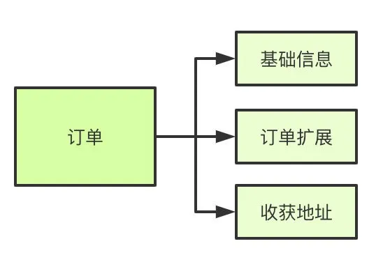

# Table of Contents

* [相关](#相关)
* [数据库三大范式是什么](#数据库三大范式是什么)
* [能说下myisam 和 innodb的区别吗？](#能说下myisam-和-innodb的区别吗)
* [说下mysql的索引有哪些吧，聚簇和非聚簇索引又是什么？](#说下mysql的索引有哪些吧聚簇和非聚簇索引又是什么)
* [索引失效情况](#索引失效情况)
* [那你知道什么是覆盖索引和回表吗？](#那你知道什么是覆盖索引和回表吗)
  * [**索引下推**](#索引下推)
* [Mysql调优](#mysql调优)
* [走了索引，但是还是查询慢，怎么解决？](#走了索引但是还是查询慢怎么解决)
* [MysqlBuffer pool](#mysqlbuffer-pool)
* [Mysql日志](#mysql日志)
* [Mysql锁](#mysql锁)
  * [Mysql死锁的原因，怎么避免死锁？](#mysql死锁的原因怎么避免死锁)
    * [**死锁的第一种情况：**](#死锁的第一种情况)
    * [update更新Where不带索引](#update更新where不带索引)
* [事务隔离级别和MVCC](#事务隔离级别和mvcc)
* [你们数据量级多大？分库分表怎么做的？](#你们数据量级多大分库分表怎么做的)
* [说说mysql主从同步怎么做的吧？](#说说mysql主从同步怎么做的吧)
  * [那主从的延迟怎么解决呢？](#那主从的延迟怎么解决呢)
  * [主从断掉怎么办？](#主从断掉怎么办)
* [大表数据查询，怎么优化](#大表数据查询怎么优化)
* [Limit大坑](#limit大坑)
  * [注意事项](#注意事项)
  * [超大分页怎么处理？](#超大分页怎么处理)
* [count的执行哪个快？？？？](#count的执行哪个快)
* [慢SQL解决思路](#慢sql解决思路)
* [**MySQL分区**](#mysql分区)
* [**MySQL数据库分布式事务**](#mysql数据库分布式事务)
* [**复制**](#复制)
  * [**从库挂机了怎么恢复同步**](#从库挂机了怎么恢复同步)
* [数据库表迁移，作何做？](#数据库表迁移作何做)
* [分库分表](#分库分表)
* [工作总结知识点](#工作总结知识点)


# 相关

**Mysql面试题：** [**https://thinkwon.blog.csdn.net/article/details/104778621**](https://thinkwon.blog.csdn.net/article/details/104778621)


https://mp.weixin.qq.com/s/VFnBf5U3bDg2ePHe1uHHXQ

# 数据库三大范式是什么

第一范式：每个列都不可以再拆分。

第二范式：在第一范式的基础上，非主键列完全依赖于主键，而不能是依赖于主键的一部分。

第三范式：在第二范式的基础上，非主键列只依赖于主键，不依赖于其他非主键。

在设计数据库结构的时候，要尽量遵守三范式，如果不遵守，必须有足够的理由。比如性能。事实上我们经常会为了性能而妥协数据库的设计。

# 能说下myisam 和 innodb的区别吗？

myisam引擎是5.1版本之前的默认引擎，支持全文检索、压缩、空间函数等，但是不支持事务和行级锁，所以一般用于有大量查询少量插入的场景来使用，而且myisam不支持外键，并且索引和数据是分开存储的。

innodb是基于聚簇索引建立的，和myisam相反它支持事务、外键，并且通过MVCC来支持高并发，索引和数据存储在一起。


# 说下mysql的索引有哪些吧，聚簇和非聚簇索引又是什么？

索引按照数据结构来说主要包含B+树和Hash索引。

B+树是左小右大的顺序存储结构，节点只包含id索引列，而叶子节点包含索引列和数据，这种数据和索引在一起存储的索引方式叫做聚簇索引，一张表只能有一个聚簇索引。假设没有定义主键，InnoDB会选择一个唯一的非空索引代替，如果没有的话则会隐式定义一个主键作为聚簇索引。

这是主键聚簇索引存储的结构，那么非聚簇索引的结构是什么样子呢？非聚簇索引(二级索引)保存的是主键id值，这一点和myisam保存的是数据地址是不同的。

[B+树索引](../学习/G.数据库/Mysql/B+树索引.md)
[B+树索引的使用.md](../学习/G.数据库/Mysql/B+树索引的使用.md)

[[组合索引遵循了最左匹配原则就走索引吗？](https://mp.weixin.qq.com/s?__biz=MzUxODAzNDg4NQ==&mid=2247495686&idx=2&sn=dfa18870d8cd2f430f893d402b9f4e54&scene=21#wechat_redirect)]


# 索引失效情况

这个我觉得要从2方面去回答

+ 是否命中索引
+ 成本是否选择了索引


# 那你知道什么是覆盖索引和回表吗？

覆盖索引指的是在一次查询中，如果一个索引包含或者说覆盖所有需要查询的字段的值，我们就称之为覆盖索引，而不再需要回表查询。

回表查询,就是需要根据二级索引树上的主键id去一级索引书上查找数据,查找可能是随机io,成本比较大.

而要确定一个查询是否是覆盖索引，我们只需要explain sql语句看Extra的结果是否是“Using index”即可。


## **索引下推**

Index Condition Pushdown) ICP

MySQL 5.6 之前是没有索引下推这个功能，后面为了提高性能避免不必要的回表，MySQL 5.6 之后就有了索引下推优化的功能。

假如我们有一个用户表，并且使用用户的 name、age 两个字段建立联合索引。name 在没有索引下推的功能，执行下面的 SQL，执行的流程如下图所示：

```
select * from tuser where name like '张%' and age=10 and ismale=1;
```

当比较第一个索引字段 name like '张%' 时就会筛选出四行数据，后面它不会再比较 age 值是否符合要求。直接获取到主键值，然后在回表查询。**回表后返回数据给Server层，Server根据条件对结果进行过滤，再对比 age、ismale 是否符合条件。**


索引下推会再次根据你的 age 进行比较。发现有两条记录不符合条件直接过滤掉，符合条件的才会进行回表查询。这样就减少了不必要的回表查询。

> 索引下推就是只有符合条件再进行回表，对索引中包含的字段先进行判断，不符合条件的跳过。减少了不必要的回表操作。


# Mysql调优

从2方面来讲，【开发规范】【数据库索引】，内部参数由专业DBA来解决。


1. 提交sql脚本，都需要审批，没有索引，提交不了。
2. 索引建立：能否使用【覆盖索引】，建立复合索引，将区分度最高的放在做左边。
3. 不要对索引进行函数计算
4. 利用子查询优化分页问题。
5. 通过explain查看执行计划，
6. 开启事务，可以先插入在修改，修改是行锁。


# 走了索引，但是还是查询慢，怎么解决？

1. 数据量大，分库分表
2. 使用缓存，业务是否能够接受
3. 使用聚合表。


# MysqlBuffer pool

[Mysql-BufferPool.md](../学习/G.数据库/Mysql/Mysql-BufferPool.md)

# Mysql日志

+ [Redo日志.md](../学习/G.数据库/Mysql/Redo日志.md)
+ [Undo日志.md](../学习/G.数据库/Mysql/Undo日志.md)
+ [Bin日志.md](../学习/G.数据库/Mysql/Bin日志.md)


# Mysql锁

[Mysql锁.md](../学习/G.数据库/Mysql/Mysql锁.md)
[Mysql如何加行级锁.md](../学习/G.数据库/Mysql/Mysql行级锁.md)


## Mysql死锁的原因，怎么避免死锁？

所谓死锁：是指两个或两个以上的进程在执行过程中,因争夺资源而造成的一种互相等待的现象,若无外力作用，它们都将无法推进下去.此时称系统处于死锁状态或系统产生了死锁，这些永远在互相等待的进程称为死锁进程。表级锁不会产生死锁.所以解决死锁主要还是针对于最常用的InnoDB。

- 死锁的关键在于：两个(或以上)的Session加锁的顺序不一致。
- 那么对应的解决死锁问题的关键就是：让不同的session加锁有次序


###  **死锁的第一种情况：**

一个用户A 访问表A(锁住了表A),然后又访问表B；另一个用户B 访问表B(锁住了表B)，然后企图访问表A；这时用户A由于用户B已经锁住表B，它必须等待用户B释放表B才能继续，同样用户B要等用户A释放表A才能继续，这就死锁就产生了。

**解决方法：**

这种死锁比较常见，是由于程序的BUG产生的，除了调整的程序的逻辑没有其它的办法。仔细分析程序的逻辑，对于数据库的多表操作时，尽量按照相同的顺序进 行处理，尽量避免同时锁定两个资源，如操作A和B两张表时，总是按先A后B的顺序处理， 必须同时锁定两个资源时，要保证在任何时刻都应该按照相同的顺序来锁定资源。

### update更新Where不带索引

在 InnoDB 事务中，对记录加锁带基本单位是 next-key 锁，但是会因为一些条件会退化成间隙锁，或者记录锁。加锁的位置准确的说，锁是加在索引上的而非行上。

比如，在 update 语句的 where 条件使用了唯一索引，那么 next-key 锁会退化成记录锁，也就是只会给一行记录加锁。
但是，**在 update 语句的 where 条件没有使用索引，就会全表扫描，于是就会对所有记录加上 next-key 锁（记录锁 + 间隙锁），相当于把整个表锁住了**。

那 update 语句的 where 带上索引就能避免全表记录加锁了吗？

并不是。

**关键还得看这条语句在执行过程中，优化器最终选择的是索引扫描，还是全表扫描，如果走了全表扫描，就会对全表的记录加锁了**。

我们可以打开 MySQL 里的 sql_safe_updates 参数，这样可以预防 update 操作时 where 条件没有带上索引列。

如果发现即使在 where 条件中带上了列索引列，优化器走的还是全标扫描，这时我们就要使用 `force index([index_name])` 可以告诉优化器使用哪个索引。


# 事务隔离级别和MVCC
[事务隔离级别和MVCC.md](../学习/G.数据库/Mysql/事务隔离级别和MVCC.md)


# 你们数据量级多大？分库分表怎么做的？

**首先为什么要分表？**

- 如果一个表的每条记录的内容很大，那么就需要更多的 IO 操作。如果字段值比较大，而使用频率相对比较低，可以将大字段移到另一张表中。当查询不查大字段的时候，这样就减少了 IO 操作；
- 如果表的数据量非常非常大，那么查询就变的比较慢；也就是表的数据量影响查询的性能；
- 表中的数据本来就有独立性，例如分别记录各个地区的数据或者不同时期的数据，特别是有些数据常用，而另外一些数据不常用；
- 分表技术有水平分割和垂直分割。


首先分库分表分为垂直和水平两个方式，一般来说我们拆分的顺序是先垂直后水平。

**垂直分库**

基于现在微服务拆分来说，都是已经做到了垂直分库了

**垂直分表**

垂直分割一般用于拆分大字段和访问频率低的字段，**分离冷热数据**。



**垂直分割比较常见场景**：例如博客系统中的文章表，比如文章 tbl_articles(id, titile, summary, content, user_id, create_time)。因为文章中的内容 content 会比较长，放在 tbl_articles 中会严重影响表的查询速度，所以将内容放到 tbl_articles_detail(article_id, content)。像文章列表只需要查询 tbl_articles 中的字段即可；

**垂直拆分的优点**：可以使得行数据变小，在查询时减少读取的 Block 数，减少 I/O 次数。此外，垂直分区可以简化表的结构，易于维护；

**垂直拆分的缺点**：主键会出现冗余，需要管理冗余列，并会引起 Join 操作。可以通过在应用层进行Join来解决。此外，垂直分区会让事务变得更加复杂。


**水平分表**

首先根据业务场景来决定使用什么字段作为分表字段(sharding_key)，比如我们现在日订单1000万，我们大部分的场景来源于C端，我们可以用user_id作为sharding_key，数据查询支持到最近3个月的订单，超过3个月的做归档处理，那么3个月的数据量就是9亿，可以分1024张表，那么每张表的数据大概就在100万左右。

比如用户id为100，那我们都经过hash(100)，然后对1024取模，就可以落到对应的表上了。


水平分割最重要的是找到分割的标准，不同的表应根据业务找出不同的标准：

- 用户表可以根据用户的手机号段进行分割，例如 user183、user150、user153、user189 等，每个号段就是一张表；
- 用户表也可以根据用户的 id 进行分割，加入分 3 张表 user0、user1、user2。如果用户的 id%3=0 就查询 user0 表，如果用户的 id%3=1 就查询 user1 表；
- 对于订单表可以按照订单的时间进行分表。


**分库分表后主键id的处理方式**

一般用的是雪花算法，雪花算法收时间的影响。

也可以自己写生成策略，


# 说说mysql主从同步怎么做的吧？

1. master提交完事务后，写入binlog
2. slave连接到master，获取binlog
3. master创建dump线程，推送binglog到slave
4. slave启动一个IO线程读取同步过来的master的binlog，记录到relay log中继日志中
5. slave再开启一个sql线程读取relay log事件并在slave执行，完成同步
6. slave记录自己的binglog


由于mysql默认的复制方式是异步的，主库把日志发送给从库后不关心从库是否已经处理，这样会产生一个问题就是假设主库挂了，从库处理失败了，这时候从库升为主库后，日志就丢失了。由此产生两个概念。

**全同步复制**

主库写入binlog后强制同步日志到从库，所有的从库都执行完成后才返回给客户端，但是很显然这个方式的话性能会受到严重影响。

**半同步复制**

和全同步不同的是，半同步复制的逻辑是这样，从库写入日志成功后返回ACK确认给主库，主库收到至少一个从库的确认就认为写操作完成。

##  那主从的延迟怎么解决呢？

+ 这个问题貌似真的是个无解的问题，只能是说自己来判断了，需要走主库的强制走主库查询。

+ 要么就让从库等到主库同步完


## 主从断掉怎么办？

从库会记录主库同步的位置，并将读取到的主服务端的 bin-log 的文件名和位置记录到 master-info 


# 大表数据查询，怎么优化


=========题目回顾：

今日面试题：
MySQL对于千万级的大表如何优化？

==============下面是参考思路

很多同学第一反应是各种切分；这里给出参考思路顺序是:

1、第一优化你的sql和索引

2、第二加缓存，guava cache 或redis

3、第三以上都做了后，还是慢，就做主从复制或主主复制，读写分离，可以在应用层做，效率高，也可以用三方工具，第三方工具推荐360的atlas，其它的要么效率不高，要么没人维护

4、第四如果以上都做了还是慢，不要想着去做切分，mysql自带分区表，先试试这个，对你的应用是透明的，无需更改代码,但是sql语句是需要针对分区表做优化的，sql条件中要带上分区条件的列，从而使查询定位到少量的分区上，否则就会扫描全部分区，另外分区表还有一些坑，在这里就不多说了

5、第五如果以上都做了，那就先做垂直拆分，其实就是根据你模块的耦合度，将一个大的系统分为多个小的系统，也就是分布式系统

6、第六才是水平切分，针对数据量大的表，这一步最麻烦，最能考验技术水平，要选择一个合理的sharding key，为了有好的查询效率，表结构也要改动，做一定的冗余，应用也要改，sql中尽量带sharding key，将数据定位到限定的表上去查，而不是扫描全部的表

 

# Limit大坑

```java
 EXPLAIN SELECT * FROM t ORDER BY key1 LIMIT 5000, 1;
```

由于MySQL中是在【**实际向客户端发送记录前**】才会去判断LIMIT子句是否符合要求，所以如果使用二级索引执行上述查询的话，意味着要进行5001次回表操作。

**mysql通过二级索引取到的主键后，并没有直接进行过滤操作，而是又通过聚集索引查询到所有数据后再进行的offset操作，所以耗时长；**

server层在进行执行计划分析的时候会觉得执行这么多次回表的成本太大了，还不如直接全表扫描+filesort快呢，所以就选择了后者执行查询。

> 如何优化？

```mysql
ELECT * FROM t, (SELECT id FROM t ORDER BY key1 LIMIT 5000, 1) AS d
    WHERE t.id = d.id;
```

`SELECT id FROM t ORDER BY key1 LIMIT 5000, 1`作为一个子查询单独存在，由于该子查询的查询列表只有一个`id`列，MySQL可以通过仅扫描二级索引idx_key1执行该子查询，然后再根据子查询中获得到的主键值去表t中进行查找。

**而通过索引覆盖时，offset操作直接在子句中就过滤10条数据主键，所以再参与查询的时候直接利用那10条数据就可以了**

这样就省去了前5000条记录的回表操作，从而大大提升了查询效率！


## 注意事项

```mysql
limit 10  查到10条就返回
limit 10，20 查到10+20，舍弃10条。这里就可以看出优化，主要就是快读定位10这个的起始位置。
```


## 超大分页怎么处理？

超大的分页一般从两个方向上来解决.

+ 数据库层面,这也是我们主要集中关注的(虽然收效没那么大),类似于select * from table where age > 20 limit 1000000,10这种查询其实也是有可以优化的余地的. 这条语句需要load1000000数据然后基本上全部丢弃,只取10条当然比较慢. 当时我们可以修改为select * from table where id in (select id from table where age > 20 limit 1000000,10).这样虽然也load了一百万的数据,但是由于索引覆盖,要查询的所有字段都在索引中,所以速度会很快. 同时如果ID连续的好,我们还可以select * from table where id > 1000000 limit 10,效率也是不错的,优化的可能性有许多种,但是核心思想都一样,就是减少load的数据.

    如果不是id呢？那就没法完了！！！！！！
+ 从需求的角度减少这种请求…主要是不做类似的需求(直接跳转到几百万页之后的具体某一页.只允许逐页查看或者按照给定的路线走,这样可预测,可缓存)以及防止ID泄漏且连续被人恶意攻击.

  [](https://mp.weixin.qq.com/s?__biz=MzUxODAzNDg4NQ==&mid=2247493642&idx=2&sn=715241c1519eba973d0086e0d27244aa&scene=21#wechat_redirect)

# count的执行哪个快？？？？

count(*)会忽略所有的列，直接统计所有列数，不要使用count(列名)


# 慢SQL解决思路


+ [慢SQl解决思路.md](../学习/G.数据库/Mysql/Mysql整体流程.md)


优化汇总：<https://www.cnblogs.com/yungyu16/p/12956251.html>

 


# **MySQL分区**

分区的一个主要目的是将数据按照一个较粗的粒度分在不同的表中。这样做可以将相关的数据存放在一起，另外，如果想一次批量删除整个分区的数据也会变得很方便

表数据很大时，索引会没有什么作用，除非是覆盖索引，其他会有很大随机io。这时通过分区确定区域，然后可以顺序扫描/建索引/缓存到内存等

 

分区表的原理:

分区表由多个相关的底层表实现，这些底层表也是由句柄对象(Handler object)表示，所以我们也可以直接访问各个分区。存储引擎管理分区的各个底层表和 管理普通表一样(所有的底层表都必须使用相同的存储引擎)，分区表的索引只是在各个底层表上各自加上一个完全相同的索引。从存储引擎的角度来看，底层表和一个普通表没有任何不同，存储引擎也无须知道这是一个普通表还是一个分区表的一部分

 

**mysql分区是局部分区索引，一个分区中又放数据又放索引**

在OLTP应用中，对于分区的使用应该非常 小心。总之，如果只是一味地使用分区，而不理解分区是如何工作的，也不清楚你的应 用如何使用分区，那么分区极有可能会对性能产生负面的影响

 

分区类型：

· RANGE分区：行数据基于属于亠个给定连续区间的列值被放入分区。MySQL 5.5 开始支持RANGE COLUMNS的分区。

· LIST分区：和RANGE分区类型，只是LIST分区面向的是离散的值。MySQL 5.5 开始支持LIST COLUMNS的分区。

· hash分区：根据用户自定义的表达式的返回值来进行分区，返回值不能为负数。

· KEY分区：根据MySQL数据库提供的哈希函数来进行分区。

不论创建何种类型的分区，如果表中存在主键或唯一索引时，分区列必须是唯一索 引的一个组成部分

 

**RANGE 分区**

CREATE TABLE t(

id INT

)ENGINE=INNDB

PARTITION BY RANGE (id)(

PARTITION pO VALUES LESS THAN (10)

PARTITION pl VALUES LESS THAN (20))；

 

优化器只能对YEAR(), TO_DAYS(), TO_ SECONDS0, UNIX_TIMESTAMP()这类函数进行优化选择

 

 

**LIST分区**

 

 

 

 

**HASH分区**

HASH分区的目的是将数据均匀地分布到预先定义的各个分区中，保证各分区的数 据数量大致都是一样的

CREATE TABLE t_hash (

a INT,

b DATETIME

)ENGINE=InnoDB

PARTITION BY HASH (YEAR(b))

PARTITIONS 4;

如果插入一个列b为2010-04-01的记录到表t_hash中，那么保存该条记录的分区 如下：

MOD(YEAR(2010-04-01)， 4)=MOD{2010,4)

 

 

**KEY分区**

 

KEY分区和HASH分区相似，不同之处在于HASH分区使用用户定义的函数进 行分区，KEY分区使用MySQL数据库提供的函数进行分区

mysql> CREATE TABLE t_key (

-> a INT,

-> b DATETIME)ENGINE=InnoDB

-> PARTITION BY KEY (b)

-> PARTITIONS 4;

Query OK, 0 rows affected (0,43 sec)

 

**COLUMNS 分区**

 

在前面介绍的RANGE、LIST、HASH和KEY这四种分区中，分区的条件是：数 据必须是整型(interger),如果不是整型，那应该需要通过函数将其转化为整型，如 YEAR(), TO_DAYS0, MONTH()等函数。

MySQL5.5 版本开始支持 COLUMNS分区，可视为RANGE分区和LIST分区的一种进化。COLUMNS分区可以直接使用非整型的数据进行分区，分区根据类型直接比较而得，不需要转化为整型。此外，RANGE COLUMNS分区可以对多个列的值进行分区

 

COLUMNS分区支持以下的数据类型：

所有的整型类型，如 INT、SMALLINT、TINYINT、BIGINT。FLOAT 和 DECIMAL 则不予支持。

 日期类型，如DATE和DATETIME.其余的日期类型不予支持°

字符串类型，如 CHAR、VARCkAR, BINARY 和 VARBINARY。BLOB 和 TEXT 类型不予支持。

 

 

 

 

 

 

 

 

 

 

**子分区**

子分区是在分区的基础上再进行分区，有时也称这种分区为复合分区。MySQL数据库允许在RANGE和LIST的分区上再进行 HASH或KEY的子分区

 

 

 

也可以 通过使用SUBPARTITION语法来显式地指出各个子分区的名字

 

 

 

子分区的建立需要注意以下几个问题：

每个子分区的数量必须相同。

要在一个分区表的任何分区上使用SUBPARTITION来明确定义任何子分区，就必须定义所有的子分区。

子分区的名字必须是唯一的。

 

 

数据库的应用分为两类：**一类是****OLTP** **（在线事务处理）**，如Blog、电子商务、网络 游戏等；另一类是OLAP （在线分析处理），如数据仓库、数据集市。在一个实际的应用 环境中，可能既有OLTP的应用，也有OLAP的应用。如网络游戏中，玩家操作的游戏 数据库应用就是OLTP的，但是游戏厂商可能需要对游戏产生的日志进行分析，通过分 析得到的结果来更好地服务于游戏，预测玩家的行为等，而这却是OLAP的应用。

对于OLAP的应用，分区的确是可以很好地提高査询的性能，因为OLAP应用大多数查询需要频繁地扫描一张很大的表。假设有一张1亿行的表，其中有一个时间戳属性 列。用户的查询需要从这张表中获取一年的数据。如果按时间戳进行分区，则只需要扫描相应的分区即可。这就是前面介绍的Partition Pruning技术。

然而对于OLTP的应用，分区应该非常小心。在这种应用下，通常不可能会获取一 张大表中10%的数据，大部分都是通过索引返回几条记录即可。而根据B+树索引的原理可知，对于一张大表，一般的B+树需要2〜3次的磁盘IO。因此B+树可以很好地完成操作，不需要分区的帮助，并且设计不好的分区会带来严重的性能问题。

我发现很多开发团队会认为含有1000W行的表是一张非常巨大的表，所以他们往 往会选择采用分区，如对主键做10个HASH的分区，这样每个分区就只有100W的数 据了，因此查询应该变得更快了，如SELECT * FROM TABLE WHERE PK=@pk*但 是有没有考虑过这样一种情况：100W和1000W行的数据本身构成的B+树的层次都是 一样的，可能都是2层。那么上述走主键分区的索引并不会带来性能的提高。好的，如 果1000W的B+树的高度是3, 100W的B+树的高度是2,那么上述按主键分区的索引 可以避免1次IO,从而提高査询的效率。这没问题，但是这张表只有主键索引，没有任何其他的列需要查询的。如果还有类似如下的SQL语句：SELECT * FROM TABLE WHERE KEY=@key,这时对于KEY的査询需要扫描所有的10个分区，即使每个分区的査询开销为2次IO,则一共需要20次IO。而对于原来单表的设计，对询只需要2〜3次IO。

因此对于使用InnoDB存储引擎作为OLTP应用的表在使用分区时应该十分小心， 设计时确认数据的访问模式，否则在OLTP应用下分区可能不仅不会带来査询速度的提 高，反而可能会使你的应用执行得更慢。

 

 

 

 

 

# **MySQL数据库分布式事务**

InnoDB存储引擎提供了对XA事务的支持。

分布式事务指的是允许多个独立的事务资源参与到一个全局的事务中。全局事务要求在其中的所有参与的事务要么都提交，要么都回滚。在使用分布式事务时，InnoDB存储引擎的事务隔离级别必须设置 为 SERIALIZABLE

 

XA事务由一个或多个资源管理器(Resource Managers). 一个事务管理器 (Transaction Manager)以及一个应用程序(Application Program)组成。

资源管理器：提供访问事务资源的方法。通常一个数据库就是一个资源管理器。

事务管理器：协调参与全局事务中的各个事务。需要和参与全局事务的所有资源 管理器进行通信。

应用程序：定义事务的边界，指定全局事务中的操作。

 

分布式事务使用两段式提交(two-phase commit)的方式。在第一阶段，所有参与 全局事务的节点都开始准备(PREPARE),告诉事务管理器它们准备好提交了。在第二 阶段，事务管理器告诉资源管理器执行ROLLBACK还是C0MMIT*如果任何一个节点 显示不能提交，则所有的节点都被告知需要回滚。可见与本地事务不同的是，分布式事 务需要多一次的PREPARE操作，待收到所有节点的同意信息后，再进行COMMIT或是 ROLLBACK 操作。

 

 

**内部XA事务**

之前讨论的分布式事务是外部事务，即资源管理器是MySQL数据库本身。在 MySQL数据库中还存在另外一种分布式事务，其在存储引擎与插件之间，又或者在存存储引擎之间，称之为内部XA事务。

最为常见的内部XA事务存在于binlog与InnoDB存储引擎之间。在事务提交时，先写二进制日志，再写InnoDB存储引擎的重做日志。对上述两个操作的要求也是原子的，即二进制日志和重做日志必须同时写入。若二进制日志先写了，而在写入InnoDB存储引擎时发生了宕机，那么slave可能会接收到master传过去的二进制日志并执行，最终导致了主从不一 致的情况。

为了解决这个问题，MySQL数据库在binlog与 InnoDB存储引擎之间采用XA事务。当事务提交时，InnoDB存储引擎会先做一个PREPARE操作，将事务的xid写入，接着进行二进制日志的写入，如图7-24所示。 如果在InnoDB存储引擎提交前，MySQL数据库宕机了，那么MySQL数据库在重 启后会先检査准备的UXID事务是否已经提交，若没有，则在存储引撃层再进行一次 提交操作。

 

**不好的事务习惯**

循环中提交：每个循环都不是一个事务，并且性能低，因为每次提交都写一次重做日志

使用自动提交：容易产生误解

**长事务**

     长事务，顾名思义，就是执行时间较长的事务。比如，对 于银行系统的数据库，每过一个阶段可能需要更新对应账户的利息。如果对应账号的数量非常大，这时这个事务可能需要非常长的时间来完成。由于事务ACID的特性，这个操作被封装在一个事务中完成。这就产生了一个问题，在执行 过程中，当数据库或操作系统、硬件等发生问题时，重新开始事务的代价变得不可接受。 数据库需要回滚所有已经发生的变化，而这个过程可能比产生这些变化的时间还要长。因此，对于长事务的问题，有时可以通过转化为小批量的事务来进行处理。当事务发生错误时，只需要回滚一部分数据，然后接着上次已完成的事务继续。**这个既可以通过程序完成，也可以通过存储过程完成。**
    
          通过批量处理小事务来完成大事务的逻辑。每完成一个小事务，将完成 batchcontext表中，表示已完成批量事务的最大账号1D。若事务在运行过程中产生问题, 需要重做事务，可以从这个已完成的最大事务ID继续进行批量的小事务，这样重新开启事务的代价就显得比较低，也更容易让用户接受。batchcontext表的另外一个好处是， 在长事务的执行过程中，用户可以知道现在大概已经执行到了哪个阶段。

**在应用程序中，最好的做法是把事务的START TRANSACTION， COMMIT，ROLLBACK操作交给程序端来完成，而不是在存储过程内完成！！！**

 

**事务日志**

事务日志可以帮助提高事务的效率。使用事务日志，存储引擎在修改表的数据时只需要 修改其内存拷贝，再把该修改行为记录到持久在硬盘上的事务日志中，而不用每次都将 修改的数据本身持久到磁盘。事务日志采用的是追加的方式，因此写日志的操作是磁盘 上一小块区域内的顺序I/O,而不像随机I/O需要在磁盘的多个地方移动磁头，所以釆用 事务日志的方式相对来说要快得多。事务日志持久以后，内存中被修改的数据在后台可 以慢慢地刷回到磁盘。目前大多数存储引擎都是这样实现的，我们通常称之为预写式日 志(Write-Ahead Logging),修改数据需要写两次磁盘。

**MySQL的逻辑架构**

 

 

**如何选择数据类型**

1.更小的通常更好：

2.简单的更好：整型比字符串代价低，其次应该用内建类型而不是字符串存储时间，应该用整型存储IP

3.尽量避免null：通常指定not null，除非真的要存储null。如果査询中包含可为NULL的列，对MySQL来说更难优化，因为可为NULL的列使 得索            引、索引统计和值比较都更复杂。可为NULL的列会使用更多的存储空间，在 MySQL里也需要特殊处理。

 

**整数类型**

TINYINT, SMALLINT, MEDIUMINT, INT, BIGINT。

分别使用8, 16, 24, 32, 64位存储空间。它们可以存储的值的范围从-2(N-1)到2(N-1)-1,其中N是 存储空间的位数.

MySQL可以为整数类型指定宽度，例如INT(ll),对大多数应用这是没有意义的：它不 会限制值的合法范围，只是规定了 MySQL的一些交互工具(例如MySQL命令行客户端) 用来显示字符的个数。对于存储和计算来说，INT(l)和INT(20)是相同的。

 

 

**实数类型**

FLOAT和DOUBLE类型支持使用标准的浮点运算进行近似计算，CPU直接支持速度比较快

DECIMAL类型用于存储精确的小数。在MySQL内部使用字符串存放。更精确。但是空间占用和速度代价高，可以使用bigint代替

两种都可以指定精度。对于DECIMAL列，可以指定小数点前后所允许的最大位数。这会影响列的空间消耗

**字符串类型**

VAECHAR

          存储可变长字符串(在字符串长度不定时更节省空间，但是当每行字符串长度相等时，这样是浪费空间的，因为他需要额外的字节记录字符串长度。)在UPDATE时可能使行变得比原来更长，这就导致需要做额外的工作。如果一个行占用的空间增长，并且在页内没有更多的空间可以存储，在这种情况下，不同的存储引擎的处理方式是不一样的。InnoDB 则需要分裂页来使行可以放进页内。
    
          下面这些情况下使用VARCHAR是合适的：字符串列的最大长度比平均长度大很多； 列的更新很少，所以碎片不是问题；使用了像UTF-8这样复杂的字符集，每个字符 都使用不同的字节数进行存储。

CHAR

          定长，会截掉末尾空格，CHAR适合存储很短的字符串，或者所有值都接近同一个长度。两如，CHAR非常适 合存储密码的MD5值，因为这是一个定长的值。对于经常变更的数据，CHAR也比 VARCHAR更好，因为定长的CHAR类型不容易产生碎片。对于非常短的列，CHAR比 VARCHAR在存储空间上也更有效率。例如用CHAR(l)来存储只有Y和N的值，如果采用单字节字符集只需要一个字节，但是VARCHAR(l)却需要两个字节，因为还有 一个记录长度的额外字节。

 


BLOB和TEXT

          都是为存储很大的数据而设计的字符串数据类型，分别采用二进制和字符方式存储。MySQL把每个BLOB和TEXT值当作一个独立的对象处理。存储引擎 在存储时通常会做特殊处理。当BLOB和TEXT值太大时，InnoDB会使用专门的“外部”存储区域来进行存储，此时每个值在行内需要1〜4个字节存储一个指针，然后在外部 存储区域存储实际的值。BLOB和TEXT家族之间仅有的不同是BLOB类型存储的是二进制数据，没有排序规则或字符集，而TEXT类型有字符集和排序规则。MySQL对BLOB和TEXT列进行排序与其他类型是不同的：它只对每个列的最前max_ sort_length字节而不是整个字符串做排序。如果只需要排序前面一小部分字符，则可以减小 max_sort_length 的配置，或者使用 ORDER BY SUSTRING（colam, length）。MySQL不能将BLOB和TEXT列全部长度的字符串进行索引，也不能使用这些索引消除排序

 


使用枚举(ENUM)代替字符串类型

有时候可以使用枚举列代替常用的字符串类型。枚举列可以把一些不重复的字符串存储成一个预定义的集合。MySQL在存储枚举时非常紧凑，会根据列表值的数量压缩到一个或者两个字节中。MySQL在内部会将每个值在列表中的位置保存为整数，并且在表的文件中保存“数字-字符串”映射关系的“査找表”。实际存储为整数，而不是字符串。另外一个让人吃惊的地方是，枚举字段是按照内部存储的整数而不是定义的字符串进行 排序的。枚举最不好的地方是，字符串列表是固定的，添加或删除字符串必须使用ALTER TABLEO 因此，对于一系列未来可能会改变的字符串，使用枚举不是一个好主意，除非能接受只 在列表末尾添加元素，这样任MySQL 5.1中就可以不用重建整个表来完成修改。由于MySQL把每个枚举值保存为整数，并且必须进行査找才能转换为字符串，所以枚 举列有一些开销。通常枚举的列表都比较小，所以开销还可以控制，但也不能保证一直 如此。在特定情况下，把CHAR/VARCHAR列与枚举列进行关联可能会比直接关联CHAR/ VARCHAR列更慢。

 

 

**日期与时间类型**

MySQL提供两种相似的日期类型：DATETIME和 TIMESTAMP

 

DATETIME

这个类型能保存大范围的值，从1001年到9999年，精度为秒。它把日期和时间封装到格式为YYYYMMDDHHMMSS的整数中，与时区无关。使用8个字节的存储空间。默认情况下，MySQL以一种可排序的、无歧义的格式显示DATETIME值，例如 "2008-01-16 22:37:08"

 

TIMESTAMP

就像它的名字一样，TIMETAMP类型保存了从1970年1月1日午夜(格林尼治标准时间)以来的秒数，它和UNIX时间戳相同。TIMESTAMP只使用4个字节的存储空间, 因此它的范围比DATETIME小得多：只能表示从1970年到2038年。MySQL提供了 FR0M_UNIXTIME()函数把Unix时间戳转换为日期，并提供了 UNIX_TIMESTAMP()函数把日期转换为Unix时间戳。

TIMESTAMP显示的值也依赖于时区。存储值为0的TIMESTAMP在美国东部时区显示为"1969-12-31 19:00:00”，与 格林尼治时间差5个小时。有必要强调一下这个区别：如果在多个时区存储或访问 数据，TIMESTAMP和DATETIME的行为将很不一样。前者提供的值与时区有关系，后者则保留文本表示的日期和时间。TIMESTAMP列默认为 NOT NULL,这也和其他的数据类型不一样。

除了特殊行为之外，通常也应该尽量使用TIMESTAMP,因为它比DATETIME空间效率更高。 有时候人们会将Unix时间截存储为整数值，但这不会来任何收益，用整数保存时间截的格式通常不方便处理，所以我们不推荐这样做。如果需要存储比秒更小粒度的日期和时间值怎么办？ MySQL目前没有提供合适的数据 类型，但是可以使用自己的存储格式：可以使用BIGINT类型存储微秒级别的时间截，或 者使用DOUBLE存储秒之后的小数部分。

**范式**

1NF:字段不可分，每个字段是原子级别的，上节中看到第一个字段为ID，它就是ID不能在分成两个字段了，不能说我要把这个人的ID、名称、班级号都塞在一个字段里面，这个是不合适的，对以后的应用造成很大影响；

2NF:有主键，非主键字段依赖主键，ID字段就是主键，它能表示这一条数据是唯一的，有的读者朋友记性很好，“unique”表示唯一的、不允许重复的，确实它经常会修饰某个字段，保证该字段唯一性，然后再设置该字段为主键；

 

3NF:非主键字段不能相互依赖，这个怎么理解呢，比如student表，班级编号受人员编号的影响，如果在这个表中再插入班级的班主任、数学老师等信息，你们觉得这样合适吗？肯定不合适，因为学生有多个，这样就会造成班级有多个，那么每个班级的班主任、数学老师都会出现多条数据，而我们理想中的效果应该是一条班级信息对应一个班主任和数学老师，这样更易于我们理解，这样就形成class表，那么student表和class表中间靠哪个字段来关联呢，肯定是通过“classNo”，这个字段也叫做两个表的外键

 

范式的优点：

· 范式化的更新操作通常比反范式化要快。

     •当数据较好地范式化时，就只有很少或者没有重复数据，所以只需要修改更少的数据。

· 范式化的表通常更小，可以更好地放在内存里，所以执行操作会更快。

             • 很少有多余的数据意味着检索列表数据时更少需要DISTINCT或者GROUP BY语句。 还是前面的例子：在非范式化的结构中必须使用DISTINCT者GROUP BY才能获得 一份唯一的部门列表，但是如果部门(DEPARTMENT)是一张单独的表，则只需要简 单的査询这张表就行了。

 


范式的缺点：

          通常需要关联不但代价昂贵，也可能使一些索引策略无效。例如，范式化可能将列存放在不同的表中，而这些列如果在一个表中本可以属 于同一个索引

 


反范式化的优点：

因为所有数据都在一张表中，可以很好地避免关联。如果不需要关联表，则对大部分査询最差的情况一一即使表没有使用索引——是全表扫 描。当数据比内存大时这可能比关联要快得多，因为这样避免了随机I/O

事实是，完全的范式化和完全的反范式化schema都是实验室里才有的东西：在真实 世界中很少会这么极端地使用。在实际应用中经常需要混用，可能使用部分范式化的 schema、缓存表，以及其他技巧。

最常见的反范式化数据的方法是复制或者缓存，在不同的表中存储相同的特定列

 

在我们的网站实例中，可以在user表和message表中都存储account_type字段，而不 用完全的反范式化。这避免了完全反范式化的插入和删除问题，因为即使没有消息的时 候也绝不会丢失用户的信息。这样也不会把user_message表搞得太大，有利于高效地 获取数据。

但是现在更新用户的账户类型的操作代价就高了，因为需要同时更新两张表。至于这会 不会是一个问题，需要考虑更新的频率以及更新的时长，并和执行SELECT査询的频率进 行比较。

另一个从父表冗余一些数据到子表的理由是排序的需要。例如，在范式化的schema里通 过作者的名字对消息做排序的代价将会非常高，但是如果在message表中缓存author, name字段并且建好索引，则可以非常高效地完成排序。

缓存衍生值也是有用的。如果需要显示每个用户发了多少消息（像很多论坛做的），可以 每次执行一个昂贵的子査询来计算并显示它；也可以在user表中建一个num messages 列，每当用户发新消息时更新这个值。

**加快ALTER TABLE操作的速度**

MySQL执行大部分修改表 结构操作的方法是用新的结构创建一个空表，从旧表中査出所有数据插入新表，然后删除旧表。这样操作可能需要花费很长时间。

对常见的场景，能使用的技巧只有两种：一种是先在一台不提供服务的机器上执行ALTER TABLE操作，然后和提供服务的主库进行切换；另外一种技巧是“影子拷贝”，影子拷贝的技巧是用要求的表结构创建一张和源表无关的新表，然后通过重命名和删表操作交换两张表。

**查询优化**

**首先查询慢有哪些可能？**

査询的生命周期大致可以按照顺序来看：从客户端，到服务器，然后 在服务器上进行解析，生成执行计划，执行，并返回结果给客户端。

在完成这些任务的时候，査询需要在不同的地方花费时间，包括网络，CPU计算，生成 统计信息和执行计划、锁等待（互斥等待）等操作，尤其是向底层存储引擎检索数据的 调用操作,这些调用需要在内存操作、CPU操作和内存不足时导致的I/O操作上消耗时间。 根据存储引擎不同，可能还会产生大量的上下文切换以及系统调用。

 

**如何优化？**

1.减少数据访问(应用程序是否查找了太多不需要的行或列或重复数据，MySQL是否扫描了太多的额外记录行)

2.多个简单查询通常优于一个复杂查询(因为现在网络开销，执行计划等是高效的，可以测试衡量一下)

3.切分查询：

          有时候对于一个大査询我们需要“分而治之”，将大査询切分成小査询，每个査询功能 完全一样，只完成一小部分，每次只返回一小部分査询结果。删除旧的数据就是一个很好的例子。定期地清除大量数据时，如果用一个大的语句一次 性完成的话，则可能需要一次锁住很多数据、占满整个事务日志、耗尽系统资源、阻塞 很多小的但重要的査询。将一个大的DELETE语句切分成多个较小的查询可以尽可能小地 影响MySQL性能，同时还可以减少MySQL复制的延迟。例如

mysql> DELETE FROM messages WHERE created < DATE_SUB(NOW(),INTERVAL 3 MONTH);

那么可以用类似下面的办法来完成同样的工作：

rows_affected = 0

do {

rows_affected = do_query(

"DELETE FROM messages WHERE created < DATE_SUB(NOW(),INTERVAL 3 MONTH) LIMIT 10000") ~

} while rows_affected > 0

4.分解关联查询：

     很多高性能的应用都会对关联查询进行分解。简单地，可以对每一个表进行一次单表查 询，然后将结果在应用程序中进行关联


​     

· 让缓存的效率更高。许多应用程序可以方便地缓存单表査询对应的结果对象。例如， 上面查询中的tag已经被缓存了，那么应用就可以跳过第一个查询。再例如，应用 中已经缓存了 ID为123、567、9098的内容，那么第三个査询的IN ()中就可以少 几个ID。另外，对MySQL的査询缓存来说注％如果关联中的某个表发生了变化, 那么就无法使用查询缓存了，而拆分后，如果某个表很少改变，那么基于该表的查 询就可以重复利用査询缓存结果了。

· 将查询分解后，执行单个査询可以减少锁的竞争。

· 在应用层做关联，可以更容易对数据库进行拆分，更容易做到高性能和可扩展。

· 查询本身效率也可能会有所提升。这个例子中，使用IN()代替关联查询，可以让 MySQL按照ID顺序进行査询，这可能比随机的关联要更高效。我们后续将详细介 绍这点。

· 可以减少冗余记录的查询。在应用层做关联査询，意味着对于某条记录应用只需要 査询一次，而在数据库中做关联査询，则可能需要重复地访问一部分数据。从这点看， 这样的重构还可能会减少网络和内存的消耗。

· 更进一步，这样做相当于在应用中实现了哈希关联，而不是使用MySQL的嵌套循环关联。某些场景哈希关联的效率要高很多(本章后续我们将讨论这点)。

· 分散在不同MySQL服务器上查询，分散压力。

JDBC连接数据库的步骤

<https://blog.csdn.net/ganchangshao/article/details/83615434>

**查询执行的过程讲解**

 

 

 

 

**MySQL客户端/服务器通信协议**

MySQL客户端和服务器之间的通信协议是“半双工”的，这意味着， 在任何一个时刻，要么是由服务器向客户端发送数据，要么是由客户端向服务器发送 数据，这两个动作不能同时发生。这意味着没法进行流量控制。一旦一端开始发生消息，另一端要接收完整个消息才 能响应它。

客户端用一个单独的数据包将査询传给服务器。一旦客户端发送了请求，它能做的事情就只 是等待结果了。相反的，一般服务器响应给用户的数据通常很多，由多个数据包组成。当服务器开始响 应客户端请求时，客户端必须完整地接收整个返回结果，而不能简单地只取前面几条结果，然后让服务器停止发送数据。这种情况下，客户端若接收完整的结果，然后取前面几条需要的结果，或者接收完几条结果后就“粗暴”地断开连接，都不是好主意。这也 是在必要的时候一定要在査询中加上LIMIT限制的原因。

MySQL连接/线程的状态

Sleep

线程正在等待客户端发送新的请求。

Query

线程正在执行査询或者正在将结果发送给客户端。

Locked

在MySQL服务器层，该线程正在等待表锁。在存储引擎级别实现的锁，例如 InnoDB的行锁，并不会体现在线程状态中。对于MylSAM来说这是一个比较典型 的状态，但在其他没有行锁的引擎中也经常会出现。

Analyzing and statistics

线程正在收集存储引擎的泰计信息，并生成査询的执行计划。

Copying to tmp table [on disk]

线程正在执行査询，并且将其结果集都复制到一个临时表中，这种状态一般要么是 在做GROUP BY操作，要么是文件排序操作，或者是UNION操作。如果这个状态后面 还有“on disk”标记，那表示MySQL正在将一个内存临时表放到磁盘上。

Sorting result

线程正在对结果集进行排序。

 

Sending data

这表示多种情况：线程可能在多个状态之间传送数据，或者在生成结果集，或者在 向客户端返回数据。

 

+++++++++++++++++++++++++++++++++++++++++++

**查询缓存**

如果査询缓存是打开的，那么MySQL会优先检査这个査询 是否命中査询缓存中的数据。这个检査是通过一个对大小写敏感的哈希査找实现的。査 询和缓存中的査询即使只有一个字节不同，那也不会匹配缓存结果。

如果当前的査询恰好命中了査询缓存，那么在返回査询结果之前MySQL会检査一次用 户权限。这仍然是无须解析査询SQL语句的，因为在査询缓存中已经存放了当前査询需 要访问的表信息。如果权限没有问题，MySQL会跳过所有其他阶段，直接从缓存中拿 到结果并返回给客户端。这种情况下，査询不会被解析，不用生成执行计划，不会被执行。

 

**查询优化**

**很多，就不写了**

 

**MySQL如何执行关联查询****【循环嵌套法】**

对于UNION査询，MySQL先将一系列的单个査询结果放到一个临时表中，然后再重新 读出临时表数据来完成UNION査询。在MySQL的概念中，每个査询都是一次关联，所以读取结果临时表也是一次关联。

 

当前MySQL关联执行的策略很简单：MySQL对任何关联都执行嵌套循环关联操作，即 MySQL先在一个表中循环取出单条数据，然后再嵌套循环到下一个表中寻找匹配的行，依次下去，直到找到所有表中匹配的行为止。然后根据各个表匹配的行，返回査询中需要的各个列。MySQL会尝试在最后一个关联表中找到所有匹配的行，如果最后一个关联表无法找到更多的行以后，MySQL返回到上一层次关联表，看是否能够找到更多的匹配记录，依此类推迭代执行。按照这样的方式査找第一个表记录，再嵌套査询下一个关联表，然后回溯到上一个表， 在MySQL中是通过嵌套循环的方式实现一一正如其名“嵌套循环关联”。

 

从本质上说，MySQL对所有的类型的査询都以同样的方式运行。例如，MySQL在FROM 子句中遇到子查询时，先执行子査询并将其结果放到一个临时表中。然后将这个临时表当作一个普通表对待（正如其名“派生表”，**临时表是没有任何索引的！！！**）。MySQL在执行UNION査询时也使用类似的临时表，在遇到右外连接的时候，MySQL将其改写成等价的左外连接。简而言之, 当前版本的MySQL会将所有的査询类型都转换成类似的执行计划。

 

不过，不是所有的査询都可以转换成上面的形式。例如，全外连接就无法通过嵌套循环 和回溯的方式完成，这时当发现关联表中没有找到任何匹配行的时候，则可能是因为关 联是恰好从一个没有任何匹配的表开始。这大概也是MySQL并不支持全外连接的原因。 还有些场景，虽然可以转换成嵌套循环的方式，但是效率却非常差。

**关联查询优化器**

MySQL优化器最重要的一部分就是关联査询优化，它决定了多个表关联时的顺序。通 常多表关联的时候，可以有多种不同的关联顺序来获得相同的执行结果。关联査询优化器则通过评估不同顺序时的成本来选择一个代价最小的关联顺序。

 

例如选择行小的表开始循环，循环查找时利用其他表的索引

 

 

**排序优化**

无论如何排序都是一个成本很高的操作，所以从性能角度考虑，应尽可能避免排序或者 尽可能避免对大量数据进行排序。当不能使用索引生成排序结果的时候，MySQL需要自己进行排序，如果数据量小则在内存中进行，如果数据量大 则需要使用磁盘，不过MySQL将这个过程统一称为文件排序｛filesort）,即使完全是内存排序不需要任何磁盘文件时也是如此。

 

如果需要排序的数据量小于“排序缓冲区”，MySQL使用内存进行“快速排序”操 作。如果内存不够排序，那么MySQL会先将数据分块，对每个独立的块使用“快速排序”进行排序，并将各个块的排序结果存放在磁盘上，然后将各个排好序的块进行合并（merge）,最后返回排序结果。

 

在关联査询的时候如果需要排序，MySQL会分两种情况来处理这样的文件排序。如 果0RDER BY子句中的所有列都来自关联的第一个表，那么MySQL在关联处理第一 个表的时候就进行文件排序。如果是这样，那么在MySQL的EXPLAIN结果中可以看到Extra字段会有“Using filesort”。除此之外的所有情况，MySQL都会先将关联的结果 存放到一个临时表中，然后在所有的关联都结束后，再进行文件排序。这种情况下，在 MySQL 的 EXPLAIN 结果的 Extra 字段可以看到"Using temporary; Using filesort 如果査询中有LIMIT的话，LIMIT也会在排序之后应用，所以即使需要返回较少的数据，临 时表和需要排序的数据量仍然会非常大。MySQL 5.6在这里做了很多重要的改进。当只需要返回部分排序结果的时候，例如使用LIMIT子句，MySQL不再对所有的结果进行排序，而是根据实际情况，选择抛弃不满足条件的结果，然后再进行排序。

 

 

 

**返回结果给客户端**

查询执行的最后一个阶段是将结果返回给客户端。即使査询不需要返回结果集给客户端， MySQL仍然会返回这个査询的一些信息，如该査询影响到的行数。如果查询可以被缓存，那么MySQL在这个阶段也会将结果存放到査询缓存中。MySQL将结果集返回客户端是一个增量、逐步返回的过程。例如，我们回头看看前面 的关联操作，一旦服务器处理完最后一个关联表，开始生成第一条结果时，MySQL就 可以开始向客户端逐步返回结果集了。这样处理有两个好处：服务器端无须存储太多的结果，也就不会因为要返回太多结果而消耗太多内存。另外，这样的处理也让MySQL客户端第一时间获得返回的结果。结果集中的每一行都会以一个满足MySQL客户端/服务器通信协议的封包发送，再通过TCP协议进行传输，在TCP传输的过程中，可能对MySQL的封包进行缓存然后批量传输。

 

**优化关联查询**

1.on条件上要有索引，建索引时要考虑关联顺序，如果A关联B on c列时，优化器优化顺序是B关联A，那么就不需要在B上建索引，在A上建索引

2.确保任何的GROUP BY和ORDER BY中的表达式只涉及到一个表中的列，这样MySQL 才有可能使用索引来优化这个过程。

3.升级时要注意

 

 

**优化group by 和 distinct**

在MySQL中，当无法使用索引的时候，GROUP BY使用两种策略来完成：使用临时表或者文件排序来做分组。

**对于大表怎么优化？**

1.限定查询范围(1个月的单子)

2.读写分离

3.应用级别的缓存

4.分库分表

     分表，主要有垂直分表(多列分为多个表)和水平分表(多行分为多个表)
    
     **垂直拆分的优点：** 可以使得行数据变小，在查询时减少读取的Block数，减少I/O次数。此外，垂直分区可以简化表的结构，易于维护。
    
     **垂直拆分的缺点：** 主键会出现冗余，需要管理冗余列，并会引起Join操作，可以通过在应用层进行Join来解决。此外，垂直分区会让事务变得更加复杂；

 


水平拆分可以支持非常大的数据量。需要注意的一点是:分表仅仅是解决了单一表数据过大的问题，但由于表的数据还是在同一台机器上，其实对于提升MySQL并发能力没有什么意义，所以 **水平拆分最好分库** 。


 

# **复制**

MySQL支持两种复制方式：基于行的复制和基于语句的复制。这两种方式都是通过在主库上记录二进制日志、在备库重放日志的方式来实 现异步的数据复制，通过复制可以将读操作指向备库来获得更好的读扩展

基于语句的复制：基于语句的复制模式下，主库会记录那些造成数据更改的査询，当备 库读取并重放这些事件时，实际上只是把主库上执行过的SQL再执行一遍（直观，sql记录小，但是不如直接复制行变化快，容易不准确）

基于行的复制：会将实际数据记录在二进制日志中（黑盒，行可能很多，较sql简单，准确）

 

复制的用途：

     1.数据分布，可以在不同的地方分布数据备份
    
     2负载均衡，通过MySQL复制可以将读操作分布到多个服务器上，实现对读密集型应用的优化
    
     3.备份
    
     4.高可用和故障切换，避免单点失败，缩短故障时间

 


复制的步骤

\1. 在主库上把数据更改记录到二进制日志(Binary Log)中(这些记录被称为二进制日志事件)。

\2. 备库将主库上的日志复制到自己的中继日志(Relay Log)中。

        备库会启动一个 工作线程，称为I/O线程，I/O线程跟主库建立一个普通的客户端连接，然后在主库上启 动一个特殊的二进制转储｛binlog dump）线程（该线程没有对应的SQL命令），这个二 进制转储线程会读取主库上二进制日志中的事件。它不会对事件进行轮询。如果该线程 追赶上了主库，它将进入睡眠状态，直到主库发送信号量通知其有新的事件产生时才会 被唤醒，备库I/O线程会将接收到的事件记录到中继日志中。

\3. 备库读取中继日志中的事件，将其重放到备库数据之上。

    SQL线程从中继日志中读取事件并在备库执行

 


3个线程以及之间的关联

主：binlog线程——记录下所有改变了数据库数据的语句，放进master上的binlog中；

从：io线程——在使用start slave 之后，负责从master上拉取 binlog 内容，放进自己的relay log中；

从：sql执行线程——执行relay log中的语句；

 

这种复制架构实现了获取事件和重放事件的解耦，允许这两个过程异步进行。也就是说 I/O线程能够独立于SQL线程之外工作。但这种架构也限制了复制的过程，其中最重要 的一点是在主库上并发运行的査询在备库只能串行化执行，因为只有一个SQL线程来重 放中继日志中的事件。

 

如果打开了 log_slave_updates选项，一个备库可以把其主库上的数据变化传播到 其他备库（通过备库的二进制日志再复制）

 

**一主多备**：适合少量写，大量读

用途：

• 为不同的角色使用不同的备库（例如添加不同的索引或使用不同的存储引擎）。

• 把一台备库当作待用的主库，除了复制没有其他数据传输。

• 将一台备库放到远程数据中心，用作灾难恢复。

• 延迟一个或多个备库，以备灾难恢复。

• 使用其中一个备库，作为备份、培训、开发或者测试使用服务器。

 

**主动-主动模式下的主主复制**：包含两台服务器，每一个都被配置成对方的主库和备库。可能的应 用场景是两个处于不同地理位置的办公室，并且都需要一份可写的数据拷贝。这种配置最大的问题是如何解决冲突，两个可写的互主服务器导致的问题非常多。这 通常发生在两台服务器同时修改一行记录

**主动-被动模式下的主主复制**：这是前面描述的主-主结构的变体，它能够避免我们之前讨论的问题。这也是构建容错 性和高可用性系统的非常强大的方式，主要区别在于其中的一台服务器是只读的被动服务器。

     例如，执行ALTER TABLE操作可能会锁住整个表，阻塞对表的读和写，这可能会花费很 长时间并导致服务中断。然而在主-主配置下，可以先停止主动服务器上的备库复制线 程（这样就不会在被动服务器上执行任何更新），然后在被动服务器上执行ALTER操作， 交换角色，最后在先前的主动服务器上注a启动复制线程。这个服务器将会读取中继日志 并执行相同的ALTER语句。这可能花费很长时间，但7^要紧，因为该服务器没有为任何 活跃査询提供服务。
    
    让我们看看主动服务器上更新时会发生什么事情。更新被记录到二进制日志中，通过复 制传递给被动服务器的中继日志中。被动服务器执行査询并将其记录到自己的二进制日 志中（因为开启了 log_slave_updates选项）。由于事件的服务器ID与主动服务器的相同， 因此主动服务器将忽略这些事件。在后面的“修改主库”可了解更多的角色切换相关内容。

设置主动-被动的主-主拓扑结构在某种意义上类似于创建一个热备份，但是可以使用这 个“备份”来提高性能，例如，用它来执行读操作、备份、“离

线”维护以及升级等。真 正的热备份做不了这些事情。然而，你不会获得比单台服务器更好的写性能（稍后会提到）。

**拥有备库的主主结构：**这种配置的优点是增加了冗余，对于不同地理位置的复制拓扑，能够消除站点单点失效 的问题。你也可以像平常一样，将读查询分配到备库上。如果在本地为了故障转移使用主-主结构，这种配置同样有用。当主库失效时，用备库 来代替主库还是可行的，虽然这有点复杂。同样也可以把备库指向一个不同的主库，但 需要考虑增加的复杂度。

**环形复制：。。。**

分发主库：

我们之前提到当备库足够多时，会对主库造成很大的负载。每个备库会在主库上创建一 国〉个线程，并执行binlog dump命令。该命令会读取二进制日志文件中的数据并将其发送 给备库。每个备库都会重复这样的工作，它们不会共享binlog dump的资源。

如果有很多备库，并且有大的事件时，例如一次很大的LOAD DATA INFILE操作，主库上 的负载会显著上升，甚至可能由于备库同时请求同样的事件而耗尽内存并崩溃。另一方 面，如果备库请求的数据不在文件系统的缓存中，可能会导致大量的磁盘检索，这同样 会影响主库的性能并增加锁的竞争。

因此，如果需要多个备库，一个好办法是从主库移除负载并使用分发主库。分发主库事 实上也是一个备库，它的唯一目的就是提取和提供主库的二进制日志。多个备库连接到 分发主库，这使原来的主库摆脱了负担。为了避免在分发主库上做实际的査询，可以将 它的表修改为blackhole存储引擎

分发主库可以是多个

 

 

糟糕的服务容量比例的根本原因是不能像分发读操作那样把写操作等同地分发到更多服 务器上。换句话说，复制只能扩展读操作，无法扩展写操作。

你可能想知道到底有没有办法使用复制来增加写入能力。答案是否定的，根本不行。对 数据进行分区是唯一可以扩展写入的方法

 

改变主库

迟早会有把备库指向一个新的主库的需求。

如果这是计划内的操作，会比较容易（至少比紧急情况下要容易）。只需在备库简单地 使用CHANGE MASTER TO命令，并指定合适的值。大多数值都是可选的。只需要指定需要改变的项即可。备库将抛弃之前的配置和中继日志并从新的主库开始复制。同样新的参 数会被更新到masterinfo文件中，这样就算重启，备库配置信息也不会丢失。

整个过程中最难的是获取新主库上合适的二进制日志位置，这样备库才可以从和老主库 相同的逻辑位置开始复制。

有两种场景需要将备库替换为主库，一种是计划内的 提升，一种是计划外的提升。

计划内的提升

把备库提升为主库理论上是很简单的。简单来说，有以下步骤：

\1. 停止向老的主库写入。

\2. 让备库追赶上主库（让它执行完所有 从主库获得的中继日志）。

\3. 将一台备库配置为新的主库。

\4. 将备库和写操作指向新的主库，然后开启主库的写入。

计划外的提升

\1. 确定哪台备库的数据最新。检査每台备库上SHOW SLAVE STATUS命令的输出，选择 其中 Master_Log_File/read_Master_Log_Pos 的值最新的那个。

\2. 让所有备库执行完所有其从崩溃前的旧主库那获得的中继日志。如果在未完成前修 改备库的主库，它会抛弃剩下的日志事件，从而无法获知该备库在什么地方停止。

\3. 执行前一小节的5 - 7步。

\4. 比较每台备库和新主库上的Master_Log_File/Read_Master_Log_Pos的值。

\5. 执行前一小节的10 - 12步。

 

 

确定期望的日志位置

如果有备库和新主库的位置不相同，则需要找到该备库最后一条执行的事件在新主库的 二进制日志中相应的位置，然后再执行CHANGE MASTER T0o可以通过mysqlbinlog工具 来找到备库执行的最后一条査询，然后在主库上找到同样的査询，进行简单的计算即可 得到。

为了便于描述，假设每个日志事件有一个自增的数字ID,最新的备库，也就是新主 库，在旧主库崩溃时获得了编号为100的事件，假设有另外两台备库:replica2和 replica3o replica2已经获取了 99号事件，replica3获取了 98号事件。如果把两台备 库都指向新主库的同一个二进制日志位置，它们将从101号事件开始复制，从而导致数 据不同步。但只要新主库的二进制日志已经通过log_slave_updates打开，就可以在新 主库的二进制日志中找到99号和100号日志，从而将备库恢复到一致的状态。

 

更快的方法是把新主库和停止的备库上的字节偏移量相减，它显示了字节位置的差异。 然后把这个值和新主库当前二进制日志的位置相减，就可以得到期望的查询的位置。只 需要验证一下就可以据此启动备库

 

## **从库挂机了怎么恢复同步**

哪儿有什么岁月静好，只不过是有人帮你顶住了锅而已。服务宕掉通常都在不经意间，一旦从库服务挂掉了怎么办。

在主服务的 binlog dump 线程将指定的 binlog 信息发给从服务时，除了日志内容，还包括本次发送内容在主服务端的 bin-log 日志文件名称以及位置信息。

从服务的 I/O 线程接收到信息后将日志内容写入realy-log 文件(mysql-relay-bin.xxxxxx)的末端，并将读取到的主服务端的 bin-log 的文件名和位置记录到 master-info 中（通过 show slave status 中的 Master_Info_File 字段可以看到 master.info 保存的位置），以便下一次读取时能告诉主服务从哪里开始同步。

从服务的 SQL 线程检测到 realy-log 新增了内容后，解析日志文件生成对应的 sql 语句，并应用这些 sql 到数据库，保证主从数据一致性。

所以，及时从库挂掉了，因为有 [http://master.info](https://link.zhihu.com/?target=http%3A//master.info) 记录了上一次同步的位置，只要同步服务再次启动，那就可以从上次同步的位置继续增量同步了。

那话说主库宕了怎么办，这就是另一个悲伤的故事了，就没有从库挂掉这么简单了，如果马上启动那就是最好的解决办法。如果由于硬件或者比较棘手的问题导致没办法立即重启，那就要选一个从库升级为主库，选择的标准是数据最接近主库的，也就是最后一次同步时间最晚的。如果有可能（比如主服务只是数据库无法启动，但机器还在）还要到主服务上拉取最新的 bin-log 进行同步。最后进行一系列设置将选中的从库变更为主库配置。（就不展开说了，因为再展开就露馅儿了，我也不会）

CAP取舍

https://my.oschina.net/lhztt/blog/915533

**读写分离**

<https://zhuanlan.zhihu.com/p/86108084>

 

**如何解决主从数据库同步延迟问题？**

· 业务量不大的

主库能处理业务就全放在主库吧，从库只做灾备，备份，对实时性要求不高的统计报表类工作；

· 如果还是经常性的短时间延迟，那就尝试加大从库的硬件配置，比如上sata SSD，pcie等

· 延迟的监控到位，可通过pt-heart-beat来准确监控延迟值，及时发现查看。

· 5.5以后版本的，可以考虑采用半同步复制，能解决少量延迟引起的问题，不过对tps性能损耗较大

· 升级到mysql 5.7吧，多线程复制，几乎完美解决单线程复制引起的从库延迟。

 

首先你要看主备之间的同步方式。

如果是强同步的，随便你怎么读备库都不会有问题，因为在任何情况下数据跟主库都是一样的。

如果是半同步或者异步，那么在某些场景下会时不时有延迟。如果不能接受就把强一致性读的请求发主库，把弱一致性读的请求发备库。

一个好的proxy不仅要判断主备延迟自动分发流量，还要提供hint让用户可以强制指定流量。

首先了解下为什么会出现主从延迟

\1. 5.6版本下 从库是单线程复制 主库是多线程复制， 当遇到执行慢的sql时，就是阻塞后面的同步，该问题可以通过升级5.7，并开启多线程复制来解决

\2. 从库太多，主库binlog同步到多个从库上，io瓶颈 解决方式：减少从库数量，增加io

\3. 硬件配置不一样 解决方式：主从使用一样的硬件配置

\4. 网络瓶颈

 

在数据库架构上来说，没有完全的同步。如果你需要完全的同步，除非你可以接受牺牲你的性能。对于主从，首先要分清楚对其的定义：从的存在主要是避免主宕机导致数据丢失。所以，主业务建议尽量在主上操作。异步是避免不了的。当然，随业务而定，如果你需要主从的业务时，你可以在中间层加个分布式缓存如redis，对于主从数据延时，在架构上，适当的延时是可以接受的

异步避免不了，可以采用策略放入缓存，避免读从库，主从同步之后触发机制更新缓存

多主方案等

 

 # 数据库表迁移，作何做？

借鉴Redis渐进式Hash的做法。

不过要做好回滚机制，保证业务数据正常。


# 分库分表

分库分表 用户 订单号 多维度查询怎么处理？


好，那么无论你是订单号还是用户ID作为shardingkey，按照以上的两种方式都可以解决问题了。那么还有一个问题就是如果既不是订单号又不是用户ID查询怎么办？最直观的例子就是来自商户端或者后台的查询，商户端都是以商户或者说卖家的ID作为查询条件来查的，后台的查询条件可能就更复杂了，像我碰到的有些后台查询条件能有几十个，这怎么查？？？别急，接下来分开说B端和后台的复杂查询。

现实中真正的流量大头都是来自于用户端C端，所以本质上解决了用户端的问题，这个问题就解了大半，剩下来自商户卖家端B端、后台支持运营业务的查询流量并不会很大，这个问题就好解。

**双写**，**双写就是下单的数据落两份，C端和B端的各自保存一份，C端用你可以用单号、用户ID做shardingkey都行，B端就用商家卖家的ID作为shardingkey就好**了。有些同学会说了，你双写不影响性能吗？因为对于B端来说轻微的延迟是可以接受的，所以可以采取异步的方式去落B端订单。你想想你去淘宝买个东西下单了，卖家稍微延迟个一两秒收到这个订单的消息有什么关系吗？你点个外卖商户晚一两秒收到这个订单有什么太大影响吗？

这是一个解决方案，另外一个方案就是走**离线数仓或者ES**查询，订单数据落库之后，不管你通过binlog还是MQ消息的都形式，**把数据同步到数仓或者ES**，他们支持的数量级对于这种查询条件来说就很简单了。同样这种方式肯定是稍微有延迟的，但是这种可控范围的延迟是可以接受的。


# 工作总结知识点

[Mysql工作总结](../学习/G.数据库/Mysql/Mysql工作总结.md)
