# Table of Contents

* [相关](#相关)
* [Redis为什么这么快](#redis为什么这么快)
* [Redis数据类型](#redis数据类型)
* [Redis内存淘汰策略](#redis内存淘汰策略)
* [Redis的缓存击穿、穿透和雪崩](#redis的缓存击穿穿透和雪崩)
  * [热点key怎么处理？](#热点key怎么处理)
* [缓存一致性问题](#缓存一致性问题)
* [BigKey怎么处理？](#bigkey怎么处理)
* [RDB和AOF](#rdb和aof)
* [Redis事务](#redis事务)
* [主从同步](#主从同步)
* [为什么要做集群？](#为什么要做集群)
  * [Sentinel](#sentinel)
  * [Codis](#codis)
  * [redis集群之Cluster](#redis集群之cluster)
    * [Redis集群模式为什么使用哈希槽不使用一致性hash算法？](#redis集群模式为什么使用哈希槽不使用一致性hash算法)
  * [为什么哈希槽设置16384](#为什么哈希槽设置16384)
* [**Info指令**](#info指令)
* [Redis分布式锁拾遗漏补](#redis分布式锁拾遗漏补)
* [flush](#flush)
* [redis在项目中的应用](#redis在项目中的应用)
* [Redis为什么变慢了?](#redis为什么变慢了)
* [如何找出前缀为XX的key](#如何找出前缀为xx的key)
* [Guava+redis实现多级缓存](#guavaredis实现多级缓存)

# 相关

**Redis面试题**  [**https://thinkwon.blog.csdn.net/article/details/103522351**](https://thinkwon.blog.csdn.net/article/details/103522351)

2:https://mp.weixin.qq.com/s?__biz=MzUxODAzNDg4NQ==&mid=2247496660&idx=2&sn=d43a68b3aab2f5803a77462d25d2b33a&scene=21#wechat_redirect

[这个面试题可以好好看下](https://mp.weixin.qq.com/s?__biz=MzUxODAzNDg4NQ==&mid=2247494655&idx=2&sn=50613f15c479580c80088882af1564fe&scene=21#wechat_redirect)

# Redis为什么这么快

1. **基于内存实现**：数据都存储在内存里，减少了一些不必要的 I/O 操作，操作速率很快。

2. **高效的数据结构**：底层多种数据结构支持不同的数据类型，支持 Redis 存储不同的数据；不同数据结构的设计，使得数据存储时间复杂度降到最低。

3. **合理的数据编码**：根据字符串的长度及元素的个数适配不同的编码格式。字典从压缩升级到hash等。

4. **合适的线程模型**
   + I/O 多路复用模型同时监听客户端连接；	
   + 单线程在执行过程中不需要进行上下文切换，减少了耗时。

+ [Redis为什么这么快-不过这个讲的很范，需要结合后面的文章来看](https://mp.weixin.qq.com/s?__biz=MzUxODAzNDg4NQ==&mid=2247486285&idx=2&sn=64c51a77d14f679ea39eeb98061a0315&scene=21#wechat_redirect)

# Redis数据类型

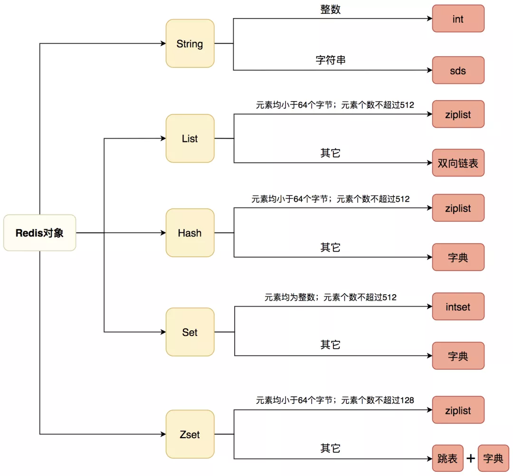

+ [5种基础数据类型详解.md](../学习/G.数据库/Redis/5种基础数据类型详解.md)
+ [3种特殊类型详解.md](../学习/G.数据库/Redis/3种特殊类型详解.md)

+ [Redis底层数据结构详解-重点](../学习/G.数据库/Redis/Redis底层数据结构详解.md)
+ [Redis对象与编码](../学习/G.数据库/Redis/Redis对象与编码.md)

# Redis内存淘汰策略

+ [Redis内存淘汰策略.md](../学习/G.数据库/Redis/Redis内存淘汰策略.md)

# Redis的缓存击穿、穿透和雪崩

[Redis的缓存击穿、穿透和雪崩,记得看总结图片](../学习/G.数据库/Redis/Redis缓存穿透击穿雪崩问题.md)

## 热点key怎么处理？

> 热点Key问题

突然有几十万的请求去访问redis上的某个特定key。那么，这样会造成流量过于集中，达到物理网卡上限，从而导致这台redis的服务器宕机。

那接下来这个key的请求，就会直接怼到你的数据库上，**导致你的服务不可用。**

**缓存击穿**

> 如何发现热点Key
> 

**Redis热点key的问题：** [**https://zhuanlan.zhihu.com/p/149855281**](https://zhuanlan.zhihu.com/p/149855281)

[                                    **https://www.cnblogs.com/leeego-123/p/11588429.html**](https://www.cnblogs.com/leeego-123/p/11588429.html)

> 如何解决

1. 记录用户的行为路径，收集热点数据,在一个访问时间相对不多的时候，**去把热点key预加载到内存中**
2. 要么就是在redis中设置永不过期。

# 缓存一致性问题

[Redis缓存相关问题](../学习/G.数据库/Redis/Redis数据一致性.md)

# BigKey怎么处理？

Big key：**数据量大的 key**  可以指一个key很大，也可以指某一类key累计起来很大

> 为什么要优化Big key

1. 内存开销大
2. 对于集群来说，部分大Key的Redis节点会导致QPS高

> 如何发现BIg key

1. 使用RDB快照文件，进行分析，建议使用

2. 使用scan命令扫描。scan:增量遍历集合中的元素

   scan命令不阻塞主线程，但是大范围扫描keys还是会加重实例的IO，可以闲时再执行。

> 如何优化？

1. 优化改进

   + 更改key的存储方式，将每个Key取hash code，然后按照业务对指定的业务分成n片，用hash code对n取模。此时我们使用hset info:{hash code%n} {key} {value}存储，通过修改hash-max-ziplist-entries(用压缩列表保存时哈希集合中的最大元素个数)和hash-max-ziplist-value(用压缩列表保存时哈希集合中单个元素的最大长度)来控制hash使用ziplist存储，节省空间。 这样可以节省dictEntry开销，剩下32b的空间。

     > 其实就是使用压缩列表进行压缩。

     

   + 使用一定的序列化方式压缩存储空间，例如`protobuf`。

     protobuf:https://zhuanlan.zhihu.com/p/401958878

     Protobuf：谷歌公司新开发的一种数据格式，适合高性能，对响应速度有要求的数据传输场景。因为Protobuf是二进制数据格式，需要编码和解码。数据本身不具有可读性，因此只能反序列化得到可读数据。

2. 直接删除

   对于可以直接删除的keys，建议使用scan命令+unlink命令删除，避免主线程阻塞。我们采用的删除方式是：scan轮流扫描各个实例，匹配需要删除的Keys。

   + 对于占用内存大的，不可直接使用del命令

     采用Redis4.0,unlink命令

> 为什么做了优化，内存占用还是很高？

Redis日常的使用是会存在内存碎片的，可在客户端执行info memory命令。如果**mem_fragmentation_ratio**值大于1.5，那么说明内存碎片超过50%，需要进行碎片整理了

**解决方案**：

- 重启Redis实例，暴力解决，不推荐
- 使用 **config set activedefrag yes** 命令，调整以下参数进行自动清理

# RDB和AOF

+ [RDB和AOF机制详解](../学习/G.数据库/Redis/Redis持久化-RDB和AOF机制详解.md)

<https://blog.csdn.net/xlgen157387/article/details/61925524>

# Redis事务

+ [Redis事务](../学习/G.数据库/Redis/Redis事务.md)

# 主从同步

+ [Redis高可用-主从](../学习/G.数据库/Redis/Redis高可用-主从.md)

# 为什么要做集群？

集群介绍：<https://www.cnblogs.com/51life/articles/10233340.html>

1.主从复制中单机的QPS可能无法满足业务需求

2.现有服务器内存不能满足业务数据的需要

 

**集群分类:**

1.主从复制

2.Sentinel 哨兵

3.cluster

4.codis

## Sentinel

 

 

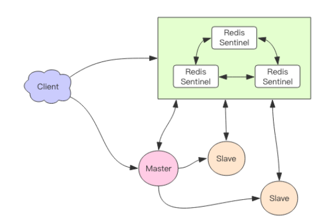

Redis Sentinel 集群一般是由 3～5 个节点组成，这样挂了个别节点集群还可以正常运转。

它负责持续监控主从节点的健康，当主节点挂掉时，自动选择一个最优的从节点切换为*主节点。**客户端来连接集群时，会首先连接 sentinel，通过 sentinel 来查询主节点的地址，然后再去连接主节点进行数据交互。当主节点发生故障时，客户端会重新向 sentinel 要地址，sentinel 会将最新的主节点地址告诉客户端**。如此应用程序将无需重启即可自动完成节点切换。比如上图的主节点挂掉后，集群将可能自动调整为下图所示结构。*

 

*主节点挂掉了，原先的主从复制也断开了，客户端和损坏的主节点也断开了。从节点被提升为新的主节点，其它从节点开始和新的主节点建立复制关系。客户端通过新的主节点继续进行交互。Sentinel 会持续监控已经挂掉了主节点，待它恢复后，原先挂掉的主节点现在变成了从节点，从新的主节点那里建立复制关系。*

 

**消息丢失**

　　*Redis 主从采用异步复制，意味着当主节点挂掉时，从节点可能没有收到全部的同步消息，这部分未同步的消息就丢失了。如果主从延迟特别大，那么丢失的数据就可能会特别多。Sentinel 无法保证消息完全不丢失，但是也尽可能保证消息少丢失。它有两个选项可以限制主从延迟过大。*

*min-slaves-to-write 1*

*min-slaves-max-lag 10*

　　*第一个参数表示主节点必须至少有一个从节点在进行正常复制，否则就停止对外写服务，丧失可用性。*

　　*何为正常复制，何为异常复制？这个就是由第二个参数控制的，它的单位是秒，表示如果 10s 没有收到从节点的反馈，就意味着从节点同步不正常，要么网络断开了，要么一直没有给反馈。*

 

*sentinel 进行主从切换时，客户端如何知道地址变更了 ? 通过分析源码，我发现 redis-py 在建立连接的时候进行了主库地址变更判断。连接池建立新连接时，会去查询主库地址，然后跟内存中的主库地址进行比对，如果变更了，就断开所有连接，重新使用新地址建立新连接。如果是旧的主库挂掉了，那么所有正在使用的连接都会被关闭，然后在重连时就会用上新地址。但是这样还不够，如果是 sentinel 主动进行主从切换，主库并没有挂掉，而之前的主库连接已经建立了在使用了，没有新连接需要建立，那这个连接是不是一致切换不了？继续深入研究源码，我发现 redis-py 在另外一个点也做了控制。那就是在处理命令的时候捕获了一个特殊的异常 ReadOnlyError，在这个异常里将所有的旧连接全部关闭了，后续指令就会进行重连。主从切换后，之前的主库被降级到从库，所有的修改性的指令都会抛出 ReadonlyError。如果没有修改性指令，虽然连接不会得到切换，但是数据不会被破坏，所以即使不切换也没关系。*

 

 

## Codis

在大数据高并发场景下，单个 Redis 实例往往会显得捉襟见肘。首先体现在内存上，单个 Redis 的内存不宜过大，内存太大会导致 rdb 文件过大，进一步导致主从同步时全量同步时间过长，在实例重启恢复时也会消耗很长的数据加载时间，特别是在云环境下，单个实例内存往往都是受限的。其次体现在 CPU 的利用率上，单个 Redis 实例只能利用单个核心，这单个核心要完成海量数据的存取和管理工作压力会非常大。正是在这样的大数据高并发的需求之下，Redis 集群方案应运而生。它可以将众多小内存的 Redis 实例综合起来，将分布在多台机器上的众多 CPU 核心的计算能力聚集到一起，完成海量数据存储和高并发读写操作。Codis 是 Redis 集群方案之一.

 

*当客户端向 Codis 发送指令时，Codis 负责将指令转发到后面的 Redis 实例来执行，并将返回结果再转回给客户端。Codis 上挂接的所有 Redis 实例构成一个 Redis 集群，当集群空间不足时，可以通过动态增加 Redis 实例来实现扩容需求。因为 Codis 是无状态的，它只是一个转发代理中间件，这意味着我们可以启动多个Codis 实例，供客户端使用，每个 Codis 节点都是对等的。因为单个 Codis 代理能支撑的QPS 比较有限，通过启动多个 Codis 代理可以显著增加整体的 QPS 需求，还能起到容灾功能，挂掉一个 Codis 代理没关系，还有很多 Codis 代理可以继续服务。*

 

 

 

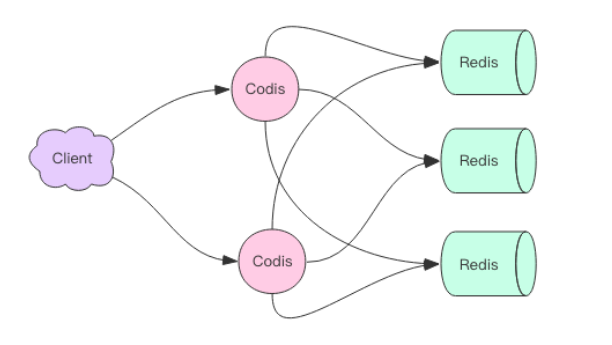

 

*Codis 要负责将特定的 key 转发到特定的 Redis 实例，那么这种对应关系 Codis 是如*

*何管理的呢？Codis 将所有的 key 默认划分为 1024 个槽位(slot)，它首先对客户端传过来的 key 进行 crc32 运算计算哈希值，再将 hash 后的整数值对 1024 这个整数进行取模得到一个余数，这个余数就是对应 key 的槽位。*

*每个槽位都会唯一映射到后面的多个 Redis 实例之一，Codis 会在内存维护槽位和Redis 实例的映射关系。这样有了上面 key 对应的槽位，那么它应该转发到哪个 Redis 实例*

*就很明确了。*

*hash = crc32(command.key)*

*slot_index = hash % 1024*

*redis = slots[slot_index].redis*

*redis.do(command)*

*如果 Codis 的槽位映射关系只存储在内存里，那么不同的 Codis 实例之间的槽位关系就无法得到同步。所以 Codis 还需要一个分布式配置存储数据库专门用来持久化槽位关系。*

*Codis 开始使用 ZooKeeper，后来连 etcd 也一块支持了。*

*刚开始 Codis 后端只有一个 Redis 实例，1024 个槽位全部指向同一个 Redis。然后一个 Redis 实例内存不够了，所以又加了一个 Redis 实例。这时候需要对槽位关系进行调整，*

*将一半的槽位划分到新的节点。这意味着需要对这一半的槽位对应的所有 key 进行迁移，迁移到新的 Redis 实例。*

*那 Codis 如果找到槽位对应的所有 key 呢？*

　　*Codis 对 Redis 进行了改造，增加了 SLOTSSCAN 指令，可以遍历指定 slot 下所有的key。Codis 通过 SLOTSSCAN 扫描出待迁移槽位的所有的 key，然后挨个迁移每个 key 到新的 Redis 节点。在迁移过程中，Codis 还是会接收到新的请求打在当前正在迁移的槽位上，因为当前槽位的数据同时存在于新旧两个槽位中，Codis 如何判断该将请求转发到后面的哪个具体实例呢？Codis 无法判定迁移过程中的 key 究竟在哪个实例中，所以它采用了另一种完全不同的思路。当 Codis 接收到位于正在迁移槽位中的 key 后，会立即强制对当前的单个 key 进行迁移，迁移完成后，再将请求转发到新的 Redis 实例。*

*slot_index = crc32(command.key) % 1024*

*if slot_index in migrating_slots:*

*do_migrate_key(command.key) # 强制执行迁移*

*redis = slots[slot_index].new_redis*

*else:*

*redis = slots[slot_index].redis*

*redis.do(command)*

　　*我们知道 Redis 支持的所有 Scan 指令都是无法避免重复的，同样 Codis 自定义的SLOTSSCAN 也是一样，但是这并不会影响迁移。因为单个 key 被迁移一次后，在旧实例中它就彻底被删除了，也就不可能会再次被扫描出来了。*

**自动均衡**

　　*Redis 新增实例，手工均衡 slots 太繁琐，所以 Codis 提供了自动均衡功能。自动均衡会在系统比较空闲的时候观察每个 Redis 实例对应的 Slots 数量，如果不平衡，就会自动进行*

*迁移。*

**Codis 的代价**

　　*Codis 给 Redis 带来了扩容的同时，也损失了其它一些特性。因为 Codis 中所有的 key 分散在不同的 Redis 实例中，所以事务就不能再支持了，事务只能在单个 Redis 实例中完成。同样 rename 操作也很危险，它的参数是两个 key，如果这两个 key 在不同的 Redis 实例中，rename 操作是无法正确完成的。Codis 的官方文档中给出了一系列不支持的命令列表。同样为了支持扩容，单个 key 对应的 value 不宜过大，因为集群的迁移的最小单位是key，对于一个 hash 结构，它会一次性使用 hgetall 拉取所有的内容，然后使用 hmset 放置到另一个节点。如果 hash 内部的 kv 太多，可能会带来迁移卡顿。官方建议单个集合结构的总字节容量不要超过 1M。如果我们要放置社交关系数据，例如粉丝列表这种，就需要注意了，可以考虑分桶存储，在业务上作折中。Codis 因为增加了 Proxy 作为中转层，所有在网络开销上要比单个 Redis 大，毕竟数据包多走了一个网络节点，整体在性能上要比单个 Redis 的性能有所下降。但是这部分性能损耗不是太明显，可以通过增加 Proxy 的数量来弥补性能上的不足。Codis 的集群配置中心使用 zk 来实现，意味着在部署上增加了 zk 运维的代价，不过大部分互联网企业内部都有 zk 集群，可以使用现有的 zk 集群使用即可。*

 

 

 

## redis集群之Cluster

RedisCluster 是 Redis 的亲儿子，它是 Redis 作者自己提供的 Redis 集群化方案。

相对于 Codis 的不同，**它是去中心化的**，如图所示，该集群有三个 Redis 节点组成，每个节点负责整个集群的一部分数据，每个节点负责的数据多少可能不一样。这三个节点相互连接组成一个对等的集群，它们之间通过一种特殊的二进制协议相互交互集群信息。

 

redis最开始使用主从模式做集群，若master宕机需要手动配置slave转为master；后来为了高可用提出来**哨兵**模式，该模式下有一个哨兵监视master和slave，若master宕机可自动将slave转为master，但它也有一个问题，就是不能动态扩充,；所以在3.x提出cluster集群模式。

 

1.Redis Cluster数据分区规则采用虚拟槽方式(16384个槽)，每个节点负责一部分槽和相关数据，实现数据和请求的负载均衡

2.搭建Redis Cluster划分四个步骤：准备节点，meet操作，分配槽，复制数据。

3.集群读写分离：集群模式下，从节点不接受任何读写操作，当向从节点执行读请求时，重定向到负责槽的主节点。

4.集群伸缩通过在节点之间移动槽和相关数据实现，扩容时根据槽迁移计划把槽从源节点迁移到新节点,收缩时如果下线的节点有负责的槽需要迁移到其他节点，再通过cluster forget命令让集群内所有节点忘记被下线节点

5.使用smart客户端操作集群过到通信效率最大化，客户端内部负责计算维护键，槽以及节点的映射，用于快速定位到目标节点

6.集群自动故障转移过程分为故障发现和节点恢复。节点下线分为主观下线和客观下线，当超过半数节点认为故障节点为主观下线时，标记这个节点为客观下线状态。从节点负责对客观下线的主节点触发故障恢复流程，保证集群的可用性

 

相关博客：

[**https://blog.csdn.net/weixin_42463199/article/details/112367870**](https://blog.csdn.net/weixin_42463199/article/details/112367870)

<https://blog.csdn.net/liuxiao723846/article/details/86715614>

[**https://blog.csdn.net/qq_40741855/article/details/116029185**](https://blog.csdn.net/qq_40741855/article/details/116029185)

[一致性Hash算法](../学习/C.数据结构与算法/CAP/一致性Hash算法.md)

### Redis集群模式为什么使用哈希槽不使用一致性hash算法？

+  它并不是闭合的，key的定位规则是**根据CRC-16(key)%16384的值来判断属于哪个槽区，从而判断该key属于哪个节点**，而一致性哈希是根据hash(key)的值来顺时针找第一个hash(ip)的节点，从而确定key存储在哪个节点。

+ 一致性哈希是创建虚拟节点来实现节点宕机后的数据转移并保证数据的安全性和集群的可用性的。redis cluster是采用master节点有多个slave节点机制来保证数据的完整性的,master节点写入数据，slave节点同步数据。当master节点挂机后，slave节点会通过选举机制选举出一个节点变成master节点，实现高可用。**但是这里有一点需要考虑，如果master节点存在热点缓存，某一个时刻某个key的访问急剧增高，这时该mater节点可能操劳过度而死，随后从节点选举为主节点后，同样宕机，一次类推，造成缓存雪崩。**

+ 扩容和缩容
   可以看到一致性哈希算法在新增和删除节点后，数据会按照顺时针来重新分布节点。而redis cluster的新增和删除节点都需要手动来分配槽区。

> 哈希槽方案，如果要恢复集群，只需要恢复A节点即可，逻辑简单易懂，恢复成本较小。

## 为什么哈希槽设置16384

网上的答案都是 16384/8/1024就是为了压缩发送信息，提升速度。

#  **Info指令**

**Info指令的作用**

1、Server 服务器运行的环境参数

2、Clients 客户端相关信息

3、Memory 服务器运行内存统计数据

4、Persistence 持久化信息

5、Stats 通用统计数据

6、Replication 主从复制相关信息

7、CPU CPU 使用情况

8、Cluster 集群信息

9、KeySpace 键值对统计数量信息

具体使用见书155-157页

 

# Redis分布式锁拾遗漏补

[Redis分布式锁](../学习/G.数据库/Redis/Redis分布式锁.md)

**Redis分布式锁不是绝对安全的**

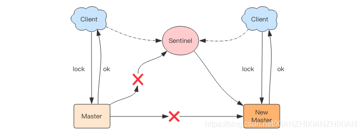

 

原理：

**分布式锁之Redis实现** <https://www.jianshu.com/p/47fd7f86c848>

**RedLock** [**https://help.aliyun.com/document_detail/146758.html?spm=a2c4g.11186623.6.863.31113efchlzgL4**](https://help.aliyun.com/document_detail/146758.html?spm=a2c4g.11186623.6.863.31113efchlzgL4)

分布式锁：<http://ifeve.com/redis-lock/>

<https://www.jianshu.com/p/a64de00dbd59>

 

# flush

Redis提供了flush和flushall指令用来清空数据库，这也是极其缓慢的操作。Redis4.0同样给这两个指令带来了异步化，在指令后增加async参数就可以将整棵大树连根拔起，扔给后台线程慢慢焚烧

**异步指令实现的原理-异步队列**

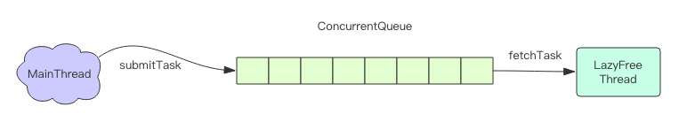

1、主线程将对象的引用从“大树”中摘除后会将这个key的内存回收操作包装成一个任务塞进异步任务队列，后台线程会从这个异步队列中取任务；异步任务被主线程和异步线程同时操作，所以必须是一个线程安全的队列

2、不是所有的unlink都会延后处理，如果对应key所占用的内存很小，Redis会将对应的key内存立即回收，不会进行延后处理

**AOF Sync很慢**

Redis需要每秒同步一次AOF日志到磁盘来确保信息尽量不丢失，调用fsync函数将指定文件内容强制从内核缓存写入到磁盘中去；这个操作很耗时，所以**Redis也将这个操作移到异步线程来完成；**执行AOF Sync操作的线程是一个独立的异步线程，和前面的懒惰删除线程不是一个线程，同样它也有一个属于自己的任务队列，队列中只用来存放AOF Sync任务

**更多异步删除点**

Redis回收内存除了del和flush指令，还会存在于key的过期、LRU淘汰、rename指令以及从库全量同步时接收完rdb文件后悔立即进行的flush操作

Redis4.0为以下操作带来了异步删除机制，需要进行额外配置使以下操作异步处理

1、slave-lazy-flush 从库接受完 rdb 文件后的 flush 操作

2、lazyfree-lazy-eviction 内存达到 maxmemory 时进行淘汰

3、lazyfree-lazy-expire key 过期删除

4、lazyfree-lazy-server-del rename 指令删除 destKey

 

 

 # redis在项目中的应用

1. 分布式锁和分布式读写锁

2. 缓存使用

3. **做实时链路追踪用**，使用到了 set，hash，list

   在发送入后对下发的消息，打上自定义模板id，在关键链路进行对应点位。

   1. 我要看某一天下发多少个模板，直接讲模板di丢到set。
   2. 我要看模板下发链路，是用hash去存的，以模板id作为key，value是hash，key是state，不用的state，代表不同的意思。
   3. 看某一个用户下一天的下发链路，用list，key=模板id，value=状态+时间+点位

   

> 如何使用redis，取决于什么样场景下，使用什么样的数据结构。

# Redis为什么变慢了?
**Redis的性能瓶颈在于【内存】和【网络IO】!!!!!!!!!**

+ 网卡负载过多，导致发送延迟，和数据丢包。
+ 是否进行绑定CPU,`fork`操作时，会抢占主线程的CPU。
+ AOF刷盘策略。
+ 内存达到上限，进行淘汰策略。
+ Redis是否使用了swap。
+ Fork耗时严重，本质还是big key。
+ 集中过期，**主线程执行**。
+ 慢日志观察，复杂命令。SLOWLOG get 5

# 如何找出前缀为XX的key

1. keys

keys命令的原理就是扫描整个redis里面所有的db的key数据，然后根据我们的通配的字符串进行模糊查找出来。**一次返回**

**这个命令会阻塞redis多路复用的io主线程**

2. scan

scan命令或者其他的scan如SSCAN ，HSCAN，ZSCAN命令，可以**不用阻塞主线程**，并支持游标按批次迭代返回数据,

**返回的数据有可能重复**

3. 根据aof或者RDB进行分析。
4. 还有就是，直接设计的时候，放hash就行了。

# Guava+redis实现多级缓存

[Guava+redis实现多级缓存](../学习/I.分布式/Guava+redis实现多级缓存.md)

**Redis字符串源码**

**Redis字符串结构**

Redis中的字符串是可修改的字符串，在内存中是以**字节数组**形式存在的

**SDS**

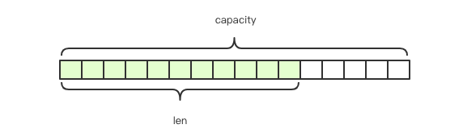

Redis中的字符串叫做“SDS”，也就是Simple Dynamic String，它的结构是带长度信息的字节数组；字符串是可以修改的字符串，支持append操作

 

\1. struct SDS<T> {

\2. T capacity; //数组容量

\3. T len; //数组长度

\4. byte flags; //特殊标识位，不理睬它

\5. byte[] content; //数组内容

\6. }

1、content种存储了字符串的真正内容

2、capacity表示了所分配数组的长度

3、len表示字符串的实际长度

4、扩容时如果capacity不够容纳追加的内容就会重新分配字节数组并复制原字符串的内容到新数组中；SDS结构使用了泛型T，因为当字符串较短时len和capacity可以使用byte和short表示；Redis中的字符串的长度不能超过512M，创建字符串时len和capacity一样大，不会多分配冗余空间

 

 

Redis对象头结构体，所有的Redis对象都有下面这个结构头

 

\1. struct RedisObject {

\2. int4 type; // 4bits

\3. int4 encoding; // 4bits

\4. int24 lru; // 24bits

\5. int32 refcount; // 4bits

\6. void *ptr; // 8bytes，64-bit system

\7. } robj;

不同对象具有不同的类型type（4bit），同一个类型的type会有不同的存储形式encoding（4bit），使用24bit的长度来记录对象的LRU信息。每个对象都有引用计数，当引用计数为0时对象会被销毁，内存会被回收；ptr指针指向对象内容（body）的具体存储位置。一个RedisObject对象头需要占据16字节的存储空间

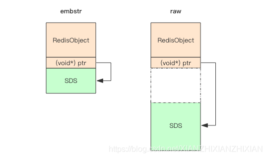

继续看SDS在字符串比较小的时候泛型T可以使用byte和short表示，SDS对象头的大小是capacity+3，至少是3字节，意味着分配一个字符串的最小空间占用为19字节；embstr存储形式是将对象头RedisObject和SDS对象连续存在一起（使用一次malloc），而raw存储需要两次malloc，两个对象头在内存地址上一般是不连续的；内存分配器jemalloc/tcmalloc分配内存大小的单位都是2、4、8、16、32、64等等，为了容纳一个完整的embstr对象最少会分配32字节的空间；如果字符串总长度超过了64字节，Redis认为它是一个大字符串，不再使用emdstr形式存储，而使用raw形式

 

\1. struct SDS {

\2. int8 capacity; //1byte，int8即为byte

\3. int8 len; //1byte

\4. byte flags; //1byte

\5. byte[] content; //内联数组，长度为capacity

\6. }

当内存分配了64字节的空间时，字符串最大长度是44的原因（一个字符占用1字节）

SDS结构中content中的字符串是以字节\0结尾的，\0便于glibc的字符串处理函数以及调试打印输出；留给content的长度最多只有45（64-19），content字符串以\0结尾，所以embstr最大能容纳的字符串长度是44

**字符串扩容策略**

字符串长度在小于1M之前扩容采用加倍策略，当长度超过1M之后，为避免家背后的冗余空间过大导致浪费，每次扩容只会多分配1M大小的冗余空间

源码分析：<https://www.jianshu.com/p/0282f81b26dc>

<https://www.cnblogs.com/lovelaker007/articles/8676101.html>

**Redis字典源码**

1.Redis中 hash结构的数据会使用到字典

2.整个Redis数据库中所有的key和value也组成了一个全局字典

3.带过期时间的key集合也是一个字典

4.zset集合中存储value和score值的映射关系也是通过dict结构实现的

 

**dict内部结构**

dict内部有两个hashtable，通常情况下只有一个hashtable是有值的；在dict扩容或者缩容时需要分配新的hashtable，然后进行渐进式rehash，两个hashtable种存储的分别是新值和旧值；在rehash完成之后，旧的hashtable被删除，新的hashtable会取代旧的hashtable

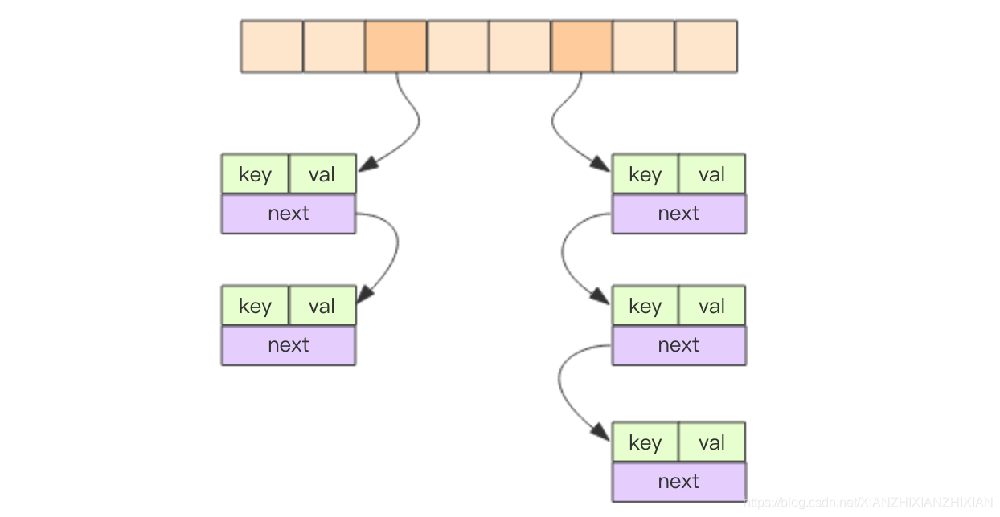

 

\1. struct dict {

\2. dictType *type; //类型特定函数

\3. void *privdata; //私有数据

\4. dictht ht[2]; //2个哈希表，哈希表负载过高进行rehash的时候才会用到第2个哈希表

\5. int rehashidx; //rehash目前进度，当哈希表进行rehash的时候用到，其他情况下为-1

\6. }

\7. struct dictEntry {

\8. void *key;

\9. union {

\10. void *val;

\11. uint64_t u64; //uint64_t整数

\12. int64_t s64; //int64_t整数

\13. }v;

\14. struct dictEntry *next; //指向下个哈希表节点

\15. }

\16. struct dictht {

\17. dictEntry **table; //哈希表数组

\18. unsigned long size; //哈希表大小，即哈希表数组大小

\19. unsigned long sizemask; //哈希表大小掩码，总是等于size-1，主要用于计算索引

\20. unsigned long used; //已使用节点数，即已使用键值对数

\21. }

Redis中的hashtable结构和Java的HashMap几乎是一样的，都是通过分桶的方式解决hash冲突。第一维是数组，第二维是链表；数组中存储的是链表的第一个元素的指针

**渐进式rehash**

**相关博客：**[**https://blog.csdn.net/weichi7549/article/details/107633330**](https://blog.csdn.net/weichi7549/article/details/107633330)

大字典扩容是比较耗时的，需要重新 申请新的数组，然后将旧字典所有链表中的元素重新挂接到新的数组下面，这是一个O(n)级别的操作，作为单线程的Redis无法接受这样的阻塞；Redis采用渐进式rehash

在客户端对dict进行(hset/hdel等指令时)会触发rehash，除了指令触发rehash，Redis还会在定时任务中对字典进行主动搬迁

 

**dict查找过程**

插入和删除元素都依赖于查找，hashtable的元素是存储在链表中的，所以得先计算出key对应的数组下标；hash_func会将keyhash得出一个整数，不同的key会被映射成分布比较均匀散乱的整数。只有hash均匀之后整个hashtable才是平衡的，二维链表的长度就不会差距很远，查找算法的性能也会比较稳定

 

\1. func get(key) {

\2. let index = hash_func(key) % size;

\3. let entry = table[index];

\4. while(entry != NULL) {

\5. if entry.key == target {

\6. return entry.value;

\7. }

\8. entry = entry.next;

\9. }

\10. }

**hash函数**

Redis字典默认的hash函数是siphash，siphash算法即使在输入key很小的情况下，也可以产生随机性特别好的输出，而且它的性能也非常突出。对于Redis这样的单线程来说，字典数据结构如此普遍，字典操作也会非常频繁，hash函数自然也是越快越好

**hash攻击**

如果 hash 函数存在偏向性，黑客就可能利用这种偏向性对服务器进行攻击。存在偏向性的 hash 函数在特定模式下的输入会导致 hash 第二维链表长度极为不均匀，甚至所有的元素都集中到个别链表中，直接导致查找效率急剧下降，从O(1)退化到O(n)。有限的服务器计算能力将会被 hashtable 的查找效率彻底拖垮。这就是所谓 hash 攻击。

**hash扩容**

**正常情况下，当hash表中元素的个数等于一维数组的长度时会开始扩容，扩容的新数组大小是原数组的2倍；若Redis正在做bgsave，为了减少内存页的过多分离（Copy On Write），Redis尽量不去扩容（dict_can_resize）；如果hash表已经非常满了，元素个数已经达到了一维数组长度的5倍（dict_force_resize_ratio），说明hash表已经过于拥挤了，这个时候就会强制扩容**

当hash表因为元素的逐渐删减变得越来越稀疏时，Redis会对hash表进行缩容来减少hash表的一维数组空间占用；缩容的条件是元素个数低于数组长度的10%，缩绒不会考虑Redis是否正在做bgsave

Redis中的set底层结构也是字典，只不过所有的value都是NULL，其它特性和字典一模一样

为什么缩容不用考虑bgsave

扩容时考虑bgsave是因为，扩容需要申请额外的很多内存，且会重新链接链表（如果会冲突的话）, 这样会造成很多内存碎片，也会占用更多的内存，造成系统的压力；而缩容过程中，由于申请的内存比较小，同时会释放掉一些已经使用的内存，不会增大系统的压力，因此不用考虑是否在进行bgsave操作

 

rehash的步骤

（1）为字典的ht[1]哈希表分配空间

若是扩展操作，那么ht[1]的大小为>=ht[0].used*2的2^n

若是收缩操作，那么ht[1]的大小为>=ht[0].used的2^n

（2）将保存在ht[0]中的所有键值对rehash到ht[1]中，rehash指重新计算键的哈希值和索引值，然后将键值对放置到ht[1]哈希表的指定位置上。

（3）当ht[0]的所有键值对都迁移到了ht[1]之后（ht[0]变为空表），释放ht[0]，将ht[1]设置为ht[0],新建空白的哈希表ht[1]，以备下次rehash使用。

扩展与收缩的条件

当以下条件满足任意一个时，程序就会对哈希表进行扩展操作

服务器目前没有执行bgsave或bgrewriteaof命令，并且哈希表的负载因子>=1

服务器目前正在执行bgsave或bgrewriteaof命令，并且哈希表的负载因子>=5

负载因子的计算

load_factor=ht[0].used/ht[0].size

当负载因子的值小于0.1时，程序就会对哈希表进行收缩操作

 

讲解很好：<https://www.cnblogs.com/williamjie/articles/11205593.html>

**Redis压缩列表**

**压缩列表**

听到“压缩”两个字，直观的反应就是节省内存。之所以说这种存储结构节省内存,是相较于数组的存储思路而言的。我们知道,数组要求每个元素的大小相同,如果我们要存储不同长度的字符串,那我们就需要用最大长度的字符串大小作为元素的大小(假设是20个字节)。存储小于 20 个字节长度的字符串的时候，便会浪费部分存储空间。

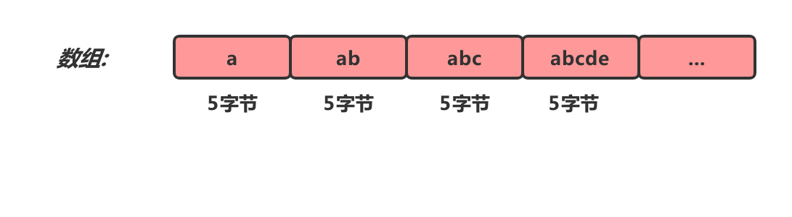

​    数组的优势占用一片连续的空间可以很好的利用CPU缓存访问数据。如果我们想要保留这种优势，又想节省存储空间我们可以对数组进行压缩。

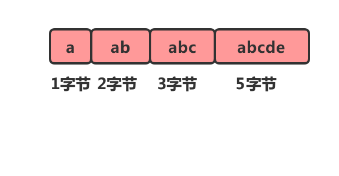

​     但是这样有一个问题，我们在遍历它的时候由于不知道每个元素的大小是多少，因此也就无法计算出下一个节点的具体位置。这个时候我们可以给每个节点增加一个lenght的属性。

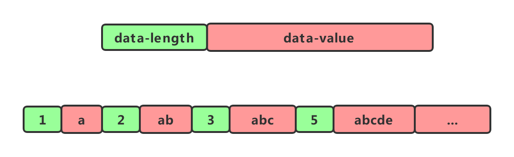

​    如此。我们在遍历节点的之后就知道每个节点的长度(占用内存的大小)，就可以很容易计算出下一个节点再内存中的位置。这种结构就像一个简单的压缩列表了。

 

 

**Redis压缩列表**

**什么是ziplist**

<https://blog.csdn.net/weixin_33755554/article/details/87988696?utm_medium=distribute.pc_relevant.none-task-blog-BlogCommendFromBaidu-1.control&depth_1-utm_source=distribute.pc_relevant.none-task-blog-BlogCommendFromBaidu-1.control>

 

 

是一个双向链表，采用变长的编码方式，将每一项存储在连续的内存空间中，通过记录长度来查找下一个，能以O(1)的时间复杂度在表的两端提供push和pop操作。充分体现了Redis对于存储效率的追求。

ziplist是一个经过特殊编码的双向链表，它的设计目标就是为了提高存储效率。ziplist可以用于存储字符串或整数，其中整数是按真正的二进制表示进行编码的，而不是编码成字符串序列。它能以O(1)的时间复杂度在表的两端提供push和pop操作。

实际上，ziplist充分体现了Redis对于存储效率的追求。一个普通的双向链表，链表中每一项都占用独立的一块内存，各项之间用地址指针（或引用）连接起来。这种方式会带来大量的内存碎片，而且地址指针也会占用额外的内存。而ziplist却是将表中每一项存放在前后连续的地址空间内，一个ziplist整体占用一大块内存。它是一个表（list），但其实不是一个链表（linked list）。

另外，ziplist为了在细节上节省内存，对于值的存储采用了变长的编码方式，大概意思是说，对于大的整数，就多用一些字节来存储，而对于小的整数，就少用一些字节来存储。我们接下来很快就会讨论到这些实现细节。

 

Redis为了节约内存空间使用，zset和hash容器对象在元素个数少的时候采用压缩列表（ziplist）进行存储。压缩列表是一块连续的内存空间，元素之间紧挨着存储，没有任何冗余空间。

 

压缩列表(zip1ist)是列表和哈希的底层实现之一。

​    当一个列表只包含少量列表项,并且每个列表项要么就是小整数值,要么就是长度比较短的字符串,那么Redis就会使用压缩列表来做列表的底层实现。

​    当一个哈希只包含少量键值对,比且每个键值对的键和值要么就是小整数值,要么就是长度比较短的字符串,那么Redis就会使用压缩列表来做哈希的底层实现。

一个压缩列表可以包含任意多个节点(entry),每个节点可以保存一个字节数组或者一个整数值

 

**压缩列表内部结构**

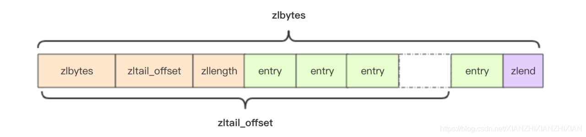

 

\1. struct ziplist<T> {

\2. int32 zlbytes; // 整个压缩列表占用字节数

\3. int32 zltail_offset; // 最后一个元素距离压缩列表起始位置的偏移量，用于快速定位到最后一个节点

\4. int16 zllength; // 元素个数

\5. T[] entries; // 元素内容列表，挨个挨个紧凑存储

\6. int8 zlend; // 标志压缩列表的结束，值恒为 0xFF

\7. }

\8. //entry块随着容纳的元素不同会有不一样的结构

\9. struct entry {

\10. int<var> prevlen; // 前一个 entry 的字节长度

\11. int<var> encoding; // 元素类型编码

\12. optional byte[] content; // 元素内容

\13. }

 

1、压缩列表为了支持双向遍历，才会有ztail_offset用来定位到最后一个元素，然后倒序遍历

2、entry块随着容纳元素类型的不同也会有不一样的结构，prevlen字段表示签一个entry的字节长度，当压缩列表倒着遍历时需要通过这个字段快速定位到下一个元素的位置。这是一个变长的整数，当字符串小于254（0xFE）时使用一个字节表示，如果达到或者超出254（0xFE）就使用5个字节来表示，剩余四个字节表示字符串长度

**增加元素**

ziplist是紧凑型存储没有冗余空间，意味着插入一个新的元素就需要调用realloc扩展内存；取决于内存分配器算法和当前ziplist内存大小，realloc可能会重新分配新的内存空间并将之前的内容一次性拷贝到新的地址，也可能在原有地址上进行扩展，这时就不需要进行旧内容的内存拷贝；如果ziplist占据内存太大，重新分配内存和拷贝内存就会有很大的消耗；所以ziplist不适合存储大型字符串，存储的元素也不宜过多

**级联更新**

每个entry都会用一个prevlen字段存储前一个entry的长度，如果内容小于254字节prevlen用1字节存储，否则就是5字节；如果某个entry经过了修改操作从253字节变成了254字节，那么它的下一个entry的prevlen字段就要更新，从1个字节扩展到5个字节；如果这个entry的长度本来也是253字节，那么后面entry的prevlen字段还得继续更新；ziplist的每个entry存储了253字节的内容，那么第一个entry内容的扩大会导致后续所有entry的级联更新，同时删除中间的某个节点也可能会导致级联更新，这是一个比较耗费计算资源的操作

**Redis快速列表源码**

**Redis早期版本中list的存储形式**

1、Redis早期版本存储list列表数据结构使用的是压缩列表ziplist和普通的双向链表linkedlist，元素少时使用ziplist，元素多时使用linkedlist

2、链表的附加空间相对太高，prev和next指针要占用16个字节（64bit系统的指针是8字节），而且每个节点内存的单独分配会加剧内存的碎片化，影响内存管理的效率；后续版本中使用quicklist代替了ziplist和linkedlist

**quicklist**

quicklist是ziplist和linkedlist的混合体，ziplist将linkedlist按段切分，每一段使用ziplist来紧凑存储，多个ziplist之间使用双向指针串接起来

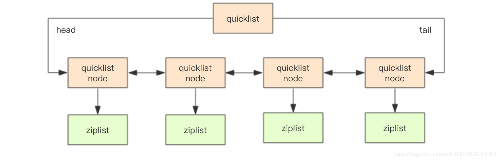

 

\1. struct ziplist {

\2. uint32_t bytes; //ziplist分配的内存大小

\3. uint32_t tail_offset; //达到尾部的偏移量

\4. uint16_t length; //存储元素实体个数

\5. unsigned char* content[]; //存储内容实体元素

\6. unsigned char end; //尾部标识

\7. }

\8. struct ziplist_compressed {

\9. int32 size;

\10. byte[] compressed_data;

\11. }

\12. struct quicklistNode {

\13. quicklistNode* prev;

\14. quicklistNode* next;

\15. ziplist* zl; // 指向压缩列表

\16. int32 size; // ziplist 的字节总数

\17. int16 count; // ziplist 中的元素数量

\18. int2 encoding; // 存储形式 2bit，原生字节数组还是 LZF 压缩存储

\19. ...

\20. }

\21. struct quicklist {

\22. quicklistNode* head;

\23. quicklistNode* tail;

\24. long count; // 元素总数

\25. int nodes; // ziplist 节点的个数

\26. int compressDepth; // LZF 算法压缩深度

\27. ...

\28. }

 

 

 

**压缩深度**

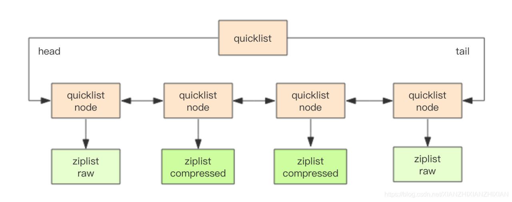

quicklist默认压缩深度是0，也就是不压缩；压缩的实际深度是由配置参数list-compress-depth决定；为了支持快速的push/pop操作，quicklist的首尾两个ziplist不压缩，此时深度就是1；如果深度为2就表示quicklist的首尾第一个ziplist以及首尾第二个ziplist都不压缩

介绍：https://www.jianshu.com/p/f22408a39511

**Redis跳跃列表**

一：基本概念

​        跳跃表是一种随机化的数据结构，在查找、插入和删除这些字典操作上，其效率可比拟于平衡二叉树（如红黑树），大多数操作只需要O(log n)平均时间，但它的代码以及原理更简单。跳跃表的定义如下：

​        “Skip lists are data structures  that use probabilistic  balancing rather than  strictly  enforced balancing. As a result, the algorithms for insertion and deletion in skip lists  are much simpler and significantly  faster  than  equivalent  algorithms for balanced trees.”

​        译文：跳跃表使用概率平衡，而不是强制平衡，因此，对于插入和删除结点比传统上的平衡树算法更为简洁高效。 

 

​        跳跃表基于有序单链表，在链表的基础上，每个结点不只包含一个指针，还可能包含多个指向后继结点的指针，这样就可以跳过一些不必要的结点，从而加快查找、删除等操作。如下图就是一个跳跃表：

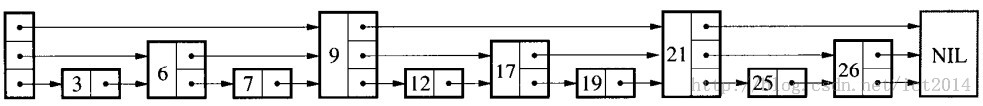

​        传统的单链表是一个线性结构，向有序的链表中插入、查找一个结点需要O(n)的时间。如果使用上图的跳跃表，就可以减少查找所需的时间。

 

​        跳跃表的插入和删除操作都基于查找操作，理解了查找操作，也就理解了跳跃表的本质。查找就是给定一个key，查找这个key是否出现在跳跃表中。

​        结合上图，如果想查找19是否存在，从最高层开始，首先和头结点的最高层的后继结点9进行比较，19大于9，因此接着和9在该层上的后继结点21进行比较，小于21，那这个值肯定在9结点和21结点之间。

​        因此，下移一层，接着和9在该层上的后继结点17进行比较，19大于17，然后和21进行比较，小于21，此时肯定在17结点和21结点之间。

​        接着下移一层，和17在该层上的后继结点19进行比较，这样就最终找到了。

 

​        上面就是跳跃表的基本思想，跳跃表结点包含多少个指向后继元素的指针，是通过一个随机函数生成器得到的。这就是为什么论文“Skip Lists : A Probabilistic Alternative to Balanced Trees ”中有“概率”的原因了，就是通过随机生成一个结点中指向后续结点的指针数目。

二：Redis中的跳跃表

​        Redis使用跳跃表作为有序集合键（zset）的底层实现之一，若一个有序集合包含的元素数量比较多，或者有序集合中的成员是比较长的字符串时，Redis就会使用跳跃表来作为有序集合键的底层实现。

​        **有序集合使用两种数据结构来实现，从而可以使插入和删除操作达到O(log(N))的时间复杂度。这两种数据结构是哈希表和跳跃表。向哈希表添加元素，用于将成员对象映射到分数；同时将该元素添加到跳跃表，以分数进行排序。**

​        和链表、字典等数据结构被广泛地应用在Redis内部不同，Redis只在两个地方用到了跳跃表，一个是实现有序集合键，另一个是在集群结点中用作内部数据结构。除此之外，跳跃表在Redis里面没有其他用途。

 

​        Redis的跳跃表实现跟WilliamPugh在"Skip Lists: A Probabilistic Alternative to Balanced Trees"中描述的跳跃表算法类似，只是有三点不同：

​        a、允许重复分数；

​        b、排序不止根据分数，还可能根据成员对象（当分数相同时）；

​        c、有一个前继指针，因此在第1层，就形成了一个双向链表，从而可以方便的从表尾向表头遍历，用于ZREVRANGE命令的实现。

跳表：

 <https://blog.csdn.net/universe_ant/article/details/51134020>

 

Redis Set的底层数据结构

<https://blog.csdn.net/meser88/article/details/109339911>

 

**Redis LFU**

<https://blog.csdn.net/jh0218/article/details/95389361>

 

**RDB存在哪些优势呢？**

1). 一旦采用该方式，那么你的整个Redis数据库将只包含一个文件，这对于文件备份而言是非常完美的。比如，你可能打算每个小时归档一次最近24小时的数据，同时还要每天归档一次最近30天的数据。通过这样的备份策略，一旦系统出现灾难性故障，我们可以非常容易的进行恢复。

2). 对于灾难恢复而言，RDB是非常不错的选择。因为我们可以非常轻松的将一个单独的文件压缩后再转移到其它存储介质上。

3). 性能最大化。对于Redis的服务进程而言，在开始持久化时，它唯一需要做的只是fork出子进程，之后再由子进程完成这些持久化的工作，这样就可以极大的避免服务进程执行IO操作了。

4). 相比于AOF机制，如果数据集很大，RDB的启动效率会更高。

RDB又存在哪些劣势呢？

1). 如果你想保证数据的高可用性，即最大限度的避免数据丢失，那么RDB将不是一个很好的选择。因为系统一旦在定时持久化之前出现宕机现象，此前没有来得及写入磁盘的数据都将丢失。

2). 由于RDB是通过fork子进程来协助完成数据持久化工作的，因此，如果当数据集较大时，可能会导致整个服务器停止服务几百毫秒，甚至是1秒钟。

**AOF的优势有哪些呢？**

1). 该机制可以带来更高的数据安全性，即数据持久性。Redis中提供了3中同步策略，即每秒同步、每修改同步和不同步。事实上，每秒同步也是异步完成的，其效率也是非常高的，所差的是一旦系统出现宕机现象，那么这一秒钟之内修改的数据将会丢失。而每修改同步，我们可以将其视为同步持久化，即每次发生的数据变化都会被立即记录到磁盘中。可以预见，这种方式在效率上是最低的。至于无同步，无需多言，我想大家都能正确的理解它。

2). 由于该机制对日志文件的写入操作采用的是append模式，因此在写入过程中即使出现宕机现象，也不会破坏日志文件中已经存在的内容。然而如果我们本次操作只是写入了一半数据就出现了系统崩溃问题，不用担心，在Redis下一次启动之前，我们可以通过redis-check-aof工具来帮助我们解决数据一致性的问题。

3). 如果日志过大，Redis可以自动启用rewrite机制。即Redis以append模式不断的将修改数据写入到老的磁盘文件中，同时Redis还会创建一个新的文件用于记录此期间有哪些修改命令被执行。因此在进行rewrite切换时可以更好的保证数据安全性。

4). AOF包含一个格式清晰、易于理解的日志文件用于记录所有的修改操作。事实上，我们也可以通过该文件完成数据的重建。

AOF的劣势有哪些呢？

1). 对于相同数量的数据集而言，AOF文件通常要大于RDB文件。RDB 在恢复大数据集时的速度比 AOF 的恢复速度要快。

2). 根据同步策略的不同，AOF在运行效率上往往会慢于RDB。总之，每秒同步策略的效率是比较高的，同步禁用策略的效率和RDB一样高效。

二者选择的标准，就是看系统是愿意牺牲一些性能，换取更高的缓存一致性（aof），还是愿意写操作频繁的时候，不启用备份来换取更高的性能，待手动运行save的时候，再做备份（rdb）。rdb这个就更有些 eventually consistent的意思了。

 

Redis五大数据结构的底层：

string：字符串是可以修改的字符串，在内存中它是以字节数组的形式存在的，字符串有两种存储方式，在长度特别短的时候，使用embstr形式存储，而当 

​            长度超过44字节的时候，使用raw形式存储。字符串长度小于1MB，每次扩容加倍，当大于1MB，为了减少冗余空间，每次扩容增加1MB.

list：使用quicklist【快速列表】，quicklist是ziplist和linkedlist的混合体，它将linkedlist按段切分，每段都使用ziplist让存储紧凑，多个ziplist之间使用双向指针串联起来。

set：当元素都是整数并且个数较少的时候，redis会使用intset来存储集合元素，当发现set里面放了非整数值的时候，存储形式立刻由intset转变成hash结构【value为null】

zset：元素个数较少的时候，采用压缩列表进行存储。【压缩列表是一块连续的内存的空间，元素之间紧挨着，没有任何冗余的空间】，当元素多的时候，内部实现是一个hash字典加一个跳跃列表。

hash: 元素的个数较少的时候，采用压缩列表进行存储。字典结构内部包含两个hashtable，通常情况下，只有一个hashtable有值，当字典库容的时候，需要分配新的hashtable，然后进行渐进式的搬迁，

这个时候，两个hashtable分别是旧的hashtable和新的hashtable，待搬迁结束后，旧的hashtable呗删除，新的hashtable取而代之，字典的hashtable结果和java的hashmap结构一样，都是通过分桶的方式解决hash冲突，第一维度是数组，第二维度是链表。hash表的扩容，在正常情况下，当hash表中的元素个数等于第一维度数组长度的时候，就开始扩容，新数组是原来数组的两倍。但是如果redis正在进行bgsave【后台异步保存当前数据库的数据到磁盘】，为了减少内存页的过多分离，redis尽量不去扩容，但是如果hash表元素个数达到了数组长度的5倍，表明hash表已经过于拥挤了，这个时候强制扩容。缩容的条件是元素个数低于数长度的10%，缩容不需要考虑redis是否正在做bgsave。

 

 

 
