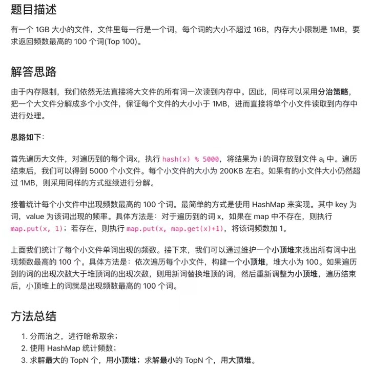
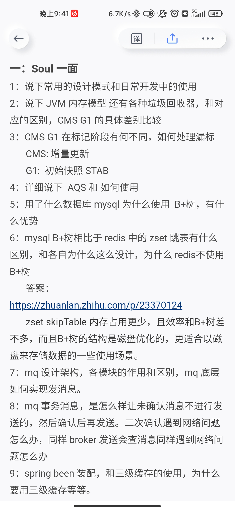
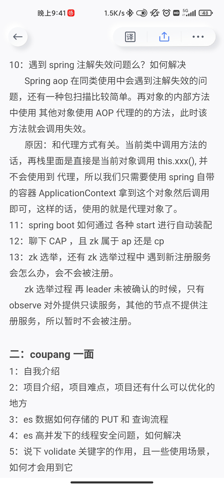
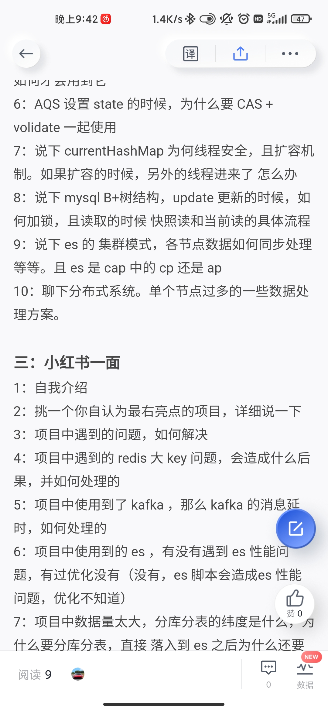

# Table of Contents

1. 一个文件里面有n亿条url 每行一个 有些url重复出现了几次 重复出现的位置随机 现在内存只有4g 怎么找到重复次数前十的url

2.布隆过滤器的作用，以及给过亿的数进行排序,使用BitMap

[BitMap](../学习/C.数据结构与算法/dataStructures/BitMap.md)
[布隆过滤器](../学习/C.数据结构与算法/dataStructures/布隆过滤器.md)

3.

