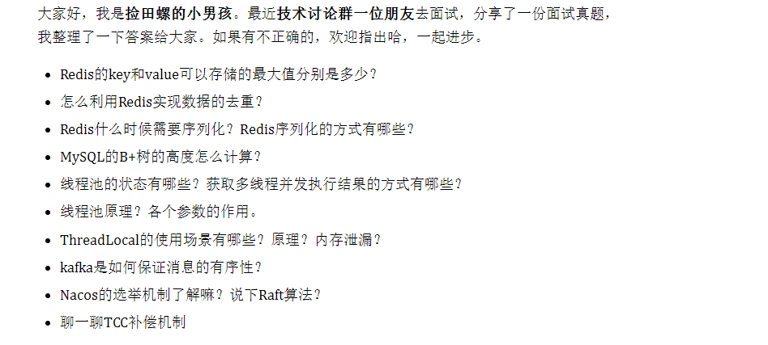

# Table of Contents

* [聊聊你印象最深刻的项目，或者做了什么优化。](#聊聊你印象最深刻的项目或者做了什么优化)
* [如何快速判断一个数是奇数还是偶数，除开对2取余呢](#如何快速判断一个数是奇数还是偶数除开对2取余呢)
* [面试合集](#面试合集)
  * [1](#1)
  * [2](#2)
  * [3](#3)


# 聊聊你印象最深刻的项目，或者做了什么优化。

这个要从自己的项目开始谈起了，

我是准备从以下介绍自己的优化

1. 动态切换数据连接。

2. 分页优化

3. 大事务优化

   > 详情见大事务优化
   >
   > 1. 使用编程式事务
   >
   > 2. 将查询提取出来
   >
   > 3. 事务中少用接口调用
   >
   > 4. 是否有必要用事务
   >
   > 5. 异步调用事务中
   >
   > 6.  事务中避免一次性处理太多数据
   > 
   >    

4. 接口优化

   > 缓存、分批、并发调用、异步

5. Redis优化big key案列

   > 以图片 ID 1101000060 和图片存储对象 ID 3302000080 为例，我们可以把图片 ID 的前
   > 7 位（1101000）作为 Hash 类型的键，把图片 ID 的最后 3 位（060）和图片存储对象
   > ID 分别作为 Hash 类型值中的 key 和 value。  
   >
   > 
   >
   > 为了能充分使用压缩列表的精简内存布局，我们一般要控制保存在 Hash 集合中的元素个
   > 数。所以，在刚才的二级编码中，我们只用图片 ID 最后 3 位作为 Hash 集合的 key，也就
   > 保证了 Hash 集合的元素个数不超过 1000，同时，我们把 hash-max-ziplist-entries 设置
   > 为 1000，这样一来，Hash 集合就可以一直使用压缩列表来节省内存空间了。 

6. 慢Sql优化

    explain  分析语句

   show profile：了解sql执行的线程以及消耗的时间

   trace :   分析优化器如何选择执行计划  why 选择 A 执行计划而不选择 B 执行计划。


# 如何快速判断一个数是奇数还是偶数，除开对2取余呢

判断一个数是奇数还是偶数，我们最容易想到的就是对2取余。

```
if( x % 2 )
// 奇数
else
// 偶数
```

还有一种方法，就是与1相与（ `&1`），具体实现如下：

```
if( x & 1 )
// 奇数
else
// 偶数
```


+ https加密过程

  

+ 分库分表 用户 订单号 多维度查询怎么处理？

+ redis 读写慢？有哪些情况？

+ 找出所有前缀为_order的key。

+ mysql主从下，主插入一条数据，怎么实时读? sharding jdbc怎么做的？

+ mysql从库断了，下次怎么读？

+ 用redis和guava做多级缓存，怎么做的？

+ Mysql服务端缓存是怎么做的?

+ 线上OOM，日志十几个G，怎么快速定位。

  > -XX:+HeapDumpOnOutOfMemoryError -XX:HeapDumpPath=/usr/local/javaproject/oom"
  >
  > 配置好了  自动生成oom文件

+ 网址输入域名后的过程，然后http三次握手 四次挥手，如何优化挥手时候处于time_waited,https加密过程

+ 找出N大小的数组中出现次数>n/2的数   

  > 中位数
  >
  > hash
  >
  > **摩尔投票**

+ 非严格先增后减数组查找最大值下标  

  >  **求峰值**   直接遍历 或者  二分法

+ 一百万行的string,排序,怎么排 从算法等多个方面优化

  > 可以先按首字母划分成若文件
  >
  > 如果划分后文件还太大可以继续划分
  >
  > 单个文件排好序后直接合并

+ 非严格递增的数组旋转，求最小值，时间复杂度小于o（n）

  > 左右指针 进行比较 

+ 设计一个长链转短链的系统，要求一天有1000W跳数据转换，查询要求1W TPS
  （系统要高可用，数据存储，缓存集群，数据库分库分表，数据库要有主库，同机房从库，跨机房备灾库）


# 面试合集

## 1 


## 2


## 3


